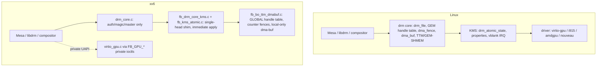

# Linux DRM / GPU Graphics ABI Compatibility Plan

Last updated: 2026-06-09. Phases 0–6 landed and committed. Validators pass
(Mesa virgl, direct KMS GBM/EGL, damage-aware scanout, upstream kmscube,
upstream drm_info, libdrm modetest/drmdevice). **Convergence Task 1**
(kernel → stock Mesa/GBM; retire `virgl_xv6_winsys.c` + `xv6-gbm`) is now
validated end-to-end including the fullscreen video performance gate (§8
step 7), realized offline as a deterministic local high-res/60fps gate — see
"Convergence status" below — and is **committed** (super `e404aa8`, kernel
`512fac7`, ports `7954144`). Tasks 2–4 are validated and committed in ports
through `5c22780`. Host-visible zero-copy blob is
reclassified as an optional, host-refused optimization: the init-time probe
proves the rutabaga host rejects mappable host3d blobs, and Alpine 3.23.4 on
this host runs a full virgl desktop using only the classic transfer model.
Full per-validator logs live in `docs/linux-drm-abi-audit.md`.

## Implementation status (2026-06-07)

This plan is no longer purely forward-looking: most of the roadmap has been
built. Status verified by source reads, headless QEMU boot of the freshly
built kernel (`dma_fence: selftest ok`, all DRM nodes register, boots clean to
the Wayland desktop with no panics), and the GTK `-gl` virgl validator.

| Phase | State | Evidence |
|---|---|---|
| 0 — audit + `drmabitest` | **Done** | `user/programs/drmabitest`, `docs/linux-drm-abi-audit.md` baseline |
| 1 — `dma_fence` core + syncobj/sync_file | **Done (committed)** | `dev/fb/dma_fence.c`; `dma_fence: selftest ok` at boot; `SYNCOBJ_EVENTFD` real |
| 2 — per-file GEM + FLINK/OPEN + dma-buf | **Done (committed)** | per-file handle table, `fb_gem_flink`, generic dma-buf ops + mmap |
| 3 — KMS atomic + blobs + cursor + vblank | **Done (committed)** | writable propblobs, atomic out-fences, cursor plane, present-driven vblank |
| 4 — standard virtio-gpu UAPI | **Done (committed)** | `EXECBUFFER` honors fences, resource wait-by-fence, virtgpu→PRIME bridge |
| 5 — blob / host-visible / zero-copy | **Complete for this host via the transfer model; host-visible zero-copy is an optional, host-refused optimization** | Guest blobs, `F_RESOURCE_BLOB`, host-visible cap/BAR discovery, `MAP_BLOB`/`UNMAP_BLOB`, checked mmap, scanout bind, and dirty-rect flushes committed; fail-closed `HOST_VISIBLE=0` proven. See the "Host-blocked status" summary below for the probe + Alpine evidence. |
| 6 — structural cleanup | **Done (committed)** | shared `fb_shmem_*` page allocator; KMS/virtgpu split into smaller concern fragments; BO backing file renamed to `fb_bo_shmem_dmabuf.c`; retained `FB_GPU_TTM_*` private ABI labels documented as sysmem/shmem metadata compatibility names |

**Validation evidence (2026-06-07).** All validators pass on the freshly
rebuilt image; full logs, commit hashes, and marker caveats are recorded in
`docs/linux-drm-abi-audit.md`. Summary:

- **Mesa virgl `gpu-validate`** — PASS. `wlcomp: linux-dmabuf enabled (virgl)`,
  `mesawlegl`/`mesaglsmoke` complete, dmabuf resource import OK,
  `virtio_failures 0`, `virtio_timeouts 0`.
- **libdrm** — `modetest -c`, `drmdevice`, and `modetest -D /dev/dri/card0 -p`
  discover both `/dev/dri/card0` and `renderD128` and print CRTC/plane state.
- **upstream drm_info** — prints connector/CRTC/plane/property state;
  object-property ABI fix (`CRTC_ID`/`FB_ID` target object type) verified.
- **upstream kmscube** — render-node and KMS runs reach Mesa EGL 1.5 /
  GLES 3.1 (`virgl (D3D12 ...)`) and render frames.
- **direct KMS GBM/EGL (`mesakmsgl`)** — opens `/dev/dri/card0`, creates
  exportable GBM BOs, renders up to ~81 FPS.
- **damage-aware resource-bind scanout** — PASS with on-screen framebuffer
  proof; steady present-trace with `scanout_rebinds=0`, `virtio_failures 0`.

**Host-blocked status — host-visible zero-copy blob (summary).** The kernel
guest-blob path and fail-closed `HOST_VISIBLE` plumbing boot clean; the gap is
purely host-side and is now an optional optimization, not a Phase 5 blocker:

- QEMU 9.0.2's classic virgl path rejects blob outright ("blobs and virgl are
  not compatible (yet)"); the launcher auto-disables blob for virgl GPUs
  (override `QEMU_VIRGL_BLOB_OK=1`). Non-GL `virtio-gpu` blob needs shared
  memfd guest RAM, which the launcher now wires.
- The only host-visible-capable backend here (a local QEMU 9.2.0 rutabaga
  build, `x-virgl2` + surfaceless FFI) negotiates the 32 MiB host-visible BAR
  and virgl2 capset, but the init-time probe (`virtio_gpu_smoke_host_visible_map`)
  proves it **refuses** the mappable `HOST3D` create (`create=-5`), so
  `GETPARAM(HOST_VISIBLE)` correctly stays `0`. Verified by host round-trip,
  not inferred. Evidence: `/tmp/xv6-rutabaga-hostvis-probe.log`.
- Alpine 3.23.4 (Weston/Mesa virgl) on this host drives a 66–73 FPS desktop
  using only the classic transfer model (zero blob/host-visible commands),
  which xv6 already implements — confirming host-visible zero-copy is optional.
- Positive host-visible zero-copy awaits a backend that both negotiates the BAR
  and successfully creates/maps mappable blobs (rutabaga/gfxstream-capable
  QEMU, or a working vhost-user/rutabaga virgl backend).

## Goal

Make the xv6-os graphics subsystem compatible with the **Linux DRM/GPU kernel
ABI** so that unmodified Linux userland graphics stacks — `libdrm`, Mesa
(`gallium`, `drm/virtio`, `kmsro`), `libgbm`, `libEGL`, Wayland compositors,
and the X/Xorg `modesetting` driver — can drive the kernel through the same
ioctl contract they use on Linux.

"Compatible" here means the same thing the syscall-ABI plans
(`docs/linux-abi-compat-plan.md`) mean for syscalls, applied to graphics:

- the same device-node layout (`/dev/dri/card0`, `/dev/dri/renderD128`);
- the same `DRM_IOCTL_*` numbers, struct layouts, and field semantics;
- the same object models (GEM handles per-file, dumb buffers, PRIME dma-buf,
  DRM syncobj / `dma_fence`, KMS atomic state);
- the same `virtio-gpu` UAPI (`DRM_IOCTL_VIRTGPU_*`) so a stock Mesa
  `virtio_gpu`/`virgl` winsys binds without xv6-specific shims.

This document is a **comparison + implementation plan**. Sections §1–§6 record
the original gap analysis (the pre-implementation baseline); §7 tracks the
phased roadmap, now mostly **landed** (see the status table above). Phase 6
cleanup is complete. Phase 5 guest blob and fail-closed host-visible plumbing
are landed; the Alpine-validated transfer path is the complete working model
for this host, while positive host-visible zero-copy remains an optional
backend-dependent optimization.

This plan is scoped to **x86_64** (consistent with the syscall ABI plans).
RISC-V graphics is out of scope.

---

## 1. Current state — what xv6-os already has

The kernel already ships a surprisingly complete DRM shim. Files (all under
`kernel/kernel/`):

| Area | File(s) | Approx LOC | Maturity |
|---|---|---|---|
| DRM generic core (device/file/auth/magic/dispatch) | `dev/drm_core.c`, `inc/dev/drm_core.h` | ~245 | Solid, device-agnostic |
| DRM UAPI numbers/structs | `inc/uabi/drm.h` | ~900 | Broad ioctl + struct coverage |
| Node registration (`card0`, `renderD128`, `gpu0`, `fb0`) | `dev/fb/fb_init_panic.c` | ~450 | Both primary + render nodes |
| KMS modesetting + properties + blobs | `dev/fb/fb_drm_core_kms.c`, `dev/fb/fb_drm_kms_*.c` | split fragments | Single-head, real queries |
| KMS atomic + page-flip + FB lifecycle | `dev/fb/fb_kms_atomic.c` | ~600 | Simplified atomic shim |
| Ioctl router | `dev/fb/fb_drm_dispatch.c` | ~600 | Dispatch table |
| GEM/BO + shmem placement metadata + dma-buf wrapper | `dev/fb/fb_bo_shmem_dmabuf.c` | ~1800 | Per-file GEM handles over shmem pages |
| syncobj + PRIME + virtgpu user ioctls | `dev/fb/fb_syncobj_prime_virtgpu.c` | ~1600 | Counter fences |
| Fence fd / dma-buf file ops | `dev/fb/fb_fd_sync.c` | ~400 | Real custom fds |
| Scanout / BO→framebuffer present | `dev/fb/fb_scanout.c` | ~1000 | virgl + CPU paths |
| virtio-gpu driver (2D + 3D virgl) | `virtio_gpu.c`, `virtio_gpu_*.c` | split fragments | Full 2D + 3D, async ring |
| Device facade ioctls (`FB_GPU_*`) | `dev/fb/fb_device_ioctl.c` | ~2200 | xv6-private UAPI |
| Hyper-V DXG present backend | `dev/fb/fb_dxg_present.c` | — | Out of DRM scope |
| Nouveau scaffold | `dev/fb/fb_nouveau.c` | — | DDA path, separate |

What works today against the **real** Linux ioctl numbers:

- **DRM core**: `VERSION`, `GET_MAGIC`, `AUTH_MAGIC`, `GET_CLIENT`, `GET_CAP`,
  `SET_CLIENT_CAP`, `SET_MASTER`, `DROP_MASTER`. Render-node auth bypass and
  primary-node master arbitration are modeled (`drm_core.c`).
- **KMS queries**: `MODE_GETRESOURCES`, `GETCRTC`, `GETCONNECTOR`, `GETENCODER`,
  `GETPLANE`, `GETPLANERESOURCES`, `GETPROPERTY`, `GETPROPBLOB`, `GETFB`,
  `GETFB2`, `OBJ_GETPROPERTIES`.
- **KMS state**: `SETCRTC`, `ADDFB2`, `RMFB`, `CLOSEFB`, `PAGE_FLIP` (with
  `PAGE_FLIP_EVENT`), `DIRTYFB`, `ATOMIC` (validate + immediate apply),
  `OBJ_SETPROPERTY`.
- **Buffers**: `MODE_CREATE_DUMB`/`MAP_DUMB`/`DESTROY_DUMB` backed by real
  anon pages; `GEM_CLOSE`.
- **PRIME**: `PRIME_HANDLE_TO_FD`/`FD_TO_HANDLE` with a real custom fd and
  file-ops (poll/release), local-only.
- **syncobj**: `CREATE`/`DESTROY`/`WAIT`/`TIMELINE_WAIT`/`SIGNAL`/
  `TIMELINE_SIGNAL`/`RESET`/`TRANSFER`/`QUERY`/`HANDLE_TO_FD`/`FD_TO_HANDLE`.
- **virtio-gpu**: full 2D + 3D virgl command path internally
  (`RESOURCE_CREATE_2D/3D`, `ATTACH_BACKING`, `SET_SCANOUT`, `TRANSFER_*`,
  `RESOURCE_FLUSH`, `CTX_CREATE/DESTROY/ATTACH/DETACH`, `SUBMIT_3D`,
  `GET_CAPSET*`), with an async submission ring and fence reaping.

This is a strong foundation. The gaps below are mostly about **closing
semantic mismatches** and **exposing the existing engine through the standard
UAPI** rather than building from scratch.

---

## 2. Architecture comparison: xv6-os vs Linux DRM

Key structural differences (the **xv6 column below is the original baseline**;
the **Now** column reflects the landed implementation — see the status table at
the top):

| Concept | Linux | xv6-os baseline | Now |
|---|---|---|---|
| **GEM handle scope** | Per-`drm_file` handle table (`idr`) | One **global** table, isolation by `owner_id`/`tgid` | **Per-file handle table + global BO refcount; `FLINK`/`OPEN` implemented** (Phase 2) |
| **dma_fence** | First-class refcounted fence objects, fence context/seqno, cross-driver | `uint64` counters + pending-callback counts | **Real `dma_fence` core (`dma_fence.c`); syncobj/sync_file rebacked on it** (Phase 1) |
| **dma_buf** | `struct dma_buf` + attachments + sg_table, cross-device | Local-only wrapper, foreign fd rejected | **Generic dma-buf wrapper ops + mmap; virtgpu→PRIME bridge** (Phase 2/4) |
| **KMS atomic** | `drm_atomic_state` trees, check/commit, rollback, async commit, in/out fences | Validate then immediate global apply; in-fence wait rejected | **Atomic publishes after present; real out-fences signal on display completion** (Phase 3) |
| **KMS objects** | Dynamic per-HW (N CRTCs/connectors/planes, hotplug) | Static singletons (1 each), no overlay/cursor plane | **Cursor plane wired to virtio cursor queue; connector mode list exposed** (Phase 3) |
| **vblank** | HW IRQ timestamped, `drm_vblank` accounting | Synthetic 60 Hz from tick counter | **Driven from present completion; `WAIT_VBLANK`/`CRTC_*_SEQUENCE`** (Phase 3) |
| **virtio-gpu UAPI** | `DRM_IOCTL_VIRTGPU_*` (Mesa winsys target) | Standard ioctls **wired** but incomplete | **`EXECBUFFER` honors BO list + in/out fences; `WAIT` per-resource fence** (Phase 4) |
| **BO backing / memory mgr** | TTM or GEM-SHMEM, real placement/migration, mmap fault | Metadata-only naming, plain anon pages | **Unified shmem allocator; file split/TTM naming cleanup complete**. Real placement/migration remains out of scope for the single virtio scanout backend (Phase 6) |
| **Blob resources** | `VIRTGPU_RESOURCE_CREATE_BLOB`, host-visible, zero-copy | Absent (explicit transfers only) | **Code complete** — `RESOURCE_CREATE_BLOB` + `F_RESOURCE_BLOB` + host-visible SHM-cap/BAR + `MAP_BLOB`/`UNMAP_BLOB` + PFNMAP mmap; init-time map probe shows the rutabaga host actively refuses mappable host3d blobs (`create=-5`), so host-visible zero-copy stays fail-closed pending a backend that accepts them (Phase 5) |

---

## 3. Detailed gap inventory

### 3.1 DRM core (`drm_core.c`)

Mostly compatible. Gaps:

- **`DRM_IOCTL_GET_UNIQUE` / `SET_VERSION` / `GET_STATS` / `GET_MAP` / `IRQ_BUSID`**
  — verify presence/behavior; libdrm's `drmGetVersion`/`drmGetBusid` path calls
  some of these. `SET_VERSION` interacts with the implicit `UNIVERSAL_PLANES`
  legacy behavior.
- **Capabilities (`GET_CAP`)** — audit the returned values against what a real
  driver reports: `DUMB_BUFFER=1`, `PRIME` import/export bits, `TIMESTAMP_MONOTONIC`,
  `CRTC_IN_VBLANK_EVENT`, `SYNCOBJ`, `SYNCOBJ_TIMELINE`, `ADDFB2_MODIFIERS`,
  `PAGE_FLIP_TARGET`, `ASYNC_PAGE_FLIP`. Several map to features that are
  currently rejected (target/async flip) and must report `0` consistently.
- **`drm_version`** name/date/desc lengths: ensure the two-pass length probe
  (caller passes `len=0` to size buffers) matches libdrm exactly.

### 3.2 KMS modesetting (`fb_drm_core_kms.c`, `fb_kms_atomic.c`)

- **`MODE_CREATEPROPBLOB` / `DESTROYPROPBLOB`** — currently `-EOPNOTSUPP`. Real
  atomic clients create a MODE_ID blob via `CREATEPROPBLOB` and reference it in
  the atomic commit. Without writable blobs, `drmModeAtomicCommit` with a
  mode set (the normal compositor modeset path) cannot work. **Must implement.**
- **`MODE_SETPLANE`** — `-EOPNOTSUPP`. Needed by legacy (non-atomic) plane
  users and by `xf86-video-modesetting` cursor/overlay fallback.
- **`MODE_ADDFB` (legacy)** — `-EOPNOTSUPP`. Some older userland and the kernel
  fbdev-emulation path use the legacy single-plane AddFB; ADDFB2 covers modern
  clients, but a legacy shim mapping to ADDFB2 is cheap and improves coverage.
- **Cursor plane** — `MODE_CURSOR`/`CURSOR2` validate-only; no actual cursor
  plane. A real cursor plane (DRM_PLANE_TYPE_CURSOR) + `SETPLANE` is needed for
  hardware-cursor compositors. The virtio-gpu cursor queue already exists
  (`FB_GPU_SET_CURSOR`/`MOVE_CURSOR`); wire it to the KMS cursor plane.
- **Universal planes / overlay** — only one PRIMARY plane. Add a CURSOR plane
  and (optionally) an OVERLAY plane so `DRM_CLIENT_CAP_UNIVERSAL_PLANES`
  reports something truthful.
- **Multi-mode connector** — connector exposes a single generated mode from
  `xres/yres`. Real EDID/mode lists improve compositor mode selection. The
  virtio-gpu `GET_EDID` and `GET_DISPLAY_INFO` paths can feed a proper mode
  list.
- **Atomic engine** — replace the immediate-apply shim with a minimal but real
  `drm_atomic_state`-style flow:
  - build a transient per-object state set during `ATOMIC`,
  - run a **check** phase (TEST_ONLY uses only this) that validates the whole
    set atomically and can fail without side effects,
  - run a **commit** phase that applies plane/CRTC/connector state together,
  - support **`ATOMIC_NONBLOCK`** real async commit (currently rejected unless
    TEST_ONLY),
  - honor **`IN_FENCE_FD`** by actually waiting on the imported fence before
    the flip (currently rejected), and emit a **real `OUT_FENCE_PTR`** fence
    that signals on flip completion (currently prepared but not signaled by a
    completion event).
- **vblank / events** — move from synthetic ticks to a present-completion
  driven sequence: increment the CRTC sequence and timestamp when the scanout
  actually flips (virtio-gpu `RESOURCE_FLUSH` / present completion), and deliver
  `FLIP_COMPLETE` / vblank events at that point. Implement
  `CRTC_GET_SEQUENCE`/`CRTC_QUEUE_SEQUENCE` and `WAIT_VBLANK` consistently
  (currently rejected).
- **Page-flip target / async** — implement `PAGE_FLIP_TARGET_*` and
  `PAGE_FLIP_ASYNC` or keep them rejected but make `GET_CAP` report `0` for the
  matching caps so userland negotiates down cleanly.

### 3.3 GEM / buffer objects (`fb_bo_ttm_dmabuf.c`)

- **Per-file handle table** — the biggest structural correctness gap. Linux
  GEM handles are scoped to the open `drm_file`. xv6 uses one global table with
  `owner_id` matching. Refactor to a per-`drm_core_file` handle→BO map
  (small `idr`/`xarray`), with the BO itself globally refcounted. This is a
  prerequisite for correct `GEM_FLINK`/`GEM_OPEN`, for PRIME import creating a
  *new handle in the importing file*, and for multi-client render-node use.
- **`GEM_FLINK` / `GEM_OPEN`** — implement global flink names so two processes
  can share a BO by name (legacy but still used, e.g. by some Xorg paths).
- **`GEM_CLOSE` semantics** — ensure closing a handle drops only the *file's*
  reference, not the global BO, once per-file tables exist.
- **mmap fault model** — dumb/GEM mmap uses a precomputed offset and a custom
  VMA handler with `DONTFORK|DONTDUMP` (see runtime memory notes). Keep that,
  but align the offset scheme with `MAP_DUMB`'s returned offset and document
  the fake-offset → BO mapping the way Linux's `drm_gem_mmap` does.

### 3.4 dma-buf / PRIME (`fb_bo_ttm_dmabuf.c`, `fb_fd_sync.c`)

- **Cross-driver import** — foreign fds are rejected. To interoperate with the
  rest of the kernel (future v4l, future second GPU, or the virtio-gpu blob
  path), introduce a minimal generic `dma_buf`-like object with a small ops
  vtable (`map`, `unmap`, `mmap`, attach pages/sg). The fb BO becomes one
  exporter; importers obtain pages through the ops rather than a type check.
- **`sg_table` equivalent** — BOs are page arrays. A scatter-list abstraction
  is needed before any real DMA-capable importer (IOMMU/device DMA) can consume
  an imported buffer. For pure-sysmem QEMU this is low priority.
- **dma-buf mmap** — expose `mmap()` on the PRIME fd itself (Linux allows
  `mmap(dmabuf_fd)`), not only via the GEM offset path. `libgbm`/`gbm_bo_map`
  and some EGL paths rely on it.
- **Poll semantics** — current poll compares snapshot fence counters. Once real
  `dma_fence` objects exist (3.5), wire dma-buf `POLLIN/POLLOUT` to the
  reservation object's fences as Linux does.

### 3.5 DRM syncobj / dma-fence (`fb_syncobj_prime_virtgpu.c`, `fb_fd_sync.c`)

- **Real `dma_fence` objects** — replace `uint64` counters with a refcounted
  fence type carrying `{context, seqno, signaled, callbacks, error}`. This is
  the single most leveraged change: it makes syncobj, dma-buf reservation,
  sync_file, and atomic in/out fences all share one mechanism, matching Linux.
- **`SYNCOBJ_EVENTFD`** — currently `-EOPNOTSUPP`. With real fences, register a
  fence callback that signals an eventfd. Needed by modern compositors that
  poll syncobj via eventfd.
- **sync_file import/export** — `HANDLE_TO_FD`/`FD_TO_HANDLE` already produce
  custom fds; make the exported fd a genuine `sync_file` (with the
  `SYNC_IOC_*` / `POLLIN`-on-signal contract) so it round-trips through other
  Linux components.
- **Timeline correctness** — timeline points work via `timeline_value`. Audit
  `QUERY` to return the *last signaled* point (`QUERY_FLAGS_LAST_SUBMITTED`
  semantics) and ensure transfer/proxy chains signal transitively under the
  real fence model.
- **`WAIT_FOR_SUBMIT` / `WAIT_AVAILABLE` / deadline** — verify these flags
  behave like Linux (block until a fence is even attached, not just signaled).

### 3.6 virtio-gpu UAPI (`fb_device_ioctl.c`, `fb_syncobj_prime_virtgpu.c`, `virtio_gpu.c`)

Correction after source audit: the standard `DRM_IOCTL_VIRTGPU_*` set is
**already dispatched** in `fb_drm_dispatch.c` (`GETPARAM`, `CONTEXT_INIT`,
`RESOURCE_CREATE`, `RESOURCE_CREATE_BLOB`, `RESOURCE_INFO`, `TRANSFER_TO/FROM_HOST`,
`WAIT`, `GET_CAPS`, `EXECBUFFER`, `MAP`) on top of the existing engine. The work
is therefore **completion**, not greenfield. Remaining gaps:

- **`VIRTGPU_EXECBUFFER`** ignores the `bo_handles` array and the in/out
  fence fds (it calls `virtio_gpu_user_submit(..., NULL, 0, &fence, &signaled)`).
  Plumb the BO handle list (for residency) and honor `DRM_IOCTL` in-fence wait /
  out-fence (`fence_fd`) so Mesa's explicit-sync path works.
- **Per-ioctl completion** to verify against the engine:
  - `VIRTGPU_GETPARAM` → 3D features / capset query-fix / resource-blob /
    host-visible / context-init / supported-capset-IDs.
  - `VIRTGPU_GET_CAPS` → return virgl/virgl2 capset payloads (already queried).
  - `VIRTGPU_CONTEXT_INIT` → map to `CTX_CREATE` with capset/num-rings/debug-name.
  - `VIRTGPU_RESOURCE_CREATE` → `RESOURCE_CREATE_3D` + backing + GEM handle.
  - `VIRTGPU_RESOURCE_INFO` → resource metadata by handle.
  - `VIRTGPU_EXECBUFFER` → `SUBMIT_3D` (with in/out fence + ring index +
    bo handle list). This is the core 3D submit path Mesa uses.
  - `VIRTGPU_TRANSFER_TO_HOST` / `FROM_HOST` → existing transfer cmds.
  - `VIRTGPU_WAIT` → wait on a BO's last fence.
  - `VIRTGPU_MAP` → return mmap offset for a resource (like `MAP_DUMB`).
  - `VIRTGPU_RESOURCE_CREATE_BLOB` → see blob work below.
- **Blob resources + host-visible memory** — implement
  `VIRTIO_GPU_F_RESOURCE_BLOB` (`RESOURCE_CREATE_BLOB` cmd, blob mem
  guest/host3d/host3d-guest, `USE_MAPPABLE`/`USE_SHAREABLE`). Modern Mesa
  (venus, and recent virgl) and zero-copy presentation rely on it. Requires the
  virtio-gpu host-visible shared-memory region (`VIRTIO_GPU_SHM_ID_HOST_VISIBLE`)
  and `RESOURCE_MAP_BLOB`/`UNMAP_BLOB`.
- **GBM/dma-buf bridge** — virtgpu resources must be exportable as PRIME fds
  (handle↔resource↔dma-buf) so EGL/GBM can scan out a rendered buffer through
  KMS `ADDFB2`. The render-node→KMS-node buffer hand-off is the desktop path.
- **Keep `FB_GPU_*`** as an internal/diagnostic UAPI; the new path is additive.

### 3.7 fbdev compat (`inc/dev/fb.h`)

- `FBIOGET_VSCREENINFO`/`FSCREENINFO`/`PUT_VSCREENINFO` exist. Audit the
  `fb_var_screeninfo`/`fb_fix_screeninfo` struct layouts against Linux
  `<linux/fb.h>` (bitfields for RGBA offsets, `smem_len`, `line_length`) so
  `fbdev` clients and the kernel's own `fbcon`-style users see correct values.
- Consider exposing the DRM-managed scanout through fbdev emulation
  (`drm_fbdev`) so `/dev/fb0` and `/dev/dri/card0` stay coherent.

### 3.8 Memory management / TTM

- TTM here is naming-only metadata. For QEMU sysmem this is acceptable. The
  real need is a **GEM-SHMEM-equivalent** clean abstraction (shmem-backed BO
  with pages, mmap, and a single allocation/free/refcount path) that GEM,
  dumb, virtgpu resources, and dma-buf all share — replacing the parallel
  page-array logic currently duplicated across `fb_bo_ttm_dmabuf.c`,
  `fb_syncobj_prime_virtgpu.c`, and `virtio_gpu.c`.

---

## 4. Semantic mismatches to fix (correctness, not features)

These are places where an ioctl exists but may behave differently from Linux,
which silently breaks real clients:

1. **GEM handle scope** (§3.3) — handles must be per-file; returning a global
   handle violates the contract `drmPrimeFDToHandle` relies on (a *new* handle
   in the importing file).
2. **Atomic in-fence rejection** (§3.2) — Linux clients that pass `IN_FENCE_FD`
   expect the commit to wait, not `-EOPNOTSUPP`. Either honor it or ensure the
   client never advertises it (but Mesa/compositors do).
3. **Out-fence never signals** (§3.2/§3.5) — an `OUT_FENCE_PTR` fd that never
   signals will hang a compositor's frame loop. Must be backed by a real
   completion.
4. **`GET_CAP` truthfulness** (§3.1) — `gpu_drm_get_cap()` already returns `0`
   for `ASYNC_PAGE_FLIP`/`PAGE_FLIP_TARGET`/`CRTC_IN_VBLANK_EVENT`, so caps and
   behavior currently agree. Keep this invariant: if a flip flag is later
   implemented, flip the cap to `1` in the same change; never advertise a cap
   whose ioctl path returns `-EOPNOTSUPP`.
5. **`CREATEPROPBLOB` rejection** (§3.2) — blocks the standard atomic-modeset
   path; must be implemented for atomic modeset to function at all.
6. **PRIME foreign-fd rejection** (§3.4) — breaks the intended cross-component
   buffer sharing that `card0`↔`renderD128` desktop hand-off needs.
7. **syncobj fd not a real sync_file** (§3.5) — round-tripping through other
   Linux components (EGL_ANDROID_native_fence_sync style) needs true poll-on-
   signal semantics.

---

## 5. Structural improvements

1. **Introduce a `dma_fence` core** (`dev/fb/dma_fence.c` or a shared
   `kernel/kernel/inc/dev/dma_fence.h`): refcounted fence, context/seqno,
   `signal`, `add_callback`, `wait`, `default_wait`. Back syncobj, dma-buf
   reservation, sync_file, and atomic fences on it. **Highest leverage.**
2. **Per-file GEM handle table** in `struct drm_core_file` (or a driver
   sub-struct), with global BO refcount. Centralizes 3.3/3.4 correctness.
3. **Unify BO allocation** behind one shmem-style allocator (§3.8) used by GEM,
   dumb, virtgpu, and dma-buf. Removes triplicated page logic.
4. **Real atomic state objects** (§3.2): a small `kms_atomic_state` with per
   plane/CRTC/connector snapshots, check/commit split, rollback on failure.
5. **Generic `dma_buf` object** with an ops vtable (§3.4) so import is not a
   driver-type check.
6. **Split the monolithic files**: `fb_drm_core_kms.c` (2300L) and
   `virtio_gpu.c` (7400L) are large; once the new abstractions land, group by
   concern (objects vs atomic vs properties; transport vs resource vs 3D).
7. **virtgpu UAPI layer** (§3.6) as a thin translation file mapping
   `DRM_IOCTL_VIRTGPU_*` onto the existing engine, keeping `FB_GPU_*` separate.

---

## 6. Performance improvements

Grounded in the runtime notes (`/memories/repo/xv6-os-*`) and the alpine-virgl
handoff plan:

1. **Blob / host-visible resources** (§3.6) — eliminate explicit
   `TRANSFER_TO_HOST` copies for mappable buffers (zero-copy present). This is
   the largest virgl-path win.
2. **Real vblank pacing** (§3.2) — drive present from actual flip completion
   instead of synthetic 60 Hz ticks, removing over/under-submission and the
   jitter described in the alpine handoff plan.
3. **Deeper async submit ring** — the engine has an 8-slot async ring; expose
   ring depth to the virtgpu `EXECBUFFER` path and let the compositor overlap
   GL submit with host vsync (already partially proven; make it the default
   through the standard UAPI).
4. **Scanout fast paths** — the kernel already has direct-scanout mmap and
   fast row-copy blits (see `xv6-os-hyperv-fb.md`). Ensure the KMS `PAGE_FLIP`
   / atomic commit uses resource-bind scanout (no readback) whenever the FB is
   a virgl resource, falling back to CPU copy only for shm buffers.
5. **Damage-aware present** — plumb `MODE_DIRTYFB` / atomic `FB_DAMAGE_CLIPS`
   into virtio-gpu `RESOURCE_FLUSH` partial rects to avoid full-frame transfers
   (the compositor already computes damage).
6. **Avoid COW divergence on BO maps** — keep the `DONTFORK|DONTDUMP` mapping
   fix already documented in `xv6-os-runtime.md`; apply it uniformly to all BO/
   resource maps in the unified allocator (§3.8) so the class of bug cannot
   recur.

---

## 7. Phased roadmap

Ordered by dependency and compatibility payoff. **Phases 0–4 and Phase 6 are
landed and committed; Phase 5 is complete for this host via the
Alpine-validated transfer model, with host-visible zero-copy demoted to an
optional optimization the host refuses** (see status table at the top). Detail
is retained below for reference and for the remaining host-dependent work.

### Phase 0 — Audit & truthfulness — **DONE**
- `GET_CAP` values reconciled with behavior (`gpu_drm_get_cap`).
- `drmabitest` probe added (`user/programs/drmabitest`); baseline captured in
  `docs/linux-drm-abi-audit.md`.

### Phase 1 — dma_fence core + syncobj/sync_file correctness — **DONE**
- `dma_fence` implemented in `dev/fb/dma_fence.c` (boot self-test passes).
- syncobj rebacked on `dma_fence`; exported syncobj/PRIME fds are real
  `sync_file`s; `SYNCOBJ_EVENTFD` signals via `eventfd_signal_file`.

### Phase 2 — Per-file GEM table + FLINK/OPEN + dma-buf generalization — **DONE**
- Per-`drm_file` handle table with global BO refcount; `GEM_CLOSE` drops only
  the file's reference.
- `GEM_FLINK`/`GEM_OPEN` (`fb_gem_flink`); PRIME import creates a new per-file
  handle; generic `dma_buf` wrapper ops + `mmap`.

### Phase 3 — Real KMS atomic + CREATEPROPBLOB + cursor/planes — **DONE**
- Writable `CREATEPROPBLOB`/`DESTROYPROPBLOB`.
- Atomic state published after a successful present; real `OUT_FENCE_PTR`
  signalled from display completion.
- CURSOR plane wired to the virtio-gpu cursor queue; legacy `ADDFB` shim;
  connector mode list exposed.
- vblank/sequence driven from present completion.

### Phase 4 — Complete the standard virtio-gpu UAPI — **DONE**
- `VIRTGPU_EXECBUFFER` honors BO handles + in/out fence fds; `VIRTGPU_WAIT`
  waits the resource's last-submit fence; virtgpu resources bridge to PRIME
  export for the render-node → KMS-node desktop hand-off.
- Still to validate end-to-end with a stock Mesa `virgl` build against
  `renderD128` (needs the `-gl` GTK path; see §8).

### Phase 5 — Blob resources + zero-copy + damage present — **COMPLETE (transfer model); host-visible zero-copy optional/host-refused**

- **Landed (committed):**
  `VIRTIO_GPU_F_RESOURCE_BLOB` negotiation + `VIRTIO_GPU_CMD_RESOURCE_CREATE_BLOB`
  + `virtio_gpu_resource_create_blob()`; 64-bit shared-memory PCI cap discovery
  with on-the-fly BAR assignment (`pci.c`, `virtio_pci_cap64`); host-visible
  region (`VIRTIO_GPU_SHM_ID_HOST_VISIBLE`) + `RESOURCE_MAP_BLOB`/`UNMAP_BLOB`;
  `VIRTGPU_MAP` returns the real blob offset; `VIRTGPU_GETPARAM` advertises
  `HOST_VISIBLE`/`RESOURCE_BLOB` **only** when negotiated (caps = behavior);
  bounds/ownership-checked user mmap (`virtio_gpu_user_host_visible_mmap`/
  `_page`) + `VMA_FLAG_PFNMAP` fault semantics in `mm/vm.c`; resource-bind
  scanout preference and dirty-rect flushes.
- **Launcher validation path:** `QEMU_VIRTIO_GPU_BLOB=auto` now wires
  `blob=true,hostmem=...,max_hostmem=...` into non-GL `virtio-gpu` devices and
  attaches the required shared memfd RAM backend. A headless boot through that
  script path proves `RESOURCE_BLOB=1`, real guest blob create commands, and
  fail-closed `HOST_VISIBLE=0` when the current transport lacks a usable
  host-visible virgl lane.
- **Host-visible map probe (closes the circular gate):**
  `virtio_gpu_smoke_host_visible_map()` runs once at init whenever the host has
  negotiated a host-visible blob aperture. It creates one mappable `HOST3D`
  blob and, if creation succeeds, issues a real `RESOURCE_MAP_BLOB`, so
  `GETPARAM(HOST_VISIBLE)` no longer depends on a map that nothing ever
  attempts. Against the rutabaga
  backend (which negotiates a 32 MiB host-visible BAR + virgl2 capset + working
  3D smoke) the host **rejects the mappable create** (`create=-5`, virtio error
  response), so the cap stays `0` and zero panics occur. This converts the
  former "untested" host-visible blocker into a **verified host refusal**
  (`/tmp/xv6-rutabaga-hostvis-probe.log`).
- **Alpine-validated alternative (the working solution on this host):**
  Alpine 3.23.4 running Weston/Mesa virgl on this same machine was traced
  (`scripts/gpu/alpine-virgl-desktop-capture.sh`, device
  `virtio-vga-gl,xres=1280,yres=800` with **no** `blob=true`). Both captures
  (`build-x86_64/alpine-trace/alpine-qemu.trace` LLVMPIPE host GL,
  `alpine-d3d12-qemu.trace` D3D12 host GL; summary in
  `alpine-virgl-behavior-summary.txt`) show **zero** blob, map-blob, or
  host-visible commands. Alpine's stock Mesa virgl winsys renders into
  guest-page-backed 3D resources and presents purely through the classic
  transfer model — histogram (d3d12): `ctx_submit 13552`, `res_flush 5290`,
  `set_scanout 4529`, `res_xfer_toh_2d 761`, `res_create_3d 15`,
  `res_back_attach 16` — at 66–73 FPS. **xv6 already implements every one of
  these commands** (`TRANSFER_TO_HOST_2D/3D`, `RESOURCE_CREATE_3D`,
  `RESOURCE_ATTACH_BACKING`, `RESOURCE_FLUSH`, `SET_SCANOUT`, `CTX_SUBMIT`)
  and the rutabaga boot log already prints `using Alpine-style virgl 3D
  scanout resource`. The transfer-based virgl path is therefore the complete,
  proven solution for this host, and the existing fail-closed
  `GETPARAM(HOST_VISIBLE)=0` correctly makes guest Mesa fall back to that path
  exactly as Alpine's Mesa does when blob is not offered. No guest or kernel
  changes are needed to match Alpine.
- **Remaining (host-blocked, optional optimization only):** end-to-end
  virgl+blob zero-copy can't be exercised on QEMU 9.0.2 — its classic virgl
  path rejects blob ("blobs and virgl are not compatible"), and udmabuf needs a
  shared memfd RAM backend. The rutabaga backend negotiates the host-visible
  BAR but refuses mappable blob creation (proven by the probe above). This is
  no longer on the critical path: it would only avoid the `TRANSFER_TO_HOST`
  copies that Alpine performs happily at full frame rate. Realizing it needs a
  rutabaga/gfxstream-capable QEMU that accepts mappable host3d blobs, or a
  working vhost-user/rutabaga virgl backend.

### Phase 6 — Structural cleanup — **DONE**
- Unified shmem BO allocator, KMS/virtgpu file splits, and TTM-naming retirement
  are committed and validated by the post-cleanup `drmabitest`/`gpu-validate`
  runs.

---

## 8. Validation strategy

Follow the existing ABI-audit discipline (do not declare a path dead from
source alone — runtime-trace it; see `xv6-os-runtime.md`).

**Host readiness (2026-06-07):** KVM (`/dev/kvm`), `tun`, and `memfd` are
present; `/dev/udmabuf` is **now available** (custom WSL2+ kernel) and QEMU
9.0.2 exposes `blob`/`hostmem`/`max_hostmem`. `scripts/launch/run-qemu.sh`
auto-enables `blob=true,hostmem=…` for non-GL `virtio-gpu` devices when
`/dev/udmabuf` is readable (`QEMU_VIRTIO_GPU_BLOB=auto`) and adds the required
shared memfd guest RAM backend. The same script intentionally disables blob on
this host's `-gl` virgl devices because QEMU 9.0.2 rejects classic virgl + blob
before boot.

**Boot caveat:** the GTK `gl=es` GUI path can stall at GtkGLArea in this WSLg
environment and produces no debugcon output. Use a **headless** boot
(`DISPLAY_MODE=nographic`, serial captured) for kernel-boot/DRM-init checks;
use the GTK `-gl` path only for actual virgl present/scanout validation. A
headless boot of the current kernel already shows `dma_fence: selftest ok`, all
DRM nodes registering, and a clean desktop start.

1. **`drmabitest`** — exercise every ioctl with known-good and error inputs,
   asserting Linux-matching errno and struct output. The audit file has been
   refreshed against the current kernel with full-suite and focused
   virtgpu/blob probes.
2. **libdrm conformance** — `modetest`, `kmscube`, `drm_info` against
   `/dev/dri/card0`.
3. **Mesa bring-up** — build stock Mesa `gallium-drivers=virgl`; confirm
   render-node virgl through the staged validators. This repo image does not
   currently stage upstream `eglinfo`/`es2gears`, so the current proof uses
   stock Mesa paths exercised by `gpu-validate`, `kmscube`, the direct KMS
   GBM/EGL validator, `mesawlegl`, and `mesaglsmoke`.
4. **Blob/zero-copy** — with `blob=true,hostmem=…` (udmabuf), verify
   `VIRTGPU_GETPARAM(RESOURCE_BLOB)==1`; on this host, verify the non-GL guest
   blob path and fail-closed `HOST_VISIBLE=0`. Treat full mappable virgl blob
   zero-copy as an optional backend optimization: Alpine's working virgl path on
   this host uses the classic transfer model with zero blob/map-blob commands.
5. **Compositor end-to-end** — the Wayland compositor + WebKit/GL apps remain
   the integration test; compare trace shape + on-screen output + guest
   framebuffer samples, never counters alone.
6. **Regression guard** — keep fail-closed counters; assert caps and behavior
   agree (§4.4), especially the new blob/host-visible `GETPARAM` advertising.
7. **Fullscreen video playback performance gate (MANDATORY)** — a video
   **must** play **smoothly in fullscreen mode at the default resolution**
   before any GPU/DRM milestone is declared validated. This is a hard release
   gate, not an optional check. The canonical realization is **offline and
   deterministic** (no network), so the gate is reproducible in CI: a
   high-resolution / high-FPS local clip is decoded by the in-guest WebKit GL
   path and composited to the default-resolution scanout. (A live YouTube run
   over a TAP/NAT network is an acceptable equivalent when a network is wired,
   but the local gate is the reproducible source of truth.) Assets + harness
   in-repo:
   - `rootfs-overlay/share/webkit/perf-1280x800-60fps.mp4` — 1280×800 @ **60
     fps** H.264 (Main/`yuv420p`), 30 s, with a burned-in frame counter +
     timestamp overlay so stutter/tear is visually judgeable. 1280×800 matches
     the default `video=1280x800` boot mode, so no scaling distorts the FPS
     measurement.
   - `rootfs-overlay/share/webkit/perf-video.html` — fullscreen player that
     measures decoded FPS (`getVideoPlaybackQuality`) and playback speed
     (`advanced / wall`), driving the HUD and a host-visible
     `xv6-perf-video:RESULT …` window-title marker. (Note: this WebKitGTK build
     exposes `requestVideoFrameCallback` but never fires it, so `presentedFPS`
     is 0 — rely on `decodedFPS` + `speed`.)
   - `scripts/gpu/perf-video-gate.expect` — boots `gtk` + `virtio-vga-gl-primary`
     at `video=1280x800`, loads
     `webkit_url=file:///share/webkit/perf-video.html`, and captures an in-guest
     `fbstat ppm-current` framebuffer snapshot **during** live playback (the
     QEMU monitor `screendump` returns "no surface" for the GL surface, and
     `desktop_exit_after_smoke=1` tears the scanout down after RESULT, so the
     snapshot must be taken mid-playback).

   The run passes only when **all** of the following hold for a sustained
   capture window:
   - Continuous, tear-free presentation at the desktop's default resolution
     with the player reporting/holding fullscreen (no letterboxed fallback to a
     smaller surface, no mode change).
   - Smooth playback with no stutter, frame freezes, or stalls: decoded frame
     counters advance monotonically and `speed ≥ 0.9×` real time
     (`dropPct < 10`).
   - Zero `virtio_failures`, zero `virtio_timeouts`, zero panics/coredumps, and
     no compositor or virgl error markers across the capture.
   - Evidence is a guest framebuffer screenshot **and** the trace/fbstat capture
     showing advancing present counts at the default resolution (never counters
     alone; capture on-screen output as well). Treat any stutter, resolution
     downgrade, non-fullscreen fallback, or fault as a **FAIL** for the whole
     milestone.

   **Proven result (2026-06-09, Task-1 stock-winsys image).**
   `RESULT pass fps=60.1 speed=1.001 decodedFPS=60.1 dropPct=0.00
   advanced=15.18` — 60 fps decode, **zero dropped frames**, perfect real-time
   playback. The in-guest framebuffer snapshot
   (`build-x86_64/perf-video-gate/perf-video-frame.png`, 92% non-black) shows
   the live video (overlay counter advancing, HUD `decoded=… dropped=0`) inside
   the WebKit window on the xv6 desktop at 1280×800.

---

## 9. Existing-compositor adoption (Weston) — verified gaps + bring-up plan

This section evaluates **replacing the custom `wlcomp` compositor with an
existing upstream Wayland compositor** and records the gaps that were verified
by source/tree inspection on 2026-06-07 (not assumed). The graphics substrate a
compositor needs — DRM/KMS atomic, GBM, EGL/GLES via Mesa virgl, dma-buf,
syncobj — is already validated here (upstream `kmscube`/`drm_info` run), so the
adoption cost is concentrated in the **input + seat/session boundary**, not
graphics.

### 9.1 Verified gaps to run an existing compositor (Weston / Sway)

Each row was checked against the repo; “absent” means no target port exists
(host-build-only or upstream-source-only matches do not count).

| Gap | Status | Evidence |
|---|---|---|
| The compositor itself | **Absent** | No weston/sway/wlroots dir under `ports/`; current one is custom `ports/wayland/src/wlcomp.c` |
| `libinput` | **Absent (target)** | Only `libevdev2` in the build-host `Dockerfile` and libxkbcommon docs; input today is custom `/dev/mouse` + `/dev/kbd`, not evdev |
| `udev`/`libudev`/`eudev` | **Absent (target)** | `dep_libudev` only as `required:false` in upstream Mesa `meson.build`; `eudev` only in the Alpine capture script |
| `seatd`/`logind` (seat acquisition) | **Absent** | No `seatd`/`sd_login`; GTK’s `GdkSeat*` is the toolkit’s internal abstraction, not a system seat manager |
| sysfs device enumeration | **Partial/stub** | `kernel/kernel/vfs/sysfs/inode.c` hardcodes one PCI symlink; `/sys/class/drm` is still listed as TODO in `docs/linux-userland-abi-kernel-gap-plan.md` |

**Already in our favor (verified present):** glibc userland + dynamic loader
(`build-x86_64/sysroot`), working `dlopen`/`LD_PRELOAD`
(`ports/wayland/src/xv6memshim.c`), the Wayland core + `wayland-protocols` +
`libxkbcommon`, the full GTK3/Pango/Cairo/Pixman stack, Mesa virgl + libdrm +
libepoxy, and native `epoll`/`eventfd`/`timerfd`/`signalfd`/`memfd`.

### 9.2 Additional gaps before a *full* desktop environment (GNOME/Plasma)

These are **not** required to bring up a bare compositor, but a full DE assumes
them. All verified absent on the target:

- **D-Bus message bus** — no `libdbus`/`dbus-daemon` port (GLib ships `GDBus`
  source but still needs a running session + system bus).
- **PAM / login auth** — no `libpam`/`pam_start`.
- **polkit** — not ported (only referenced in glib NEWS).
- **NetworkManager** — not ported (only glib translation strings).
- **Audio (PipeWire/PulseAudio/ALSA)** — none; no `/dev/snd` device at all.
- **Service/session manager (systemd/elogind/OpenRC)** — boot is a single
  `/init` → startup script (`scripts/image/make-initrd.sh`), not a managed
  session.
- **Display manager / greeter (GDM/SDDM/greetd)** — GUI is launched directly.
- **XWayland / X11 server** — not ported; X11-only apps will not run.
- **Settings/portal stack** (xdg-desktop-portal, accountsservice, upower) —
  absent, and blocked behind D-Bus anyway.

**Conclusion:** a full DE is a platform-services project (the D-Bus/logind/
audio/portal set above), not a compositor swap. Swapping in a single compositor
is bounded by §9.1 only.

### 9.3 Weston bring-up plan (recommended path)

Weston is the recommended first target: its `drm-backend` maps directly onto
the already-validated DRM/KMS/GBM/dma-buf path, and it has the smallest
input/seat surface of the upstream compositors. Sway/wlroots is the natural
follow-up once `libinput` is real.

1. **Stage Weston into the sysroot build.** Add a `ports/weston` recipe built
   against the existing sysroot (glibc, `libwayland-server`,
   `wayland-protocols`, `libdrm`, Mesa GBM/EGL, `libxkbcommon`, `pixman`,
   `cairo`). Configure with the heavy/optional backends and integrations off:
   no `xwayland`, no `remoting`, no `pipewire`, no `systemd`/`logind`,
   no `lcms`, no `webp`; enable only the `drm-backend` and the desktop shell.
2. **Seat/session shim (replaces `seatd`/`logind`).** Weston’s launcher chooses
   between logind, `weston-launch`, and a “direct” path. Use the **direct/root
   launcher** so no `org.freedesktop.login1` is needed: open the DRM master and
   input fds directly. Single-user dev only — no VT switching, no multi-seat.
   (Porting `seatd`, ~3k LOC, is the cleaner later option; logind is not.)
3. **Input backend shim (replaces `libinput`).** This is the main work item.
   Two options, in order of preference:
   - **(a) Thin `libinput`-shaped shim** that reads xv6’s `/dev/mouse` and
     `/dev/kbd` and synthesizes `libinput_event_pointer` / `_keyboard` events,
     exposing just the symbols Weston’s `drm-backend` input init calls. Keeps
     Weston unpatched.
   - **(b) Patch Weston’s input init** to read `/dev/mouse` + `/dev/kbd`
     directly (the same devices `wlcomp` already consumes), bypassing
     `libinput` entirely. Fewer moving parts, but a Weston fork to maintain.
4. **Device discovery without `udev`.** Hardcode `/dev/dri/card0`
   (KMS) and `/dev/dri/renderD128` (render), skipping `udev` enumeration and
   hot-plug. Add a `/sys/class/drm` shim only if a code path insists on it.
5. **Keymap.** `libxkbcommon` is already ported; feed it the default keymap
   so `/dev/kbd` scancodes map to keysyms.
6. **Launcher cutover (one-way, no fallback).** Repoint the GUI startup script
   (`/etc/startup`) at Weston as the **sole** compositor. This is a hard
   replacement, not a selectable mode: there is no `wlcomp`-vs-Weston toggle and
   no env switch to fall back. Once step 7 passes, `wlcomp.c`, its `.inc`
   fragments, and its build target are **deleted in the same change** and never
   reintroduced — Weston is the compositor from that point on.
7. **Validation (must reuse §8).** Re-prove the full §8 suite against Weston,
   including the **mandatory** smooth-fullscreen-video-at-default-resolution
   gate (§8, step 7). The compositor swap is not “done” until that gate passes
   on Weston with zero `virtio_failures`/`virtio_timeouts` and on-screen +
   framebuffer evidence. Validation and `wlcomp` deletion land together: the
   custom compositor is not kept around as a safety net once Weston is green.

### 9.4 Honest status / risks

- This is an **assessment + plan, not a runtime proof.** No upstream compositor
  is ported yet, so the input/seat shim effort in §9.3 is estimated. Confidence
  comes from the heavyweight dependencies (glibc, libwayland, Mesa virgl, GTK,
  dlopen) already running on this exact target.
- The custom `wlcomp` exists precisely because it sidesteps `libinput`/`udev`/
  `seatd`. Adopting Weston means re-solving that boundary against stricter
  upstream assumptions.
- `wlcomp` is tuned to xv6’s GPU sync/scanout path; Weston goes through the
  generic DRM backend, which is validated but not specialized — so the §8
  fullscreen-video gate must be re-proven, not assumed, after the swap. Because
  the cutover is **one-way**, this re-proof is the gate that authorizes deleting
  `wlcomp`: Weston must clear §8 step 7 *before* the custom compositor is
  removed, since there is deliberately no fallback to revert to afterwards.

---

## 10. Upstream convergence for the ported graphics libraries

**Goal:** run each graphics library as close to its upstream source as
possible, where the *only* xv6-specific divergence is a **signature** — an
upstream-supported build option or a single platform identifier — and **never**
a fork, a source patch, or a bespoke replacement library.

### 10.1 Principle: signature, not fork

Classify every current divergence into one of two buckets and drive everything
toward the first:

- **Acceptable signature (keep).** Configuration that upstream already exposes
  and that merely *selects* behavior for this target. Examples: meson/CMake
  feature switches (`-Dplatforms=wayland`, `-Dglx=disabled`,
  `-Dgallium-drivers=…`, `-Dvulkan-drivers=`, `-Dprint_backends=none`,
  `-Denable-x11=false`), and one canonical platform define (`DETECT_OS_XV6` /
  `__xv6__`) that resolves to **standard** code paths. These are not forks; they
  are how upstream is meant to be configured for a Wayland-only, software/virgl
  target.
- **Divergence to eliminate (retire).** Custom replacement libraries, source
  `.patch` files, runtime monkey-patching, and any private ioctl surface. Each
  of these is a maintenance liability and is removed by closing the underlying
  gap so stock upstream code runs unmodified.

The deciding question for each item below: *can upstream code, configured only
through its own options, run unchanged?* If yes, the gap is closed and only a
signature remains.

### 10.2 Gap → convergence map

| Gap (from the port audit) | Current divergence | Upstream-convergent action | Residual xv6 signature |
|---|---|---|---|
| Custom FB-GPU submit ioctls | `virgl_xv6_winsys.c` + `FB_GPU_VIRGL_*` (0x4619–0x4626) replacing Mesa's DRM winsys | Point Mesa at its **stock** `virgl_drm_winsys` over the standard `DRM_IOCTL_VIRTGPU_*` UAPI already shipped in Phase 4 (§3.6); delete the custom winsys | Just opening `/dev/dri/renderD128`; `DETECT_OS_XV6` selects the Wayland/virgl config, not a private path |
| Custom GBM library | `xv6-gbm` over `FB_GPU_BO_*` (0x4616/0x4623…) | Use Mesa's upstream `gbm_dri` (or minigbm) against standard DRM GEM dumb + PRIME from Phase 2 (§3.3–3.4) | Build-option selection only |
| Incomplete GL/EGL symbols | libepoxy patches `0001`/`0002` add a stub resolver returning 0 | Close the EGL/GLES symbol coverage in Mesa so every symbol epoxy resolves is real; drop both patches | None (upstream libepoxy + `-Degl=yes -Dglx=no -Dx11=false`) |
| No upstream compositor | custom `wlcomp.c` (sidesteps libinput/udev/seatd/logind) | Execute the §9 Weston bring-up: add the libinput/seat glue, run upstream Weston as the **sole** compositor, then delete `wlcomp` in the same change (one-way cutover, no fallback) | Weston config + xv6 seat/udev shim, not a compositor fork |
| WebKit/Skia fault | `xv6memshim.c` SIGSEGV/`RIP`-patcher (`xv6_webkit_skia_recovery_installed`) | Root-cause the faulting access and fix it in the WebKit/Skia port (or libc); remove the runtime patcher entirely | None |
| GTK init + printing | gtk3 patch `0001` (display-manager once-init), patch `0002` (allow no print backends) | Submit `0001` upstream (or confirm upstream is already thread-safe) and drop it; replace `0002` with the upstream `-Dprint_backends=none` option if accepted upstream | `-Dprint_backends=none` signature only |
| No udev / driver discovery | libdrm `-Dudev=false`, Mesa loader hand-wired | Provide a libudev-ABI-compatible shim (or eudev) so `-Dudev=true` works the upstream way; let Mesa discover drivers normally | A small libudev shim package |
| Fail-closed Nouveau only | libdrm `-Dnouveau=enabled` alone, skeleton UAPI | Out of scope here (tracked separately in §11); does not block convergence of the Wayland/virgl stack | n/a |
| libdrm version floor | drm_info patch relaxing the ≥2.4.134 check to accept 2.4.133 | Bump the xv6 libdrm port to ≥2.4.134 and drop the drm_info patch | None |
| No xkb data at runtime | libxkbcommon stages xkeyboard-config from host | Package xkeyboard-config in the rootfs as a normal data dependency (upstream-compatible) | `-Denable-x11=false` signature only |
| No LLVM / `kcmp` | mesa `-Dllvm=disabled`, `-Dallow-kcmp=disabled` | `-Dllvm=disabled` is a legitimate upstream signature (software/virgl target) — keep. For `kcmp`, optionally add the syscall so `-Dallow-kcmp` can return to its upstream default | Build options; optional new syscall |

### 10.3 Convergence todo list (each step ties to an existing validator)

Ordered by dependency: **first adapt the kernel so stock upstream libraries
bind, then add the missing libraries, then migrate the compositor to Weston, and
do the WebKit/Skia root-cause last.**

**Progress snapshot (2026-06-09, final Weston/API-video round).** Task 1 is
**committed** (super `e404aa8`, kernel `512fac7`, ports `7954144`); Tasks 2–4 are
**committed** in ports through `5c22780`:

- Task 1 — *committed.* Kernel `dev/fb/*` + `virtio_gpu_*` carry the standard
  UAPI; the custom Mesa winsys source under
  `mesa/src/src/gallium/winsys/virgl/xv6/` is **removed** and the standalone
  `xv6-gbm` library is **deleted**. `DETECT_OS_XV6` remains as the intended
  *signature*. **All GPU validators GREEN on the stock winsys.**
- Task 2 — *committed in ports through `5c22780`.* New library ports are built/staged:
  `libudev`, `libinput`, `libseat`, `libevdev`, `hwdata`, `xkeyboard-config`,
  and upstream Weston. The retired source patches are **deleted**: gtk3
  `0001`/`0002`, libepoxy `0001`/`0002`, drm_info 2.4.133. The final build
  shows these ports in the `port-wayland` dependency chain, and the runtime
  validators below pass.
- Task 3 — *committed in ports through `5c22780`.* `wlcomp.c`
  and all `wlcomp_*` fragments are **deleted**; `desktop.c` now
  `execve("/bin/weston")`; upstream Weston (`weston/`, `xv6-weston.ini`) is
  staged into the image and boots as the sole compositor. The final image has
  `/bin/weston` + `/bin/weston-session`, while `/bin/wlcomp` and `/bin/desktop`
  are absent.
- Task 4 — *committed in ports through `5c22780`.* The two
  `xv6memshim.c` crutches — the scalar `mem*`/`mem*_chk` override and the Skia
  null-`this` SIGSEGV recovery — are **deleted**; the remaining URI/title helper
  responsibilities were removed from the preload path. `xv6memshim.c` is
  deleted, WebKit envs no longer preload `libxv6memshim.so`, and the final image
  has no `/lib/libxv6memshim.so`. The WebKit process wrapper now links only
  WebKit + libc/`dl`/`pthread`.

VM (2026-06-09): clean Weston boot, `virgl (D3D12 NVIDIA RTX 4060)`, dmabuf
import healthy, present-trace advancing, no `xv6memshim` preload.

**Every step must pass its named existing validator(s) and must not regress the
§8 step-7 fullscreen-video gate before the divergence is deleted.** Validators
below are real scripts/programs in this repo — never declare a step done on
counters alone (§8: trace shape + on-screen output + framebuffer sample).

- [x] **1. Adapt the kernel to upstream Mesa/GBM (retire `virgl_xv6_winsys.c`
      and `xv6-gbm`).** *Committed 2026-06-09 (super `e404aa8`, kernel
      `512fac7`, ports `7954144`).* The custom winsys source + `xv6-gbm` library
      are removed and the kernel UAPI edits are landed. The standard `DRM_IOCTL_VIRTGPU_*`
      submit/transfer/fence UAPI (§3.6) and the DRM GEM-dumb + PRIME buffer path
      (§3.3–3.4) let **stock** Mesa `virgl_drm_winsys` and upstream `gbm_dri`
      bind against `/dev/dri/card0` + `renderD128` with no private `FB_GPU_*`
      ioctls.
  - Validated (kernel ABI first, then stock Mesa): `user/programs/drmabitest`
    (every virtgpu/GEM/PRIME ioctl, Linux-matching errno; the lone non-blob
    `cross:DRM_PRIME_VIRTGPU_RESOURCE` `create=-1` under a plain `virtio-gpu`
    boot is **expected fail-closed** — that boot advertised no 3D capset),
    upstream **drm_info** + **modetest** `-D /dev/dri/card0` (full atomic KMS
    enum), `scripts/gpu/virgl-kms-validate.sh` (direct KMS GBM/EGL = the
    kmscube-equivalent), `scripts/gpu/gpu-validate.sh` (virgl bring-up + 3D
    `glsmoke`, `driver=virtio_gpu` stock pipe_loader), and
    `scripts/gpu/virgl-desktop-validate.sh` (`mesawlegl`, `status=0`) — **all
    GREEN** on the stock winsys.
  - Gate: §8 step 7 fullscreen video — **PASS** via the local high-res/60fps
    gate (`scripts/gpu/perf-video-gate.expect`,
    `RESULT pass fps=60.1 dropPct=0.00`, framebuffer proof). Still on `wlcomp` +
    the WebKit shim at this stage — only the GPU substrate changed.
- [x] **2. Add the missing libraries (drop the toolkit/version source
      patches).** *Committed in ports through `5c22780`.*
      Bring up the libraries the ports
      previously faked or hand-wired: a libudev-ABI-compatible shim (or eudev)
      so libdrm/Mesa build with `-Dudev=true` and discover nodes the upstream
      way; complete the EGL/GLES symbol coverage in Mesa so libepoxy resolves
      real symbols and patches `0001`/`0002` + `EPOXY_XV6_ALLOW_MISSING` stay
      gone; bump the libdrm port to ≥2.4.134 and keep the drm_info version patch
      removed; package xkeyboard-config as a normal rootfs data dependency so
      libxkbcommon needs no host staging; upstream or option-ize the gtk3
      `0001`/`0002` patches (`-Dprint_backends=none` signature only).
  - Validated: `cmake --build build-x86_64/ports --target port-wayland
    -j$(nproc)` and `cmake --build build-x86_64 --target image -j$(nproc)`;
    `scripts/gpu/validate-webkit-runtime.sh build-x86_64/sysroot
    build-x86_64/fs.img`; `scripts/gpu/gpu-validate.sh`;
    `scripts/gpu/virgl-desktop-validate.sh`; `scripts/gpu/virgl-kms-validate.sh`;
    `scripts/gpu/webkit-virgl-gpu-validate.sh`.
  - Gate: §8 step 7 fullscreen video — PASS on Weston, see Task 3 evidence.
- [x] **3. Migrate the compositor to Weston (delete `wlcomp.c`).**
      *Committed in ports through `5c22780`.* `wlcomp.c` and its
      `.inc` fragments are deleted, `desktop.c` `execve("/bin/weston")`, and
      upstream Weston (`xv6-weston.ini`) boots as the sole compositor; WebKit
      reaches `__WEBKIT_API_SMOKE_DONE_0__` under it. This was a one-way cutover
      — no selectable fallback, no env toggle, no revert.
  - Validated: `/bin/weston`, `/bin/weston-session`, `/bin/webkitgpusmoke`, and
    the local video assets are present in `build-x86_64/fs.img`; `/bin/wlcomp`
    and `/bin/desktop` are absent. `scripts/gpu/gpu-validate.sh`,
    `scripts/gpu/virgl-desktop-validate.sh`, `scripts/gpu/virgl-kms-validate.sh`,
    and `scripts/gpu/webkit-virgl-gpu-validate.sh` pass through Weston.
  - Gate: §8 step 7 fullscreen video — PASS using the WebKitGTK API smoke
    oracle under Weston (`webkit_api_smoke=1`): `RESULT pass fps=59.8
    speed=1.001 decodedFPS=59.8 dropPct=0.00 advanced=15.15`,
    `__WEBKIT_API_SMOKE_DONE_0__`, `effective_accel=1`,
    `gpu_contract=virgl-opengl-submit`. The in-guest framebuffer sample
    `/perf-video-frame.ppm` is a 1280x800 P6 image with
    `nonblack=564975/1024000`, `unique_sample=56`.
  - Residual risk: the stock accelerated MiniBrowser UI-client path still
    stalls before page commit under Weston; the media/backend path itself is
    proven by the API oracle. Do not treat MiniBrowser UI-client parity as part
    of the §8 step-7 media gate.
- [x] **4. WebKit/Skia root-cause (delete `xv6memshim.c`).** *Committed in ports
      through `5c22780`.* Both runtime crutches are deleted: the scalar
      `mem*`/`mem*_chk` override (glibc AVX2 `mem*` now works since the kernel
      enables AVX/YMM and the host has no AVX-512) and the Skia null-`this`
      SIGSEGV/`RIP`-patcher (a vestigial mask for GPU-context-loss from the old
      xv6 virgl winsys, deleted in Task 1). The `pthread` recovery watchdog in
      `webkit_preload_wrapper.c` is gone too. The remaining URI/title helper
      path is folded out of the preload route: `desktop.c` already normalizes
      initial WebKit URLs; `webkitgpusmoke` writes `/tmp/webkit-title` directly;
      the local WebGL fixture is loaded via `webkit_web_view_load_html()` with
      the fixture URI as base.
  - Verified crutch-free: WebKit boots accel under Weston to
    `__WEBKIT_API_SMOKE_DONE_0__` with **no SIGSEGV/SIGILL/stack-smash** and
    **no recovery installed** (full GPU init: `webkit_gpu_policy`,
    `dri2 probe ok`, `driCreateNewScreen3 driver_configs ready`).
  - Validate: `scripts/gpu/webkit-virgl-gpu-validate.sh` and
    `scripts/gpu/validate-webkit-runtime.sh`; §8 step-7 PASS on Weston.

**Signatures that remain after the list is complete** (acceptable, not forks):
the Wayland-only/virgl/no-X11/no-LLVM build options on Mesa/GTK/libepoxy/
libxkbcommon, and a single `DETECT_OS_XV6` platform define that selects those
**standard** code paths. No replacement libraries, no source patches, no
runtime monkey-patching, no private ioctl winsys should survive.

---

## 11. Out of scope / explicitly separate

- **Hyper-V DXG / GPU-PV** (`fb_dxg_present.c`, `d3dkmthk.h`) — a Microsoft
  paravirtual path tracked in `GPU_REMAINING_GAPS.md`; it is not the Linux DRM
  ABI and stays fail-closed. Do not couple this plan to it.
- **Nouveau/DDA real-hardware** (`fb_nouveau.c`) — separate discrete-GPU
  passthrough effort; this plan targets the DRM ABI surface, not a new HW
  driver.
- **RISC-V graphics** — out of scope (consistent with the syscall ABI plans).

---

## 12. Summary

The convergence work is largely **done**. xv6-os now implements, on top of its
broad fail-closed DRM shim:

- a real `dma_fence` core unifying syncobj, sync_file, and atomic fences
  (Phase 1, verified by boot self-test);
- per-file GEM handles with `FLINK`/`OPEN` and a generic dma-buf wrapper
  (Phase 2);
- KMS atomic with writable property blobs, present-driven vblank, real
  out-fences, and a wired cursor plane (Phase 3);
- the standard `DRM_IOCTL_VIRTGPU_*` UAPI with `EXECBUFFER` BO list + in/out
  fences, per-resource `WAIT`, and a virtgpu→PRIME bridge (Phase 4).

**Current checkpoint (2026-06-09):**

- **Weston video gate fixed.** §8 step 7 now passes under Weston using the
  WebKitGTK API-smoke oracle (`webkit_api_smoke=1`): `RESULT pass fps=59.8
  speed=1.001 decodedFPS=59.8 dropPct=0.00 advanced=15.15`,
  `__WEBKIT_API_SMOKE_DONE_0__`, with in-guest framebuffer proof
  `/perf-video-frame.ppm` = 1280x800 P6,
  `nonblack=564975/1024000`, `unique_sample=56`.
- **Tasks 2–4 are committed in ports through `5c22780`.** New library ports build/stage;
  Weston is the sole compositor; `wlcomp*`, old `desktop`, `xv6memshim.c`, and
  `/lib/libxv6memshim.so` are gone. The scoped ports commit excludes `fs.img`
  and `config-temp/`.
- **Residual risk:** stock accelerated MiniBrowser still stalls before page
  commit under Weston, while the WebKitGTK API media/backend path is proven.
  Treat that as MiniBrowser UI-client parity work, not the §8 media gate.
- **Host-dependent validation gap:** full virgl+blob zero-copy proof still needs
  a host backend that can expose both virgl and blob resources. The current QEMU
  9.0.2 classic virgl path rejects that combination before xv6 boots, and the
  available vhost-user helper cannot initialize virgl without a host DRM render
  node.
- **External-tool sweep:** keep refreshing `drm_info`, `modetest`, `kmscube`,
  and stock Mesa virgl evidence as the host path improves. Validate with trace
  shape + on-screen output + framebuffer samples, never counters alone.
- **Mandatory release gate:** smooth fullscreen video playback at the default
  resolution (§8, step 7) must pass before any GPU/DRM milestone is declared
  validated; the reproducible realization is the offline local high-res/60fps
  gate (`scripts/gpu/perf-video-gate.expect`). Any stutter, resolution
  downgrade, non-fullscreen fallback, or fault fails the milestone.
