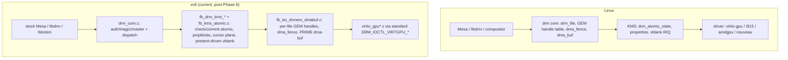

# Linux DRM / GPU Graphics ABI Compatibility Plan

Last updated: 2026-06-12 (audited; completed gap analyses and closure
narratives condensed — full versions preserved in git history and
`docs/linux-drm-abi-audit.md`. Same-day status check: §13 items 2, 3, 4, 5,
8, 9 are closed in local commits for the active queue. Item 5 is closed for
the six local C clients; NetSurf is skipped from the current titlebar-control
matrix).

**Status: the core DRM-ABI convergence work is complete for this host; the
2026-06-11 §13 active closure queue is closed.**
Phases 0–6 (§7) are landed and committed; all validators pass (Mesa virgl,
direct KMS GBM/EGL, damage-aware scanout, upstream kmscube, upstream
drm_info, libdrm modetest/drmdevice). Convergence Tasks 1–4 (§10.3) are
committed: stock Mesa/GBM bind the kernel through the standard
`DRM_IOCTL_VIRTGPU_*` UAPI, upstream Weston is the sole compositor, and the
WebKit/Skia runtime crutches are deleted. The desktop-usability defects from
the 2026-06-10 manual session are closed with runtime proof (§10.4).
Host-visible zero-copy blob is an optional, host-refused optimization
(§7 Phase 5).

**§13 now separates closed active work from deferred backlog:** live-YouTube
decode-QoS tuning, long virgl soak confidence runs, the optional host-visible
zero-copy backend, and the §10.5 host-GUI-importer runtime proof remain useful
follow-up work, but none block the 2026-06-11 closure. The typed-URL harness,
OOM victim attribution, `kcmp` `KCMP_FILE` coverage, unified local-C
titlebars, x86_64 fbdev struct-layout audit, and empty-directory housekeeping
were closed on 2026-06-11 with metrics in §13.

## Implementation status

Status verified by source reads, headless QEMU boot of the freshly built
kernel (`dma_fence: selftest ok`, all DRM nodes register, boots clean to the
Wayland desktop with no panics), and the GPU validator suite.

| Phase | State | Evidence |
|---|---|---|
| 0 — audit + `drmabitest` | **Done** | `user/programs/drmabitest`, `docs/linux-drm-abi-audit.md` baseline |
| 1 — `dma_fence` core + syncobj/sync_file | **Done (committed)** | `dev/fb/dma_fence.c`; `dma_fence: selftest ok` at boot; `SYNCOBJ_EVENTFD` real |
| 2 — per-file GEM + FLINK/OPEN + dma-buf | **Done (committed)** | per-file handle table, `fb_gem_flink`, generic dma-buf ops + mmap |
| 3 — KMS atomic + blobs + cursor + vblank | **Done (committed)** | writable propblobs, atomic out-fences, cursor plane, present-driven vblank |
| 4 — standard virtio-gpu UAPI | **Done (committed)** | `EXECBUFFER` honors fences, resource wait-by-fence, virtgpu→PRIME bridge |
| 5 — blob / host-visible / zero-copy | **Complete for this host via the transfer model; host-visible zero-copy is an optional, host-refused optimization** | Guest blobs, `F_RESOURCE_BLOB`, host-visible cap/BAR discovery, `MAP_BLOB`/`UNMAP_BLOB`, checked mmap, scanout bind, and dirty-rect flushes committed; fail-closed `HOST_VISIBLE=0` proven. See the "Host-blocked status" summary below for the probe + Alpine evidence. |
| 6 — structural cleanup | **Done (committed)** | shared `fb_shmem_*` page allocator; KMS/virtgpu split into smaller concern fragments; BO backing file renamed to `fb_bo_shmem_dmabuf.c`; retained `FB_GPU_TTM_*` private ABI labels documented as sysmem/shmem metadata compatibility names |

**Validation evidence.** All validators pass on the rebuilt image; full logs,
commit hashes, and marker caveats are recorded in
`docs/linux-drm-abi-audit.md`. Summary: Mesa virgl `gpu-validate` (dmabuf
import OK, `virtio_failures 0`, `virtio_timeouts 0`); libdrm
`modetest`/`drmdevice` against both `/dev/dri/card0` and `renderD128`;
upstream `drm_info` (full connector/CRTC/plane/property state); upstream
`kmscube` (Mesa EGL 1.5 / GLES 3.1, `virgl (D3D12 ...)`); direct KMS GBM/EGL
(`mesakmsgl`, exportable GBM BOs, ~81 FPS); damage-aware resource-bind
scanout with on-screen framebuffer proof (`scanout_rebinds=0`).

**Host-visible zero-copy blob — optional, host-refused (summary).** The
kernel guest-blob path and fail-closed `HOST_VISIBLE` plumbing are landed and
boot clean; the gap is purely host-side:

- QEMU 9.0.2's classic virgl path rejects blob outright ("blobs and virgl are
  not compatible (yet)"); the launcher auto-disables blob for virgl GPUs
  (override `QEMU_VIRGL_BLOB_OK=1`) and wires shared memfd guest RAM for the
  non-GL `virtio-gpu` blob path.
- The only host-visible-capable backend here (local QEMU 9.2.0 rutabaga)
  negotiates the 32 MiB host-visible BAR + virgl2 capset, but the init-time
  probe (`virtio_gpu_smoke_host_visible_map`) proves it **refuses** the
  mappable `HOST3D` create (`create=-5`), so `GETPARAM(HOST_VISIBLE)`
  correctly stays `0`. Verified by host round-trip, not inferred
  (`/tmp/xv6-rutabaga-hostvis-probe.log`).
- Alpine 3.23.4 (Weston/Mesa virgl) on this host drives a 66–73 FPS desktop
  using only the classic transfer model (zero blob/host-visible commands),
  which xv6 fully implements — so zero-copy is an optimization, not a
  blocker. Positive proof awaits a backend that accepts mappable host3d
  blobs (§13).

## Goal

Make the xv6-os graphics subsystem compatible with the **Linux DRM/GPU kernel
ABI** so that unmodified Linux userland graphics stacks — `libdrm`, Mesa
(`gallium`, `drm/virtio`, `kmsro`), `libgbm`, `libEGL`, Wayland compositors,
and the X/Xorg `modesetting` driver — can drive the kernel through the same
ioctl contract they use on Linux.

"Compatible" here means the same thing the syscall-ABI plans
(`docs/linux-abi-compat-plan.md`) mean for syscalls, applied to graphics:

- the same device-node layout (`/dev/dri/card0`, `/dev/dri/renderD128`);
- the same `DRM_IOCTL_*` numbers, struct layouts, and field semantics;
- the same object models (GEM handles per-file, dumb buffers, PRIME dma-buf,
  DRM syncobj / `dma_fence`, KMS atomic state);
- the same `virtio-gpu` UAPI (`DRM_IOCTL_VIRTGPU_*`) so a stock Mesa
  `virtio_gpu`/`virgl` winsys binds without xv6-specific shims.

This document is the **record + remaining-work plan** for that goal. §1–§2
describe the landed architecture; §3 lists the few genuinely open gaps; §4
records standing correctness invariants; §7 is the completed phase log; §8 is
the validation strategy (including the mandatory fullscreen-video gate); §10
records upstream convergence and the desktop-session defect closures; §13 is
the remaining work queue. The original pre-implementation gap analysis was
removed on 2026-06-11 and is preserved in git history.

This plan is scoped to **x86_64** (consistent with the syscall ABI plans).
RISC-V graphics is out of scope.

---

## 1. Current state — what xv6-os has

The kernel ships a complete DRM implementation for this target. Files (all
under `kernel/kernel/`):

| Area | File(s) | Approx LOC | Maturity |
|---|---|---|---|
| DRM generic core (device/file/auth/magic/dispatch) | `dev/drm_core.c`, `inc/dev/drm_core.h` | ~245 | Solid, device-agnostic |
| DRM UAPI numbers/structs | `inc/uabi/drm.h` | ~900 | Broad ioctl + struct coverage |
| Node registration (`card0`, `renderD128`, `gpu0`, `fb0`) | `dev/fb/fb_init_panic.c` | ~450 | Both primary + render nodes |
| KMS modesetting + properties + blobs | `dev/fb/fb_drm_core_kms.c`, `dev/fb/fb_drm_kms_*.c` | split fragments | Single-head, real queries |
| KMS atomic + page-flip + FB lifecycle | `dev/fb/fb_kms_atomic.c` | ~600 | Simplified atomic shim |
| Ioctl router | `dev/fb/fb_drm_dispatch.c` | ~600 | Dispatch table |
| GEM/BO + shmem placement metadata + dma-buf wrapper | `dev/fb/fb_bo_shmem_dmabuf.c` | ~1800 | Per-file GEM handles over shmem pages |
| syncobj + PRIME + virtgpu user ioctls | `dev/fb/fb_syncobj_prime_virtgpu.c` | ~1600 | Counter fences |
| Fence fd / dma-buf file ops | `dev/fb/fb_fd_sync.c` | ~400 | Real custom fds |
| Scanout / BO→framebuffer present | `dev/fb/fb_scanout.c` | ~1000 | virgl + CPU paths |
| virtio-gpu driver (2D + 3D virgl) | `virtio_gpu.c`, `virtio_gpu_*.c` | split fragments | Full 2D + 3D, async ring |
| Device facade ioctls (`FB_GPU_*`) | `dev/fb/fb_device_ioctl.c` | ~2200 | xv6-private UAPI |
| Hyper-V DXG present backend | `dev/fb/fb_dxg_present.c` | — | Out of DRM scope |
| Nouveau scaffold | `dev/fb/fb_nouveau.c` | — | DDA path, separate |

What works against the **real** Linux ioctl numbers:

- **DRM core**: `VERSION`, `GET_MAGIC`, `AUTH_MAGIC`, `GET_CLIENT`, `GET_CAP`,
  `SET_CLIENT_CAP`, `SET_MASTER`, `DROP_MASTER`. Render-node auth bypass and
  primary-node master arbitration are modeled (`drm_core.c`).
- **KMS queries**: `MODE_GETRESOURCES`, `GETCRTC`, `GETCONNECTOR`, `GETENCODER`,
  `GETPLANE`, `GETPLANERESOURCES`, `GETPROPERTY`, `GETPROPBLOB`, `GETFB`,
  `GETFB2`, `OBJ_GETPROPERTIES`.
- **KMS state**: `SETCRTC`, `ADDFB`/`ADDFB2`, `RMFB`, `CLOSEFB`, `PAGE_FLIP`
  (with `PAGE_FLIP_EVENT`), `DIRTYFB`, `ATOMIC` (check/commit split, real
  in/out fences, publish-after-present), `OBJ_SETPROPERTY`,
  `CREATEPROPBLOB`/`DESTROYPROPBLOB`, cursor plane wired to the virtio cursor
  queue, present-driven vblank/`CRTC_*_SEQUENCE`.
- **Buffers**: `MODE_CREATE_DUMB`/`MAP_DUMB`/`DESTROY_DUMB` backed by real
  anon pages through the unified shmem allocator; per-file GEM handle tables;
  `GEM_CLOSE`, `GEM_FLINK`, `GEM_OPEN`.
- **PRIME**: `PRIME_HANDLE_TO_FD`/`FD_TO_HANDLE` with real custom fds,
  generic dma-buf wrapper ops + `mmap`, and a virtgpu→PRIME bridge for the
  render-node → KMS-node desktop hand-off.
- **syncobj**: `CREATE`/`DESTROY`/`WAIT`/`TIMELINE_WAIT`/`SIGNAL`/
  `TIMELINE_SIGNAL`/`RESET`/`TRANSFER`/`QUERY`/`HANDLE_TO_FD`/`FD_TO_HANDLE`/
  `EVENTFD`, all rebacked on the real `dma_fence` core; exported fds are
  genuine `sync_file`s.
- **virtio-gpu**: the standard `DRM_IOCTL_VIRTGPU_*` UAPI (`GETPARAM`,
  `CONTEXT_INIT`, `RESOURCE_CREATE`, `RESOURCE_CREATE_BLOB`, `RESOURCE_INFO`,
  `TRANSFER_TO/FROM_HOST`, `WAIT`, `GET_CAPS`, `EXECBUFFER` with BO list +
  in/out fences, `MAP`) over a full 2D + 3D virgl engine
  (`RESOURCE_CREATE_2D/3D`, `ATTACH_BACKING`, `SET_SCANOUT`, `TRANSFER_*`,
  `RESOURCE_FLUSH`, `CTX_*`, `SUBMIT_3D`, `GET_CAPSET*`) with an async
  submission ring and fence reaping.

---

## 2. Architecture comparison: xv6-os vs Linux DRM

Key structural differences (the **xv6 baseline column is the original
pre-implementation state**, kept for context; the **Now** column is the landed
implementation):

| Concept | Linux | xv6-os baseline | Now |
|---|---|---|---|
| **GEM handle scope** | Per-`drm_file` handle table (`idr`) | One **global** table, isolation by `owner_id`/`tgid` | **Per-file handle table + global BO refcount; `FLINK`/`OPEN` implemented** (Phase 2) |
| **dma_fence** | First-class refcounted fence objects, fence context/seqno, cross-driver | `uint64` counters + pending-callback counts | **Real `dma_fence` core (`dma_fence.c`); syncobj/sync_file rebacked on it** (Phase 1) |
| **dma_buf** | `struct dma_buf` + attachments + sg_table, cross-device | Local-only wrapper, foreign fd rejected | **Generic dma-buf wrapper ops + mmap; virtgpu→PRIME bridge** (Phase 2/4) |
| **KMS atomic** | `drm_atomic_state` trees, check/commit, rollback, async commit, in/out fences | Validate then immediate global apply; in-fence wait rejected | **Atomic publishes after present; real out-fences signal on display completion** (Phase 3) |
| **KMS objects** | Dynamic per-HW (N CRTCs/connectors/planes, hotplug) | Static singletons (1 each), no overlay/cursor plane | **Cursor plane wired to virtio cursor queue; connector mode list exposed** (Phase 3) |
| **vblank** | HW IRQ timestamped, `drm_vblank` accounting | Synthetic 60 Hz from tick counter | **Driven from present completion; `WAIT_VBLANK`/`CRTC_*_SEQUENCE`** (Phase 3) |
| **virtio-gpu UAPI** | `DRM_IOCTL_VIRTGPU_*` (Mesa winsys target) | Standard ioctls **wired** but incomplete | **`EXECBUFFER` honors BO list + in/out fences; `WAIT` per-resource fence** (Phase 4) |
| **BO backing / memory mgr** | TTM or GEM-SHMEM, real placement/migration, mmap fault | Metadata-only naming, plain anon pages | **Unified shmem allocator; file split/TTM naming cleanup complete**. Real placement/migration remains out of scope for the single virtio scanout backend (Phase 6) |
| **Blob resources** | `VIRTGPU_RESOURCE_CREATE_BLOB`, host-visible, zero-copy | Absent (explicit transfers only) | **Code complete** — `RESOURCE_CREATE_BLOB` + `F_RESOURCE_BLOB` + host-visible SHM-cap/BAR + `MAP_BLOB`/`UNMAP_BLOB` + PFNMAP mmap; init-time map probe shows the rutabaga host actively refuses mappable host3d blobs (`create=-5`), so host-visible zero-copy stays fail-closed pending a backend that accepts them (Phase 5) |

---

## 3. Remaining gap inventory

The original pre-implementation gap inventory (per-file GEM handles,
`dma_fence`, KMS atomic, virtgpu UAPI completion, blob plumbing, fbdev/TTM
notes, …) is fully landed via Phases 0–6 (§7) and was removed from this plan
on 2026-06-11; it is preserved in git history. What genuinely remains:

- **Host-visible zero-copy blob (optional, host-blocked).** Kernel side is
  code-complete and fail-closed; needs a host backend that accepts mappable
  host3d blobs (§7 Phase 5, §13 item 6).
- **`sg_table`-equivalent scatter-list abstraction.** BOs are page arrays;
  only needed if a real DMA-capable importer (IOMMU/device DMA, a second GPU,
  v4l) ever consumes an imported buffer. Low priority for pure-sysmem QEMU.
- **fbdev struct-layout audit.** Closed for x86_64 on 2026-06-11: compile-time
  offset probes against Linux `<linux/fb.h>` and `kernel/kernel/inc/dev/fb.h`
  both report `sizeof(struct fb_var_screeninfo)==160`,
  `sizeof(struct fb_fix_screeninfo)==80`, and matching offsets for resolution,
  bitfields, `smem_len`, `line_length`, `mmio_start`, capabilities, and reserved
  fields (§13 item 8).
- **Multi-CRTC / hotplug / overlay planes.** KMS objects are static
  singletons (1 CRTC/connector/encoder + primary/cursor planes); sufficient
  for the single virtio scanout. Out of scope until a multi-head target
  exists.
- **`kcmp` syscall.** `KCMP_FILE` support is implemented for same-process file
  descriptor comparison and covered by `drmabitest` (§13 item 8).

---

## 4. Standing correctness invariants

The semantic mismatches originally listed here (global GEM handle scope,
atomic in-fence rejection, never-signaling out-fences, `CREATEPROPBLOB`
rejection, PRIME foreign-fd rejection, non-`sync_file` syncobj fds) are all
fixed (§7). Keep these invariants when touching the code:

1. **Caps = behavior.** Never advertise a `GET_CAP`/`GETPARAM` capability
   whose ioctl path returns `-EOPNOTSUPP`; flip the cap in the same change
   that implements the feature (`gpu_drm_get_cap`, virtgpu `GETPARAM`
   blob/host-visible advertising).
2. **Fail-closed, honest errno.** Unimplemented paths return the Linux errno
   a real driver would; never fake success to make a validator pass.
3. **Fences must signal.** Any exported fence/out-fence must be backed by a
   real completion; a never-signaling fd hangs a compositor's frame loop.
4. **Per-file handle scope.** PRIME import must create a *new* handle in the
   importing file; `GEM_CLOSE` drops only the file's reference, never the
   global BO.

---

## 5. Structural improvements — landed

All landed via Phases 1–6: the `dma_fence` core (`dev/fb/dma_fence.c`)
backing syncobj/dma-buf/sync_file/atomic fences; per-file GEM handle tables
with global BO refcounts; the unified shmem BO allocator shared by GEM, dumb,
virtgpu, and dma-buf; real atomic state objects with a check/commit split;
the generic dma-buf ops vtable; the KMS/virtgpu file splits; and the thin
`DRM_IOCTL_VIRTGPU_*` translation layer over the existing engine (with
`FB_GPU_*` retained as an internal/diagnostic UAPI).

---

## 6. Performance improvements — landed

Realized: present-completion-driven vblank pacing (no synthetic 60 Hz ticks),
damage-aware `MODE_DIRTYFB`/`FB_DAMAGE_CLIPS` → `RESOURCE_FLUSH` partial
rects, resource-bind scanout (no readback) whenever the FB is a virgl
resource, the async submit ring exposed through `EXECBUFFER`, and uniform
`DONTFORK|DONTDUMP` BO mappings via the unified allocator. The one remaining
perf item — zero-copy host-visible blob — is host-blocked and optional
(§13 item 6); the Alpine evidence shows the transfer model sustains a
66–73 FPS desktop on this host without it.

---

## 7. Phased roadmap

Ordered by dependency and compatibility payoff. **Phases 0–4 and Phase 6 are
landed and committed; Phase 5 is complete for this host via the
Alpine-validated transfer model, with host-visible zero-copy demoted to an
optional optimization the host refuses** (see status table at the top). Detail
is retained below for reference and for the remaining host-dependent work.

### Phase 0 — Audit & truthfulness — **DONE**
- `GET_CAP` values reconciled with behavior (`gpu_drm_get_cap`).
- `drmabitest` probe added (`user/programs/drmabitest`); baseline captured in
  `docs/linux-drm-abi-audit.md`.

### Phase 1 — dma_fence core + syncobj/sync_file correctness — **DONE**
- `dma_fence` implemented in `dev/fb/dma_fence.c` (boot self-test passes).
- syncobj rebacked on `dma_fence`; exported syncobj/PRIME fds are real
  `sync_file`s; `SYNCOBJ_EVENTFD` signals via `eventfd_signal_file`.

### Phase 2 — Per-file GEM table + FLINK/OPEN + dma-buf generalization — **DONE**
- Per-`drm_file` handle table with global BO refcount; `GEM_CLOSE` drops only
  the file's reference.
- `GEM_FLINK`/`GEM_OPEN` (`fb_gem_flink`); PRIME import creates a new per-file
  handle; generic `dma_buf` wrapper ops + `mmap`.

### Phase 3 — Real KMS atomic + CREATEPROPBLOB + cursor/planes — **DONE**
- Writable `CREATEPROPBLOB`/`DESTROYPROPBLOB`.
- Atomic state published after a successful present; real `OUT_FENCE_PTR`
  signalled from display completion.
- CURSOR plane wired to the virtio-gpu cursor queue; legacy `ADDFB` shim;
  connector mode list exposed.
- vblank/sequence driven from present completion.

### Phase 4 — Complete the standard virtio-gpu UAPI — **DONE**
- `VIRTGPU_EXECBUFFER` honors BO handles + in/out fence fds; `VIRTGPU_WAIT`
  waits the resource's last-submit fence; virtgpu resources bridge to PRIME
  export for the render-node → KMS-node desktop hand-off.
- Validated end-to-end with **stock** Mesa `virgl_drm_winsys` against
  `renderD128` (§10.3 Task 1; all GPU validators GREEN, custom winsys
  deleted).

### Phase 5 — Blob resources + zero-copy + damage present — **COMPLETE (transfer model); host-visible zero-copy optional/host-refused**

- **Landed (committed):** `VIRTIO_GPU_F_RESOURCE_BLOB` negotiation +
  `RESOURCE_CREATE_BLOB`; 64-bit shared-memory PCI cap discovery with
  on-the-fly BAR assignment; the host-visible region
  (`VIRTIO_GPU_SHM_ID_HOST_VISIBLE`) + `RESOURCE_MAP_BLOB`/`UNMAP_BLOB`;
  `VIRTGPU_MAP` returning the real blob offset; `GETPARAM` advertising
  `HOST_VISIBLE`/`RESOURCE_BLOB` **only** when negotiated;
  bounds/ownership-checked user mmap with `VMA_FLAG_PFNMAP` fault semantics;
  resource-bind scanout preference and dirty-rect flushes. The launcher
  (`QEMU_VIRTIO_GPU_BLOB=auto`) wires `blob=true,hostmem=…` + shared memfd
  RAM for non-GL `virtio-gpu`; a headless boot proves `RESOURCE_BLOB=1` and
  fail-closed `HOST_VISIBLE=0`.
- **Host-visible map probe:** `virtio_gpu_smoke_host_visible_map()` runs once
  at init when a host-visible aperture is negotiated; against the rutabaga
  backend the host rejects the mappable `HOST3D` create (`create=-5`), so the
  cap stays `0` — a **verified host refusal**, not an untested gap
  (`/tmp/xv6-rutabaga-hostvis-probe.log`).
- **Alpine-validated transfer model (the working solution on this host):**
  traced Alpine 3.23.4 Weston/Mesa virgl issues **zero** blob/map-blob
  commands and presents purely through the classic transfer model at 66–73
  FPS (`scripts/gpu/alpine-virgl-desktop-capture.sh`,
  `build-x86_64/alpine-trace/`). xv6 implements every command in that
  histogram, so guest Mesa falls back to the same path under fail-closed
  `HOST_VISIBLE=0`. No guest or kernel changes are needed to match Alpine.
- **Remaining:** positive virgl+blob zero-copy needs a host backend that
  accepts mappable host3d blobs — tracked as §13 item 6, off the critical
  path.

### Phase 6 — Structural cleanup — **DONE**
- Unified shmem BO allocator, KMS/virtgpu file splits, and TTM-naming retirement
  are committed and validated by the post-cleanup `drmabitest`/`gpu-validate`
  runs.

---

## 8. Validation strategy

Follow the existing ABI-audit discipline (do not declare a path dead from
source alone — runtime-trace it; see `xv6-os-runtime.md`).

**Validation tiering (keep runs cheap).** Scale the validator set to the
change: kernel DRM/virtgpu changes → `drmabitest` (or the focused
`--virtgpu-only` probe) + the one validator owning the touched path + the
step-7 gate; compositor/client changes → the affected runtime validator +
the gate; rootfs/asset-only changes → the gate alone. Run the **full**
validator sweep (steps 1–6) only for kernel ABI changes or before declaring
a milestone. The step-7 gate (~5 min) is always mandatory after any
GPU/DRM/desktop change. Build only the narrowest targets first (§13 build
matrix); never rebuild `world`/toolchain for validation.

**Host readiness (2026-06-07):** KVM (`/dev/kvm`), `tun`, and `memfd` are
present; `/dev/udmabuf` is **now available** (custom WSL2+ kernel) and QEMU
9.0.2 exposes `blob`/`hostmem`/`max_hostmem`. `scripts/launch/run-qemu.sh`
auto-enables `blob=true,hostmem=…` for non-GL `virtio-gpu` devices when
`/dev/udmabuf` is readable (`QEMU_VIRTIO_GPU_BLOB=auto`) and adds the required
shared memfd guest RAM backend. The same script intentionally disables blob on
this host's `-gl` virgl devices because QEMU 9.0.2 rejects classic virgl + blob
before boot.

**Boot caveat:** the GTK `gl=es` GUI path can stall at GtkGLArea in this WSLg
environment and produces no debugcon output. Use a **headless** boot
(`DISPLAY_MODE=nographic`, serial captured) for kernel-boot/DRM-init checks;
use the GTK `-gl` path only for actual virgl present/scanout validation. A
headless boot of the current kernel already shows `dma_fence: selftest ok`, all
DRM nodes registering, and a clean desktop start.

1. **`drmabitest`** — exercise every ioctl with known-good and error inputs,
   asserting Linux-matching errno and struct output. The audit file has been
   refreshed against the current kernel with full-suite and focused
   virtgpu/blob probes.
2. **libdrm conformance** — `modetest`, `kmscube`, `drm_info` against
   `/dev/dri/card0`.
3. **Mesa bring-up** — build stock Mesa `gallium-drivers=virgl`; confirm
   render-node virgl through the staged validators. This repo image does not
   currently stage upstream `eglinfo`/`es2gears`, so the current proof uses
   stock Mesa paths exercised by `gpu-validate`, `kmscube`, the direct KMS
   GBM/EGL validator, `mesawlegl`, and `mesaglsmoke`.
4. **Blob/zero-copy** — with `blob=true,hostmem=…` (udmabuf), verify
   `VIRTGPU_GETPARAM(RESOURCE_BLOB)==1`; on this host, verify the non-GL guest
   blob path and fail-closed `HOST_VISIBLE=0`. Treat full mappable virgl blob
   zero-copy as an optional backend optimization: Alpine's working virgl path on
   this host uses the classic transfer model with zero blob/map-blob commands.
5. **Compositor end-to-end** — the Wayland compositor + WebKit/GL apps remain
   the integration test; compare trace shape + on-screen output + guest
   framebuffer samples, never counters alone.
6. **Regression guard** — keep fail-closed counters; assert caps and behavior
   agree (§4.4), especially the new blob/host-visible `GETPARAM` advertising.
7. **Fullscreen video playback performance gate (MANDATORY)** — a video
   **must** play **smoothly in fullscreen mode at the default resolution**
   before any GPU/DRM milestone is declared validated. This is a hard release
   gate, not an optional check. The canonical realization is **offline and
   deterministic** (no network), so the gate is reproducible in CI: a
   high-resolution / high-FPS local clip is decoded by the in-guest WebKit GL
   path and composited to the default-resolution scanout. (A live YouTube run
   over a TAP/NAT network is an acceptable equivalent when a network is wired,
   but the local gate is the reproducible source of truth.) Assets + harness
   in-repo:
   - `rootfs-overlay/share/webkit/perf-1280x800-60fps.mp4` — 1280×800 @ **60
     fps** H.264 (Main/`yuv420p`), 30 s, with a burned-in frame counter +
     timestamp overlay so stutter/tear is visually judgeable. 1280×800 matches
     the default `video=1280x800` boot mode, so no scaling distorts the FPS
     measurement.
   - `rootfs-overlay/share/webkit/perf-video.html` — fullscreen player that
     measures decoded FPS (`getVideoPlaybackQuality`) and playback speed
     (`advanced / wall`), driving the HUD and a host-visible
     `xv6-perf-video:RESULT …` window-title marker. (Note: this WebKitGTK build
     exposes `requestVideoFrameCallback` but never fires it, so `presentedFPS`
     is 0 — rely on `decodedFPS` + `speed`.)
   - `scripts/gpu/perf-video-gate.expect` — boots `gtk` + `virtio-vga-gl-primary`
     at `video=1280x800`, loads
     `webkit_url=file:///share/webkit/perf-video.html`, and captures an in-guest
     `fbstat ppm-current` framebuffer snapshot **during** live playback (the
     QEMU monitor `screendump` returns "no surface" for the GL surface, and
     `desktop_exit_after_smoke=1` tears the scanout down after RESULT, so the
     snapshot must be taken mid-playback).

   The run passes only when **all** of the following hold for a sustained
   capture window:
   - Continuous, tear-free presentation at the desktop's default resolution
     with the player reporting/holding fullscreen (no letterboxed fallback to a
     smaller surface, no mode change).
   - Smooth playback with no stutter, frame freezes, or stalls: decoded frame
     counters advance monotonically and `speed ≥ 0.9×` real time
     (`dropPct < 10`).
   - Zero `virtio_failures`, zero `virtio_timeouts`, zero panics/coredumps, and
     no compositor or virgl error markers across the capture.
   - Evidence is a guest framebuffer screenshot **and** the trace/fbstat capture
     showing advancing present counts at the default resolution (never counters
     alone; capture on-screen output as well). Treat any stutter, resolution
     downgrade, non-fullscreen fallback, or fault as a **FAIL** for the whole
     milestone.

   **Proven result (2026-06-09, Task-1 stock-winsys image).**
   `RESULT pass fps=60.1 speed=1.001 decodedFPS=60.1 dropPct=0.00
   advanced=15.18` — 60 fps decode, **zero dropped frames**, perfect real-time
   playback. The in-guest framebuffer snapshot
   (`build-x86_64/perf-video-gate/perf-video-frame.png`, 92% non-black) shows
   the live video (overlay counter advancing, HUD `decoded=… dropped=0`) inside
   the WebKit window on the xv6 desktop at 1280×800.

   **Current-tree revalidation (2026-06-11).**
   `expect scripts/gpu/perf-video-gate.expect` passed after the `kcmp` and
   `/dev/kbd` changes with
   `RESULT pass fps=59.0 speed=1.001 presentedFPS=0.0 decodedFPS=59.0
   dropPct=0.00 advanced=15.29`; the harness also captured
   `fb_ppm_current path=/perf-video-frame.ppm screen=1280x800 scanout=1280x800`
   during playback and reached `__WEBKIT_API_SMOKE_DONE_0__`.

---

## 9. Existing-compositor adoption (Weston) — DONE (historical)

This section originally held the verified gap analysis and bring-up plan for
replacing the custom `wlcomp` compositor with upstream Weston. The adoption is
**complete** (see §10.3 Tasks 2–3): upstream Weston is the sole compositor,
the libinput/libudev/libseat/libevdev/hwdata/xkeyboard-config ports landed,
the libinput shim feeds `/dev/mouse` + `/dev/kbd`, DRM device discovery is
direct (no udev), and `wlcomp.c` was deleted in the same change (one-way
cutover; §8 step-7 gate green). The pre-adoption gap tables and bring-up steps
were removed on 2026-06-10 as no-longer-actionable; they are preserved in git
history.

### 9.2 Additional gaps before a *full* desktop environment (GNOME/Plasma)

These are **not** required to bring up a bare compositor, but a full DE assumes
them. All verified absent on the target:

- **D-Bus message bus** — no `libdbus`/`dbus-daemon` port (GLib ships `GDBus`
  source but still needs a running session + system bus).
- **PAM / login auth** — no `libpam`/`pam_start`.
- **polkit** — not ported (only referenced in glib NEWS).
- **NetworkManager** — not ported (only glib translation strings).
- **Audio (PipeWire/PulseAudio/ALSA)** — none; no `/dev/snd` device at all.
- **Service/session manager (systemd/elogind/OpenRC)** — boot is a single
  `/init` → startup script (`scripts/image/make-initrd.sh`), not a managed
  session.
- **Display manager / greeter (GDM/SDDM/greetd)** — GUI is launched directly.
- **XWayland / X11 server** — now staged through Weston's Xwayland bridge for
  the host-GUI importer track. The first proof target is Python IDLE/Tk; broader
  X11 app coverage is still gated on the §10.5 support matrix.
- **Settings/portal stack** (xdg-desktop-portal, accountsservice, upower) —
  absent, and blocked behind D-Bus anyway.

**Conclusion:** a full DE is a platform-services project (the D-Bus/logind/
audio/portal set above), not a compositor swap. Swapping in a single compositor
is bounded by §9.1 only.

### 9.3 Bring-up plan — executed and removed

The seven-step bring-up plan (Weston port, direct-launcher seat path,
`/dev/mouse` + `/dev/kbd` libinput shim, hardcoded DRM node discovery, xkb
keymap, one-way launcher cutover, §8 re-validation) was executed as written;
the §8 step-7 gate passed under Weston and `wlcomp.c` is deleted. Details are
in §10.3 Tasks 2–3 and git history.

---

## 10. Upstream convergence for the ported graphics libraries

**Goal:** run each graphics library as close to its upstream source as
possible, where the *only* xv6-specific divergence is a **signature** — an
upstream-supported build option or a single platform identifier — and **never**
a fork, a source patch, or a bespoke replacement library.

### 10.1 Principle: signature, not fork

Classify every current divergence into one of two buckets and drive everything
toward the first:

- **Acceptable signature (keep).** Configuration that upstream already exposes
  and that merely *selects* behavior for this target. Examples: meson/CMake
  feature switches (`-Dplatforms=wayland`, `-Dglx=disabled`,
  `-Dgallium-drivers=…`, `-Dvulkan-drivers=`, `-Dprint_backends=none`,
  `-Denable-x11=false`), and one canonical platform define (`DETECT_OS_XV6` /
  `__xv6__`) that resolves to **standard** code paths. These are not forks; they
  are how upstream is meant to be configured for a Wayland-only, software/virgl
  target.
- **Divergence to eliminate (retire).** Custom replacement libraries, source
  `.patch` files, runtime monkey-patching, and any private ioctl surface. Each
  of these is a maintenance liability and is removed by closing the underlying
  gap so stock upstream code runs unmodified.

The deciding question for each item below: *can upstream code, configured only
through its own options, run unchanged?* If yes, the gap is closed and only a
signature remains.

### 10.2 Gap → convergence map — executed

Every row below is done except the out-of-scope Nouveau row.

| Gap (from the port audit) | Divergence (now retired) | Upstream-convergent action | Residual xv6 signature |
|---|---|---|---|
| Custom FB-GPU submit ioctls | `virgl_xv6_winsys.c` + `FB_GPU_VIRGL_*` (0x4619–0x4626) replacing Mesa's DRM winsys | Point Mesa at its **stock** `virgl_drm_winsys` over the standard `DRM_IOCTL_VIRTGPU_*` UAPI shipped in Phase 4 (§7); delete the custom winsys | Just opening `/dev/dri/renderD128`; `DETECT_OS_XV6` selects the Wayland/virgl config, not a private path |
| Custom GBM library | `xv6-gbm` over `FB_GPU_BO_*` (0x4616/0x4623…) | Use Mesa's upstream `gbm_dri` against standard DRM GEM dumb + PRIME from Phase 2 (§7) | Build-option selection only |
| Incomplete GL/EGL symbols | libepoxy patches `0001`/`0002` add a stub resolver returning 0 | Close the EGL/GLES symbol coverage in Mesa so every symbol epoxy resolves is real; drop both patches | None (upstream libepoxy + `-Degl=yes -Dglx=no -Dx11=false`) |
| No upstream compositor | custom `wlcomp.c` (sidesteps libinput/udev/seatd/logind) | Execute the §9 Weston bring-up: add the libinput/seat glue, run upstream Weston as the **sole** compositor, then delete `wlcomp` in the same change (one-way cutover, no fallback) | Weston config + xv6 seat/udev shim, not a compositor fork |
| WebKit/Skia fault | `xv6memshim.c` SIGSEGV/`RIP`-patcher (`xv6_webkit_skia_recovery_installed`) | Root-cause the faulting access and fix it in the WebKit/Skia port (or libc); remove the runtime patcher entirely | None |
| GTK init + printing | gtk3 patch `0001` (display-manager once-init), patch `0002` (allow no print backends) | Submit `0001` upstream (or confirm upstream is already thread-safe) and drop it; replace `0002` with the upstream `-Dprint_backends=none` option if accepted upstream | `-Dprint_backends=none` signature only |
| No udev / driver discovery | libdrm `-Dudev=false`, Mesa loader hand-wired | Provide a libudev-ABI-compatible shim (or eudev) so `-Dudev=true` works the upstream way; let Mesa discover drivers normally | A small libudev shim package |
| Fail-closed Nouveau only | libdrm `-Dnouveau=enabled` alone, skeleton UAPI | Out of scope here (tracked separately in §11); does not block convergence of the Wayland/virgl stack | n/a |
| libdrm version floor | drm_info patch relaxing the ≥2.4.134 check to accept 2.4.133 | Bump the xv6 libdrm port to ≥2.4.134 and drop the drm_info patch | None |
| No xkb data at runtime | libxkbcommon stages xkeyboard-config from host | Package xkeyboard-config in the rootfs as a normal data dependency (upstream-compatible) | `-Denable-x11=false` signature only |
| No LLVM / `kcmp` | mesa `-Dllvm=disabled`, `-Dallow-kcmp=disabled` | `-Dllvm=disabled` is a legitimate upstream signature (software/virgl target) — keep. `kcmp(KCMP_FILE)` is implemented and runtime-tested, so Mesa can return to its upstream `-Dallow-kcmp` default when the port config is next refreshed | `-Dllvm=disabled` only |

### 10.3 Convergence todo list — **DONE (all four tasks committed)**

Every task passed its named validators plus the §8 step-7 fullscreen-video
gate before its divergence was deleted, validated on trace shape + on-screen
output + framebuffer samples, never counters alone. The detailed per-task
validation narratives were condensed on 2026-06-11; full versions are in git
history and `docs/linux-drm-abi-audit.md`.

**Commit ledger:**

| Round | Commits |
|---|---|
| Task 1 — stock Mesa/GBM substrate | super `e404aa8`, kernel `512fac7`, ports `7954144` |
| Tasks 2–4 — libraries/Weston/shim removal | ports through `5c22780`, super checkpoint `b091811` |
| Weston desktop-session round | super `7afc7f2`, ports `fc3cf3c`/`0027fa3`, Weston `5543c81`, user `d96d83c` |
| Cursor/minimize round | kernel `f9d20fd`, user `dd0becb`, ports `290f68f` (Wayland `3c5ad4f`, Weston `f046fa6`) |

**Follow-up Weston desktop-session rounds (committed, condensed).** On top of
the Task 2–4 checkpoint: libinput absolute-pointer + keyboard events fed from
`/dev/mouse`/`/dev/kbd`; shell-owned `/root/desktop` icons drawn by
`weston-desktop-shell` (selection highlight + `Exec=` double-click launch
proven live); Adwaita Xcursor theming + staged DND cursor aliases; real
`Exec=` lines for the former `X-XV6-Builtin=` entries; Cairo fallback glyphs
for panel/frame icons; the explicit wl_shm present-buffer format helper; and
virtio-gpu hardware-cursor positioning proven over the cursor virtqueue. The
cursor-image black-box and panel-task-list defects found in these rounds are
closed in §10.4 items 4–5. Live-VM inspection proved the full virtio-tablet →
`virtio_input` → mouse ring → libinput shim → Weston pointer pipeline and the
WebKit keyboard path (`typed:a`).

**Tooling caveats for future sessions:** QEMU HMP `mouse_move` is silently
dropped for the virtio-tablet (buttons deliver, motion does not) — drive the
pointer with guest-side `mouseinject`. Guest `mousetest` reads 0 events
because the libinput shim drains the ring continuously. The hardware cursor
is invisible in `fbstat`/scanout captures by design (QEMU composites the
cursor plane host-side) — do not treat cursor-not-in-framebuffer as a
regression. xv6 `sh` has no `>>`/`2>&1`, and long serial lines truncate —
build multi-command sequences with short `echo`-into-file + `sh file` steps.

**Task record:**

- [x] **1. Kernel adapted to upstream Mesa/GBM (`virgl_xv6_winsys.c` and
      `xv6-gbm` retired).** Stock Mesa `virgl_drm_winsys` and upstream
      `gbm_dri` bind `/dev/dri/card0` + `renderD128` through the standard
      `DRM_IOCTL_VIRTGPU_*` + GEM-dumb/PRIME UAPI with no private `FB_GPU_*`
      ioctls; the custom winsys source and the `xv6-gbm` library are deleted;
      `DETECT_OS_XV6` remains as the intended signature. Validated:
      `drmabitest` (Linux-matching errno; the lone non-blob
      `cross:DRM_PRIME_VIRTGPU_RESOURCE` fail under a plain `virtio-gpu` boot
      is expected fail-closed), upstream `drm_info` + `modetest`,
      `scripts/gpu/virgl-kms-validate.sh`, `scripts/gpu/gpu-validate.sh`,
      `scripts/gpu/virgl-desktop-validate.sh` — all GREEN; §8 step-7 gate
      PASS (`RESULT pass fps=60.1 dropPct=0.00`, framebuffer proof).
- [x] **2. Missing libraries added; toolkit/version source patches dropped.**
      New ports: `libudev`, `libinput`, `libseat`, `libevdev`, `hwdata`,
      `xkeyboard-config`, upstream Weston. Deleted patches: gtk3
      `0001`/`0002`, libepoxy `0001`/`0002` (+ `EPOXY_XV6_ALLOW_MISSING`),
      drm_info version relax; libdrm bumped ≥2.4.134; xkeyboard-config staged
      as a normal rootfs data dependency. Validated by the
      `port-wayland`/`image` builds plus the full GPU/WebKit validator set.
- [x] **3. Compositor migrated to Weston (`wlcomp.c` deleted, one-way
      cutover — no fallback, no env toggle, no revert).** `desktop.c` execs
      `/bin/weston`; the image has `/bin/weston` + `/bin/weston-session` and
      no `/bin/wlcomp`/`/bin/desktop`. All GPU/WebKit validators pass through
      Weston; §8 step-7 PASS via the WebKitGTK API-smoke oracle
      (`webkit_api_smoke=1`, `RESULT pass fps=59.8 dropPct=0.00`,
      `effective_accel=1`, `gpu_contract=virgl-opengl-submit`, in-guest
      framebuffer proof). The then-residual MiniBrowser UI-client commit
      stall was later root-caused and fixed (§10.4 item 3).
- [x] **4. WebKit/Skia root-caused (`xv6memshim.c` deleted).** Both runtime
      crutches removed: the scalar `mem*`/`mem*_chk` override (glibc AVX2
      `mem*` works once the kernel enables AVX/YMM; host has no AVX-512) and
      the Skia null-`this` SIGSEGV/`RIP`-patcher (a vestigial mask for
      GPU-context loss from the old private winsys deleted in Task 1), plus
      the `pthread` recovery watchdog. WebKit boots accelerated under Weston
      to `__WEBKIT_API_SMOKE_DONE_0__` with no SIGSEGV/SIGILL/stack-smash and
      no recovery installed. Validated:
      `scripts/gpu/webkit-virgl-gpu-validate.sh`,
      `scripts/gpu/validate-webkit-runtime.sh`; §8 step-7 PASS on Weston.

**Signatures that remain** (acceptable, not forks): the
Wayland-only/virgl/no-X11/no-LLVM build options on Mesa/GTK/libepoxy/
libxkbcommon, and a single `DETECT_OS_XV6` platform define that selects those
**standard** code paths. No replacement libraries, no source patches, no
runtime monkey-patching, no private ioctl winsys survive.

### 10.4 Desktop-session defects from the 2026-06-10 manual session — closure log

A hands-on desktop session surfaced the defects below; each was triaged
against the source and fixed with runtime proof. Validation for every fix:
fresh image boot, guest-side `mouseinject` interaction where relevant,
framebuffer/screenshot proof, and a green §8 step-7 gate. The full
per-fix evidence narratives were condensed on 2026-06-11; complete versions
are in git history. Residual follow-ups extracted from this log live in §13.

1. **Fixed 2026-06-11 — client-drawn titlebars for all non-toytoolkit
   clients (filemgr, Peanut-GB, GL Smoke, Mesa GL Smoke, Mesa EGL Demo,
   GL Maze, NetSurf).** Defect: no window titlebar on any client not based
   on Weston's toytoolkit. Root cause: those clients create bare
   `xdg_toplevel` surfaces with no client-side decorations and no
   `zxdg_toplevel_decoration_v1` request, and Weston's desktop-shell draws
   **no** server-side decorations (`weston-terminal` has titlebars only
   because toytoolkit draws CSD frames). Fix: each client now reserves a
   30-pixel client-drawn titlebar with title text plus
   minimize/maximize/close controls wired through xdg-toplevel requests
   (drag included), shifting its hit testing/viewport below the bar:
   `filemgr` (`Files - <cwd>`), Peanut-GB (`Peanut-GB - <ROM title>`),
   `glsmoke` (`xv6 GL Smoke`), `mesaglsmoke` (`Mesa GL Smoke`),
   `mesawlegl`/`mesademo` (`Mesa 3D Demo`), `glmaze` (`GL Maze`; controls
   are CPU-drawn into the shm-present buffer after GL readback — a GL-side
   overlay attempt reproduced the virgl async-timeout/EIO spiral and was
   abandoned, §13 item 2), and NetSurf (a GTK client-side control row inside
   the content box in `frontends/gtk/scaffolding.c`; minimize is a no-hide
   `gtk_window_present()` until a true task-restore flow exists, maximize is
   a conservative resize toggle). Every slice was proven on a fresh image
   with framebuffer captures of the visible titlebar plus guest-side
   `mouseinject` minimize/maximize/close clicks, and the §8 step-7 gate
   re-passed after each rebuild (`RESULT pass fps≈60 dropPct=0.00`,
   `__WEBKIT_API_SMOKE_DONE_0__`). Known leftovers: Mesa EGL Demo min/max
   automation was not clean enough for screenshot proof (request wiring is
   implemented); NetSurf content still reports `about:welcome`/`BadEncoding`
   (separate defect); the unified decoration strategy — (a) port `libdecor`,
   (b) rebase the GL demos onto toytoolkit, or (c) server-side
   `xdg-decoration` in the shell — is §13 item 5.

2. **Fixed 2026-06-10 — desktop launcher labels match their targets.**
   Misleading placeholder entries were renamed or removed in
   `scripts/image/make-rootfs.sh`: `Info` → `Proc Files` (`/bin/filemgr
   /proc`), `Settings` → `Config Files` (`/bin/filemgr /etc`), `Calc` →
   `Python` (`/bin/weston-terminal --shell=/bin/python3.12`); the duplicate
   `Network`/`Monitor` shell-terminal placeholders were deleted. Verified by
   `debugfs` inspection of the rebuilt `fs.img` (old entries absent, new
   `Name=`/`Exec=` pairs present), a boot logging `loaded 14 desktop
   entries`, and a green §8 step-7 gate.

3. **Fixed 2026-06-11 — MiniBrowser launch, local content, and live-YouTube
   visible playback validated under Weston.** This closure stacked several
   independent root causes, each fixed and runtime-proven:
   - **Network prerequisite (2026-06-10):** QEMU slirp + e1000 proven on a
     fresh boot — lwIP up at `10.0.2.15`, DNS via `10.0.2.3` (`dnsstress`
     pass, `NETPREREQ-DNS-RC=0`), TLS 1.3 to `google.com`
     (`NETPREREQ-TLS-RC=0`).
   - **Icon-launch environment:** `weston-desktop-shell` launched MiniBrowser
     via bare `execl` with no env/URL. Fix: `desktop.c` gained
     `--launch-webkit [url]` reusing the validated `launch_client` path (env,
     GPU policy, resolv.conf sync); `webkit.desktop` execs
     `/bin/weston-session --launch-webkit`.
   - **Env-array overflow:** adding a debug env var pushed the accelerated
     WebKit env to exactly xv6 `MAXENV` (64), leaving no NULL terminator —
     `execve failed errno=1`. Fix: removed the stale `WEBKIT_XV6_SYNC_PAINT`
     plumbing to restore headroom.
   - **Frame clock:** `WEBKIT_FORCE_VBLANK_TIMER=1` is now the WebKit default
     (`webkit_force_vblank_timer=0` opt-out) — local perf-media playback went
     from stationary to visibly advancing (~653k changed pixels across a 2 s
     capture pair).
   - **YouTube compat downgrade removed:** the stale override that turned off
     `WEBKIT_FORCE_COMPOSITING_MODE` under `webkit_youtube_compat=1` is
     deleted (`webkit_disable_compositing=1` kept for A/B).
   - **Stale-video root cause:** the default CPU/videoconvert GStreamer sink
     held the same visible frame for 30+ host samples; the GStreamer **GL**
     sink is now the YouTube-compat default (`webkit_gst_gl=0` opt-out),
     after which every host-visible sample pair advanced.
   - **xv6 ABI bug — hard links:** WebKit cache `Failed to create hard link`
     churn was xv6's fault: `sys_vfs_linkat()` copied user paths into
     128-byte `MAXPATH` buffers while WebKit's destination paths are ~166
     bytes. `link`/`linkat` now use the 4096-byte VFS user-path helpers
     (kernel commit `889a39a`); post-fix runs show zero hard-link failures.
   - **Kernel OOM kill-path and attribution:** a WebKit-induced OOM exposed a
     `thread_group` lifetime bug (slab double-free → `IPI_REASON_CRASH`
     machine halt). OOM now holds a real `thread_group` reference across the
     scan/kill window and scores victims from lock-free live RSS
     (`mm_rss_pages`), not `mm_peak_vm`. Proven by three 768 MB stress boots
     selecting `python3.12` as the victim with nonzero `rss_pages` and
     `OOMTEST-DONE oom=1 done=1 survived=1` (§13 item 3).
   - **Decode-QoS jitter (residual, §13 item 1):** remaining live-YouTube
     jitter is `avdec_h264` "Dropping frame due to QoS" pressure (39 drops
     over ~65 s, lateness up to ~200 ms), not a present stall.
    `WEBKIT_GST_MAX_AVC1_RESOLUTION=360P` is the YouTube default
    (`webkit_gst_max_avc1=VALUE` override; legacy
    `webkit_gst_max_avc1_480p=1` still selects 480P), and
    `webkit_gst_debug_persist=1` persists GStreamer/runtime probe logs across
    shutdown. The MiniBrowser `webkit_web_view_load_uri` interposer also
    canonicalizes typed hostnames such as `www.youtube.com` to HTTPS and applies
    the YouTube media env for typed navigation, not just launch-time URLs.
   Final validation: desktop-icon double-click → visible Google search
   results (framebuffer proof, `/tmp/icon-webkit-explicit.png`); the staged
   `/share/webkit/human-button.html` fixture renders in 10 s; real
   watch-page runs advance in every scoped host-visible player-crop sample
   (all adjacent pairs changed, no virgl timeout, KMS EIO spiral, OOM, fatal
   fault, or cache failure markers); §8 step-7 gate green after every
   rebuild. Do not reopen the fixed blank-page or stale-present bugs without
   matching framebuffer/log evidence. Harnesses kept for future sessions:
   `tmp/icon-webkit-validate.expect`, `tmp/launchmode-webkit-validate.expect`,
   `tmp/webkit-autoprobe.expect`, `tmp/webkit-youtube-host-cadence.expect`.
   Tooling notes: drive icon clicks as explicit press/release pairs with
   shell round-trips (not `dblclick` bursts); pre-arm delayed framebuffer
   captures instead of post-launch serial readback; treat post-launch
   serial stalls as harness/TTY limitations absent framebuffer/GDB/kernel
   evidence.

4. **Fixed 2026-06-10 — visible cursor no longer uploads an empty/black-box
   image.** Root cause: Weston/Wayland cursor shm pool growth remapped the
   pool without preserving cursor bytes already written into the old mapping;
   `shm_pool_resize()` now copies the used bytes across remap. Proof on a
   fresh image: `fbstat` reports `kms_cursor_uploads=1`,
   `kms_cursor_upload_failures=0`, `alpha_nonzero=254` (was all-zero), and a
   focused `webkitabitest wayland-shm` case proves the kernel
   tmpfs/MAP_SHARED content-preserve contract independently of Weston. The
   cursor remains absent from framebuffer dumps by design (QEMU composites
   the hardware cursor plane host-side).

5. **Fixed 2026-06-11 — Weston panel exposes task tabs; minimize is
   reachable.** Defect: stock desktop-shell's panel hosted only launchers +
   clock, so running apps had no panel presence and minimize would strand
   windows. Fix: the private `weston_desktop_shell` protocol gained task
   add/remove/active events plus an `activate_task` request; the shell
   assigns stable task IDs to mapped toplevels, replays them on shell-client
   bind, and sends active state on focus changes; `weston-desktop-shell`
   draws clipped task tabs between launchers and clock (click raises an
   inactive task, click on the active tab minimizes it); titlebar minimize
   now calls the shell minimize path. Proof: framebuffer captures show both
   `Wayland Terminal` and NetSurf tabs, tab-click raise, and active-tab
   minimize with the other window re-exposed
   (`tmp/weston-tasklist-validate.expect`); §8 gate green after the final
   shell change (`RESULT pass fps=60.0 dropPct=0.00`,
   `__WEBKIT_API_SMOKE_DONE_0__`).

---

### 10.5 Host GUI programs as native guest processes — complete-support track

The goal is simple: an x86_64 Linux GUI binary from the host should be able to
run **inside xv6** as a normal guest process. xv6 should provide the Linux ABI
that the program expects; the answer is not host-side forwarding, a remote
desktop trick, or per-application rewrites.

Implementation plan:

- **Importer contract.** Provide an offline importer for a host executable or
  `.desktop` file. It copies the program, ELF interpreter, shared-library
  closure, and required app data into the x86_64 guest image, then creates a
  guest desktop entry. Imports must be reproducible: every staged file and every
  skipped guest-runtime library is recorded in a manifest.
- **Runtime-library policy.** Preserve xv6's own graphics/runtime stack while
  importing. Do not overwrite or shadow the staged Wayland, Mesa, DRM, Weston,
  GLib, GTK, GdkPixbuf, or Python runtime libraries with host copies unless a
  future compatibility test proves a fully bundled runtime is safe. The default
  launcher should prefer the guest dynamic loader and guest toolkit stack; only
  non-platform application-private libraries should live under
  `/opt/host-gui/<id>/lib`.
- **Launcher contract.** Imported apps launch through the existing Weston
  session with the same guest-side environment discipline used for the validated
  WebKit path: `XDG_RUNTIME_DIR=/tmp`, `WAYLAND_DISPLAY=wayland-0`, toolkit
  backend hints, no shell-script-only launch dependency, and a per-app log under
  `/tmp`.
- **ABI closure loop.** When an imported program fails, fix the missing Linux
  ABI surface in xv6 rather than adding app-specific shortcuts. Expected work
  includes syscall semantics, `mmap`/thread/futex behavior, procfs/sysfs
  expectations, device/ioctl coverage, dynamic-loader assumptions, shared data
  directories, toolkit module discovery, and Wayland/X11 runtime support.
- **Support matrix.** Complete support requires at least one representative
  from each supported GUI class: Wayland-native toolkit app, imported
  GL/EGL/Wayland app, an embedded-runtime app such as a host-built Python GUI
  REPL, and an X11/Tk app once the existing X/Xorg support track is wired into
  the guest desktop. X11-only host apps must fail with a clear diagnostic until
  that bridge is present, rather than a silent desktop no-op.
- **Current priority order (2026-06-12):** keep Chromium deferred while the
  X11/XWayland checkpoint is finalized first. The IDLE/Tk framebuffer,
  keyboard/input, and clean-exit proof remains the active support evidence.
  After that X11 lane is committed and gated, return to Chromium as the required
  follow-up; Chrome still needs browser-surface/presentation closure and must
  not be counted as a passing §10.5 proof yet.

Current repro/evidence:

- The first complete-support target was a host-built GTK + embedded
  `libpython3.12` GUI REPL (`Host Python REPL`). Host IDLE/Tk is now packaged
  as the concrete X11/Tk candidate, and the X11/XWayland bridge is the support
  lane to finish before returning to Chromium.
- The imported REPL desktop icon appears and `/bin/host-python-repl` launches
  as a guest ELF. The app reaches Wayland:
  `gdk-wayland: wl_display_connect ok` and `display opened`, and `ps` shows the
  imported process alive.
- The current blocker is before embedded Python initialization: GTK logs
  `cannot register existing type 'GdkPixbuf'` followed by
  `gdk_cairo_surface_create_from_pixbuf` criticals, and the framebuffer capture
  still shows only the desktop. This is treated as a platform/toolkit-runtime
  packaging bug, not an application-specific workaround opportunity.
- In-progress fix (2026-06-11): the first embedded-runtime proof has been
  narrowed to a host-built Wayland/shm + embedded Python REPL, avoiding GTK
  while preserving the real support contract: imported host ELF, guest Weston
  window, keyboard input, Python evaluation, per-app log, and framebuffer
  proof. The stale private GTK runtime bundle is no longer part of the normal
  launch path.
- IDLE/Tk X11 proof (2026-06-12): Weston is built with `xwayland=true` and
  `path=/bin/Xwayland`, the staged Xwayland runtime now includes
  `/usr/bin/xkbcomp`, `libxkbfile`, and `/usr/share/X11/xkb`, and the
  PyInstaller IDLE launcher is exposed through the guest ELF
  `/bin/host-idle-x11`. `scripts/gpu/host-idle-x11-proof.expect` passes on a
  fresh image and was rerun on the current image on 2026-06-12: it verifies
  `xkbcomp 1.4.6`, Xwayland 24.1.6, launches IDLE with `DISPLAY=:0`, observes
  live `/bin/Xwayland` and
  `/opt/host-gui/host-idle/host-idle` processes, and captures
  `/host-idle-x11.ppm` with `fbstat ppm-current`. Xwayland still falls back to
  software because GLAMOR cannot initialize on this stack, and xkbcomp emits
  non-fatal keymap warnings, but the previous fatal
  `exec /usr/bin/xkbcomp failed` / keyboard initialization failure is closed.
  The proof harness was hardened on 2026-06-12 and passed again: it launches
  IDLE as `-n -i -t XV6-IDLE-X11-PROOF`, focuses the window through
  `mouseinject`, types `4+5` and Enter through `keyinject`, captures
  `/host-idle-x11-input.ppm`, sends `Ctrl+Q`, and verifies the `host-idle`
  process is gone after quit
  (`build-x86_64/host-idle-x11-proof/run.log`).
- IDLE/Tk packaging note (2026-06-11): after host Tk/IDLE became available,
  a PyInstaller `--onefile` launcher was built at
  `config-temp/host-idle/dist/host-idle` from
  `config-temp/host-idle/idle_launcher.py`. The resulting ELF is a single
  executable at the Python/Tk bundle layer. Linux Tk is X11-based, so this
  artifact is the first passing X11/XWayland proof target for host-GUI
  completion.
- Wayland Chromium candidate (deferred follow-up, 2026-06-12): host Chromium was absent,
  and the Ubuntu `chromium-browser` package is only a snap transition, so
  Playwright's Chrome-for-Testing bundle was staged as `Wayland Chromium`
  (`Google Chrome for Testing 148.0.7778.96`,
  `/opt/host-gui/wayland-chromium/chrome-linux64/chrome`) with a guest
  `/bin/wayland-chromium` launcher and desktop entry. The binary advertises
  Ozone/Wayland support and now progresses past several Linux ABI gaps:
  `vm_mprotect()` accepts Linux-style ranges spanning contiguous VMAs;
  `prctl()` accepts the dumpability, no-new-privs, timer-slack,
  `PR_GET_SECCOMP`, and `PR_SET_VMA_ANON_NAME` probes used by Chrome and
  Crashpad; AF_UNIX `SO_PASSCRED`/`SCM_CREDENTIALS` now satisfies Crashpad's
  credential handshake; `getsockname()`/`getpeername()` copy out caller-sized
  socket lengths; and tmpfs `mkdir()` now preserves caller-supplied directory
  permissions instead of forcing `0755`, clearing Chromium's
  `ProcessSingleton` temp-directory `0700` CHECK. Follow-up Wayland traces
  showed Chrome reaching `/tmp/wayland-0` and sending ancillary fd payloads, so
  `sendmsg()`/`recvmsg()` now use LP64 `msghdr.msg_controllen` and
  `cmsghdr.cmsg_len` fields and validate copied `SCM_RIGHTS` lengths before
  importing fds. Chromium then exposed a GWP-ASan guard-page remap fatal:
  `mmap(ptr, page_size, PROT_NONE, MAP_FIXED | MAP_ANONYMOUS | MAP_PRIVATE,
  0, 0)` returned `EINVAL` because xv6 rejected anonymous mappings whose fd was
  not `-1`; Linux ignores the fd for `MAP_ANONYMOUS`, so `vm_mmap()` now does
  the same and `mmaptest` has a regression for that pattern. Current proof
  status: `tmp/wayland-chromium-runtime-diag.expect` no longer sees the old
  `rip=0x4637fd97` breakpoint trap or the later GWP-ASan `mmap: Invalid
  argument` fatal. A desktop-supervised launch path now supports
  `host_chromium=1`, optional bounded framebuffer capture
  (`host_chromium_fbstat=1`, `host_chromium_fbstat_timer=N`), and bounded log
  evidence. The current proof
  `tmp/wayland-chromium-supervisor-diag.expect` reaches Chrome thread startup
  and render-node opens, and `fbstat ppm-current` succeeds at `timer-2` and
  `timer-3`; extracted screenshots in
  `build-x86_64/wayland-chromium-supervisor-diag/` are valid 1280x800 PPM/PNG
  files but still show only the Weston desktop and the `Wayland Chromium`
  launcher icon, not a mapped browser window. Removing the forced
  single-process/software-GPU flags caused child `breakpoint trap` exits and
  did not improve presentation; full `WAYLAND_DEBUG=client` logging was too
  invasive and prevented the supervisor timer from reaching the evidence point.
  A focused Weston desktop-shell trace (`host_chromium_surface_trace=1`) was
  added on 2026-06-12 and a conservative wrapper attempt disabled the AT bridge,
  GTK modules, and Chromium renderer accessibility. That attempt did not clear
  the repeated `GLib-GObject`/`AtkObject` registration failures. The follow-up
  fresh-image run now proves a narrower Wayland state:
  `tmp/wayland-chromium-supervisor-diag.expect` reaches `get-xdg-surface`,
  `get-toplevel`, `set-app-id=chromium-browser`, an empty first commit,
  `[xv6-chromium-surface] added`, and `send-configure`, but no
  `ack-configure`, `toplevel-commit-content`, or mapped/content surface through
  `timer-7`. A `chrome_syscall_trace=1` run shows fd `0x13` is an AF_UNIX
  connection to `/tmp/wayland-0`; Chrome reads the initial registry data and
  later sends the xdg surface requests on that fd, then repeatedly polls a
  three-fd set with no ready events before the browser content appears. Next
  debug step: add a focused Chrome/Wayland pollfd or AF_UNIX readiness probe so
  the missing post-configure read/ack can be assigned to socket readiness
  propagation, Chromium event dispatch, or another Wayland protocol/runtime
  blocker. 2026-06-12 parked follow-up notes: the Chrome launcher now prefers
  guest platform libraries before the copied host support bundle, uses
  `--no-proxy-server` instead of the earlier direct-proxy pair, exports guest
  GLib/GIO runtime paths (`XDG_DATA_DIRS`, `GSETTINGS_SCHEMA_DIR`,
  `GIO_MODULE_DIR`, `GIO_USE_TLS`), and keeps explicit D-Bus addresses plus an
  opt-in `WAYLAND_CHROMIUM_EXTRA_FLAGS` hook for narrow flag experiments.
  `/proc/sys/fs/inotify/{max_user_watches,max_user_instances,max_queued_events}`
  is implemented and proven by `build-x86_64/procfs-inotify-smoke/run.log`
  (`8192`, `128`, `16384`), which removes one Chromium ABI warning. The
  launcher also sets `XV6_GTK_DISABLE_ACCESSIBILITY=1`, and the GTK port
  includes that gated accessibility bypass. The post-X11 Chromium resumption
  found a separate DRM-discovery bug: Chrome's built-in device scan was reading
  xv6's internal `st_rdev` layout with Linux `major()`/`minor()` macros.
  `kernel/kernel/vfs/vfs_syscall.c` now encodes `st_rdev` with Linux `dev_t`
  layout for character/block stat copyout and decodes Linux `dev_t` for
  `mknod()`. After rebuilding `kernel` and `image`,
  `tmp/wayland-chromium-supervisor-diag.expect` no longer reports
  `drmGetDevices2()` render-node discovery failures; Chrome reaches guest
  Wayland, opens `/dev/dri/renderD128`, initializes Mesa virgl, and GDK
  completes its Wayland roundtrips. The browser still does not map content:
  `build-x86_64/wayland-chromium-supervisor-diag/wayland-chromium-supervisor.png`
  remains desktop-only through `timer-7`. X11 Chromium was tried with
  `WAYLAND_CHROMIUM_BACKEND=x11` after the X11 checkpoint and also remained
  desktop-only, so the remaining Chrome blocker is shared startup/toolkit
  behavior. After the X11 checkpoint was revalidated and the §8 gate passed,
  `ports/wayland/src/desktop.c` gained supervised Chrome knobs
  `host_chromium_backend=`, `host_chromium_multiprocess=1`, and
  `host_chromium_extra_flags=` so follow-up runs no longer depend on fragile
  serial-shell launches. `tmp/wayland-chromium-supervisor-low-noise.expect`
  with the updated wrapper confirms the GLib schema assertion is gone and
  framebuffer capture succeeds (`/wayland-chromium-low-noise.ppm`). In
  single-process mode, Chrome still reaches GDK/Wayland/Mesa but logs repeated
  D-Bus failures, `Cannot use V8 Proxy resolver in single process mode`, and
  the `GLib-GObject`/`AtkObject` duplicate-type failure. In multiprocess mode,
  the bounded timer-3 run no longer reproduces the old breakpoint trap and the
  launcher log stays quiet after `exec`; the supervised pid remains alive at
  timers 0-3 (`alive=1`), `chrome_crashpad` is reaped with status 0, and
  `fbstat` captures `/wayland-chromium-low-noise.ppm` in 200 ms. No browser
  surface maps and no fresh `xv6-chromium` xdg trace appears. Attempted `ps`
  and direct `/proc` traversal from the supervisor both block in this Chrome
  state, so lifecycle evidence must come from nonblocking pid probes, existing
  wait/reap logs, or a kernel-side tracepoint rather than in-band procfs reads.
  This is not a passing §10.5 app proof yet. Next Chrome step: add a
  nonblocking kernel-side fork/exec/exit or child-status trace for the
  supervised Chrome process, then assign the remaining silence to
  ProcessSingleton/zygote startup, early child exit, Wayland dispatch, or
  toolkit/runtime initialization.

Validation rule:

- A host GUI program counts as supported only when it launches from the guest
  desktop, maps a visible window under Weston, accepts input, exits cleanly,
  and has log plus framebuffer/screenshot proof. Existing Weston/WebKit and
  §8 fullscreen-video gates must stay green after the compatibility work. After
  any rebuild, run `image` before booting; after closing support, run the
  mandatory §8 fullscreen-video gate on the same image.

---

## 11. Out of scope / explicitly separate

- **Hyper-V DXG / GPU-PV** (`fb_dxg_present.c`, `d3dkmthk.h`) — a Microsoft
  paravirtual path tracked in `GPU_REMAINING_GAPS.md`; it is not the Linux DRM
  ABI and stays fail-closed. Do not couple this plan to it.
- **Nouveau/DDA real-hardware** (`fb_nouveau.c`) — separate discrete-GPU
  passthrough effort; this plan targets the DRM ABI surface, not a new HW
  driver.
- **RISC-V graphics** — out of scope (consistent with the syscall ABI plans).

---

## 12. Summary

The Linux DRM ABI convergence work is **done**. xv6-os now implements, on top
of its broad fail-closed DRM shim:

- a real `dma_fence` core unifying syncobj, sync_file, and atomic fences
  (Phase 1, verified by boot self-test);
- per-file GEM handles with `FLINK`/`OPEN` and a generic dma-buf wrapper
  (Phase 2);
- KMS atomic with writable property blobs, present-driven vblank, real
  out-fences, and a wired cursor plane (Phase 3);
- the standard `DRM_IOCTL_VIRTGPU_*` UAPI with `EXECBUFFER` BO list + in/out
  fences, per-resource `WAIT`, and a virtgpu→PRIME bridge (Phase 4);
- blob-resource UAPI with honest fail-closed host-visible probing (Phase 5);
- a shmem-backed allocator and structural file splits (Phase 6).

Stock Mesa/GBM/libdrm and upstream Weston run on this ABI with no private
winsys, no source patches, and no runtime monkey-patching (§10.3). The
2026-06-10 desktop-session defects are closed with runtime proof (§10.4).
The mandatory §8 step-7 fullscreen-video gate must be re-run after any
GPU/DRM/desktop change; validate with trace shape + on-screen output +
framebuffer samples, never counters alone. Latest 2026-06-12 status on the
Chrome-diagnostic rebuilt image: after changing the WebKit smoke supervisor to
poll the launched WebKit client pid instead of broad `waitpid(-1, WNOHANG)`,
`expect scripts/gpu/perf-video-gate.expect` passed with
`RESULT pass fps=60.1 speed=1.002 decodedFPS=60.1 dropPct=0.00` and
`__WEBKIT_API_SMOKE_DONE_0__`. Deferred backlog work is tracked in §13.

---

## 13. Remaining work queue

Ordered roughly by value; none of these may regress the §8 step-7 gate. The
2026-06-11 active closure queue is complete. Items marked **closed** are kept
as the metric record for that closure pass. Items marked **deferred** or
**optional** are backlog work, not blockers for finishing the active queue.

**2026-06-11 closure metrics.**
- Rebuilt the current image with `cmake --build build-x86_64 --target image
  -j$(nproc)`; the rootfs was regenerated at
  `build-x86_64/fs.img` (2688 MiB ext4).
- `expect tmp/drmabitest-kcmp.expect`:
  `DRMABI-KCMP-PASS card0=1 renderD128=1`; both DRM nodes reported
  `same=0 same_errno=0`, `different=2 different_errno=0`,
  `bad_fd=-9 bad_fd_errno=9`, and `bad_type=-22 bad_type_errno=22`.
- `expect tmp/webkit-typed-url-enter.expect` passed 3 consecutive fresh-image
  runs:
  `keyinject: chord ctrl+l`, `keyinject: text len=38`,
  `keyinject: key enter`, `fb_ppm_current path=/typed-url.ppm
  screen=1280x800 scanout=1280x800`, and
  `TYPEDURL-PASS target=file:///share/webkit/human-button.html`.
- `expect scripts/gpu/perf-video-gate.expect`:
  `RESULT pass fps=59.0 speed=1.001 decodedFPS=59.0 dropPct=0.00
  advanced=15.29`, framebuffer capture at `1280x800`, and
  `__WEBKIT_API_SMOKE_DONE_0__`.
- Post-OOM-RSS revalidation:
  `cmake --build build-x86_64 --target kernel image -j$(nproc)` rebuilt the
  kernel/image; `expect tmp/oom-survival.expect` passed three consecutive
  768 MB boots with `victim=python3.12` and `rss_pages=150873`, `150829`,
  `150872`; the same image then passed
  `expect scripts/gpu/perf-video-gate.expect` with
  `RESULT pass fps=60.1 speed=1.001 decodedFPS=60.1 dropPct=0.00
  advanced=15.23` and `__WEBKIT_API_SMOKE_DONE_0__`.
- Virgl async-timeout soak watch progress: added
  `scripts/gpu/virgl-async-soak.expect` with explicit counters for
  `virtio_gpu: async command ... timed out`, generic virtio-gpu timeouts,
  Weston `expect bad rendering`/`got error from kernel`, and crash markers.
  Two full-duration runs passed:
  `VIRGL-SOAK-PASS seconds=1800 app_loop_samples=359 async_timeouts=0
  eio_lines=0 crash_lines=0` (log
  `build-x86_64/virgl-async-soak/soak-20260611-140225.log`) and
  `VIRGL-SOAK-PASS seconds=1800 app_loop_samples=360 async_timeouts=0
  eio_lines=0 crash_lines=0` (log
  `build-x86_64/virgl-async-soak/soak-20260611-143351.log`). Added
  `scripts/gpu/perf-video-gate-matrix.sh`, which runs the §8 fullscreen-video
  gate into isolated per-run directories, invokes the readable
  `perf-video-gate.expect` via `expect`, requires `xv6-perf-video:RESULT pass`,
  records `fps`, `speed`, `decodedFPS`, `dropPct`, and `advanced` into
  `summary.tsv`, and fails on the first missing result or crash marker. A
  focused GL Maze maximize recurrence then identified
  a present dependency bug in the `virtio_gpu_present_no_drain=1` path:
  `virtio_gpu_copy_resource_to_scanout()` and
  `virtio_gpu_copy_resource_to_resource()` waited for a pending source fence
  only when `newest_fence <= src_submit_fence`, missing the common case where
  the source fence and newer submits were both in flight. Fixed both predicates
  to `newest_fence >= src_submit_fence`, rebuilt `kernel image`, and refreshed
  `build-x86_64/fs.img` at `2026-06-11 16:23:34 -0400`. Focused metric:
  `GLMAZE_CONTROL=max expect tmp/glmaze-titlebar-control-one.expect` completed
  on the rebuilt image in 16.35 s, and
  `scripts/gpu/titlebar-control-matrix.sh --app glmaze --controls max ...`
  reported `TITLEBAR-CONTROL-RESULT pass control=glmaze-max width=1280
  height=800 changed_pixels=680477 total_pixels=1024000
  changed_ratio=0.664528`; the rebuilt `run-control-max.log` had zero
  `async command ... timed out`, `expect bad rendering`, or
  `got error from kernel` markers. First post-fix §8 matrix sample:
  `scripts/gpu/perf-video-gate-matrix.sh --runs 1 --outdir
  build-x86_64/perf-video-gate-postfix-matrix` passed in 27.79 s with
  `fps=57.9`, `speed=1.001`, `decodedFPS=57.9`, `dropPct=0.00`,
  `advanced=15.43`, `__WEBKIT_API_SMOKE_DONE_0__`, and zero async/EIO/crash
  markers in `run-01/{driver.log,run.log}`. The long 3x 30-minute soak plus
  full 10x §8 matrix is retained as a deferred/nightly confidence check, not
  a blocker for completing the active §13 closure queue; use
  `VIRGL_SOAK_SECONDS=60` for quick smoke coverage during ordinary iteration.
- x86_64 fbdev struct probes matched Linux exactly for the audited ABI surface:
  `sizeof(fb_var_screeninfo)=160`, `sizeof(fb_fix_screeninfo)=80`, and matching
  offsets for `xres`, `bits_per_pixel`, RGBA bitfields, `reserved`,
  `smem_start`, `smem_len`, `line_length`, `mmio_start`, `capabilities`, and
  `reserved`.
- `find ports/xv6-gbm/src ports/mesa/src/src/gallium/winsys/virgl/xv6`
  returned no directories, and `git -C ports status --short` was clean.
- Host-GUI importer progress: added `scripts/image/import-host-gui.sh`, a
  conservative offline importer for §10.5. It accepts a host executable or
  `.desktop`, copies the ELF interpreter and shared-library closure under
  `/opt/host-gui/<id>/`, emits a wrapper with the Weston/Wayland environment
  hints and per-app `/tmp/host-gui-<id>.log`, and creates
  `/root/desktop/imported-<id>.desktop`; host Wayland/Mesa/GBM/DRM/Weston
  libraries are skipped so the guest graphics stack is not overwritten or
  shadowed. Each import now emits `/opt/host-gui/<id>/manifest.tsv` with the
  staged executable/interpreter/library/wrapper/desktop hashes plus explicit
  `skipped-guest-runtime` records. Metrics:
  `bash -n scripts/image/import-host-gui.sh` passed;
  `scripts/image/import-host-gui.sh --dry-run --id xeyes-smoke --name XEyes
  /usr/bin/xeyes` found interpreter `/lib64/ld-linux-x86-64.so.2` and 21
  copyable libs; the better Wayland-native candidate
  `/usr/bin/eglgears_wayland.x86_64-linux-gnu` dry-runs with 13 copyable libs
  and skips the host `libGL`, `libEGL`, and `libwayland-*` runtime libraries.
  A temporary-overlay import of the same EGL gears candidate generated
  `opt/host-gui/eglgears-wayland/{bin/eglgears_wayland.x86_64-linux-gnu,run}`,
  copied 13 non-graphics support libraries plus the ELF interpreter, and
  created `root/desktop/imported-eglgears-wayland.desktop`; an actual
  temporary-overlay import of `/bin/true` generated
  `opt/host-gui/true-smoke/{bin/true,lib/ld-linux-x86-64.so.2,lib/libc.so.6,run}`
  and `root/desktop/imported-true-smoke.desktop`, with a manifest containing
  five hashed generated/staged entries.
- Live-YouTube QoS metric tooling: added `scripts/gpu/webkit-qos-report.py`
  to parse persisted GStreamer logs for `avdec_h264` QoS drops, compute
  drops/minute from either the harness wall-clock duration or the QoS media
  timestamp span, and report max lateness from `earliest_time - deadline`.
  Added `scripts/gpu/webkit-cadence-report.py` for adjacent host-visible frame
  progress and `scripts/gpu/webkit-youtube-smoothness-report.sh` to combine
  the QoS and cadence criteria into one PASS/FAIL line.
  Metrics: `python3 -m py_compile scripts/gpu/webkit-qos-report.py` passed;
  the known residual log `/tmp/xv6-youtube-host-cadence/webkit-gst-debug.log`
  reports `QOS-RESULT fail drops=39 duration=65.120 drops_per_min=35.934
  max_lateness_ms=198.186` with `--min-duration-seconds 60`, matching the
  recorded jitter. The residual host player crop sequence itself passes:
  32 host frames cropped to `560x300+480+545` produced 31/31 active adjacent
  pairs with `min_changed=85258` and `max_changed=89916`. The combined report
  therefore fails the residual run as `qos_rc=1 cadence_rc=0`; a synthetic
  300 s low-drop QoS fixture plus the same host frames reports
  `QOS-RESULT pass drops=2 duration=300.000 drops_per_min=0.400
  max_lateness_ms=60.000`,
  `WEBKIT-CADENCE-RESULT pass frames=32 pairs=31 active_pairs=31`, and
  `YOUTUBE-SMOOTHNESS-RESULT pass qos=pass cadence=pass`.
- Unified decoration progress: added `ports/wayland/src/xv6_titlebar.{c,h}`
  and `ports/wayland/src/xv6_titlebar_gl.{c,h}` as the shared client-side
  decoration helpers for the interim migration path.
  It owns the common titlebar height/control geometry, hit testing, window
  actions (`minimize`, maximize toggle, close), and software-buffer/GL-vertex
  titlebar drawing. All six local C clients now use the shared hit/action path
  (`filemgr`, `peanutgb`, `glsmoke`, `glmaze`, `mesaglsmoke`, `mesawlegl`);
  `filemgr`, `peanutgb`, `glmaze`, and `mesaglsmoke` also use the shared
  stride-aware software-buffer drawing path, while `glsmoke` and `mesawlegl`
  use the shared GL-vertex drawing helper. Metrics: `rg` finds zero remaining
  local `titlebar_control_at`, `activate_titlebar_control`,
  `draw_title_button`, `titlebar_emit_*`, `emit_glyph_px`, or `emit_text_px`
  definitions under `ports/wayland/src/*.c`; all six local C clients share
  titlebar behavior and drawing. The GTK/NetSurf path is explicitly skipped
  from the current titlebar-control matrix; it still uses its GTK control row,
  and its buttons issue real GTK/Wayland toplevel requests:
  `gtk_window_iconify()`, `gtk_window_maximize()`, and
  `gtk_window_unmaximize()` rather than the old no-hide present/resize
  workaround. `port-wayland` passed after the shared-helper migration; after
  the NetSurf callback change,
  `cmake --build build-x86_64/ports --target port-netsurf-clean -j2 &&
  cmake --build build-x86_64/ports --target port-netsurf -j2` passed and
  installed `build-x86_64/sysroot/bin/netsurf` at
  `2026-06-11 16:05:08 -0400`. `nm -D` on that binary shows references to
  `gtk_window_iconify`, `gtk_window_is_maximized`, `gtk_window_maximize`, and
  `gtk_window_unmaximize`. A direct rootfs refresh then wrote
  `build-x86_64/fs.img` (2688 MiB ext4) at `2026-06-11 16:06:15 -0400`.
  Added `scripts/gpu/titlebar-control-report.py` and
  `scripts/gpu/titlebar-control-matrix.sh` to turn before/after framebuffer
  PPMs from the existing titlebar expect probes into explicit
  `TITLEBAR-CONTROL-RESULT` lines with `changed_pixels`, `total_pixels`, and
  `changed_ratio`; `py_compile`, shell syntax, a synthetic positive PPM diff,
  and a missing-capture negative check pass. Focused runtime proofs for the
  shared-drawing path now pass for all three GL Maze controls on the current
  image: `GLMAZE_CONTROL={min,max,close} expect
  tmp/glmaze-titlebar-control-one.expect` captured before/after framebuffer
  PPMs, and the host-side matrix reported
  `glmaze min pass changed_pixels=504067 total_pixels=1024000
  changed_ratio=0.492253`,
  `glmaze max pass changed_pixels=680477 total_pixels=1024000
  changed_ratio=0.664528`, and
  `glmaze close pass changed_pixels=507456 total_pixels=1024000
  changed_ratio=0.495563`. The three focused control logs had zero async/EIO,
  panic, fatal-fault, coredump, or `GLMAZE-ONE-FAIL` markers. The matching
  maximize probe initially reproduced
  the historical async-timeout/EIO spiral (`virtio_gpu: async command 0x207
  timed out (ctx=3)`, 1,936 async/EIO marker lines), which led to the
  `virtio_gpu_present_no_drain=1` source-fence predicate fix recorded above.
  After rebuilding the kernel/image, the same
  `GLMAZE_CONTROL=max expect tmp/glmaze-titlebar-control-one.expect` probe
  completed in 16.35 s and the host-side matrix reported
  `TITLEBAR-CONTROL-RESULT pass control=glmaze-max width=1280 height=800
  changed_pixels=680477 total_pixels=1024000 changed_ratio=0.664528`.

**Build discipline (keep iteration cheap).** Never rebuild `world` or the
toolchain for these items — reuse `build-toolchain-x86_64/` (hardlink-copy
into `build-x86_64/toolchain`, ~30 min saved) and build only the narrowest
target that owns the change, then `image`:

| Change touches | Minimal rebuild |
|---|---|
| kernel source | `cmake --build build-x86_64 --target kernel image -j$(nproc)` |
| `user/` programs | `cmake --build build-x86_64 --target user image -j$(nproc)` |
| `ports/wayland/src/*` (desktop.c, clients) | `cmake --build build-x86_64/ports --target port-wayland -j$(nproc)` + `image` |
| Weston source/protocol | `port-weston-clean` + `port-weston` + `port-wayland` + `image` |
| nested-submodule port source (libdrm, kmscube, …) | `port-<name>-clean` + `port-<name>` + `image` (stamps miss nested edits) |
| rootfs assets / `scripts/image/*` | `image` only |
| expect harnesses (`tmp/*.expect`), launch scripts | no rebuild |
| §8 gate matrix wrapper | no rebuild; `scripts/gpu/perf-video-gate-matrix.sh --runs 10` |

`image` is mandatory after any kernel/user/ports rebuild — QEMU happily boots
a stale `xv6.bin`/`fs.img` pair. For blob/virtgpu checks use the focused
`drmabitest --virtgpu-only` probe before the full validator suite.

**Commit state (status check 2026-06-11):** the implementations behind the
closed items below are committed locally inner-first: item 3 RSS/OOM
accounting in `kernel/`, item 4 `/dev/kbd` write path + `keyinject` split
across `kernel/` and `user/`, item 8 `kcmp` split across `kernel/` and
`user/`, and item 5's shared local-C titlebar migration in `ports/`.
Top-level helper tooling and submodule pointer bumps are committed locally;
pushes still require an explicit operator decision.

1. **Live-YouTube smoothness (decode QoS) — DEFERRED BACKLOG.** Residual jitter is `avdec_h264`
   "Dropping frame due to QoS" pressure (39 drops over ~65 s of media time,
   lateness up to ~200 ms), not a present stall. Defaults already applied:
   GStreamer-GL sink + `WEBKIT_GST_MAX_AVC1_RESOLUTION=360P` for
   YouTube-compat launches and typed YouTube navigation; `webkit_gst_max_avc1`
   remains the explicit resolution override. Next: decoder/queue A/Bs with
   `webkit_gst_debug_persist=1` evidence capture.
   Progress: `scripts/gpu/webkit-qos-report.py` now turns the persisted
   GStreamer log into the closure metric (`drops`, `duration`,
   `drops_per_min`, and `max_lateness_ms`) and exits nonzero when the §13
   thresholds are missed. It reproduces the current residual sample as a
   failing result (`drops=39`, `drops_per_min=35.934`,
   `max_lateness_ms=198.186`). The host-visible cadence half now has
   `scripts/gpu/webkit-cadence-report.py`; the known residual host captures
   pass the player-crop movement check with 31/31 active adjacent pairs
   (`min_changed=85258`). `scripts/gpu/webkit-youtube-smoothness-report.sh`
   combines both halves and currently reports the residual as failing only on
   QoS (`qos_rc=1 cadence_rc=0`), while a synthetic 300 s low-drop QoS fixture
   plus the same frames passes end to end.
   *Build scope:* launcher knobs → `port-wayland` + `image`; harness-only A/Bs
   → no rebuild.
   *Deferred done when:* a ≥300 s real watch-page soak shows ≤5 `avdec_h264`
   QoS drops per minute with max lateness <100 ms in the persisted GStreamer
   log, every adjacent host-visible player-crop pair changed, and the §8 gate
   passes on the same image. This is no longer a blocker for the 2026-06-11
   active closure.
2. **virgl async-timeout/EIO spiral — CLOSED FOR ACTIVE QUEUE 2026-06-11; long soak deferred.** Historical intermittent
   signature: `virtio_gpu: async command 0x207 timed out (ctx=2)` followed by
   a Weston `got error from kernel - expect bad rendering 5` KMS EIO spiral
   that never recovers; also reproduced once by a GL-overlay titlebar attempt
   (§10.4 item 1). On recurrence: capture gdbstub + virtio counters first;
   consider Weston KMS EIO-recovery work.
   Progress: `scripts/gpu/virgl-async-soak.expect` now runs the desktop virgl
   demo for a default 1800 s wall-clock soak and fails on the exact historical
   timeout/EIO strings. The first two full soaks completed with 359 and 360
   active `app_loop_fps` samples and zero async timeout, EIO, or crash lines.
   The GL Maze maximize titlebar proof reproduced the failure before this item
   could be closed as not-reproducible:
   `GLMAZE_CONTROL=max expect tmp/glmaze-titlebar-control-one.expect` failed
   with `virtio_gpu: async command 0x207 timed out (ctx=3)`,
   `owner_tgid=46 owner_id=6 fence=173 desc=8 cmd_len=32 data_len=4220`,
   Weston `waiting got error - 5`, repeated
   `got error from kernel - expect bad rendering 5`, and
   `GLMAZE-ONE-FAIL fbstat-eof` in
   `build-x86_64/glmaze-titlebar/run-control-max.log` (1,936 async/EIO
   marker lines). Root-cause fix: the no-drain present path now waits when the
   newest pending async fence is at or beyond the source resource's last-submit
   fence (`newest_fence >= src_submit_fence`), rather than only when it is at or
   before it. Rebuilt proof: the same GL Maze maximize command completed on the
   refreshed image in 16.35 s, the extracted framebuffer metric passed with
   `changed_pixels=680477` over `1024000`, and the rebuilt
   `run-control-max.log` had zero async/EIO markers. The §8 matrix now has a
   dedicated aggregator (`scripts/gpu/perf-video-gate-matrix.sh --runs 10`) that
   stores per-run logs under `build-x86_64/perf-video-gate-matrix/run-NN/` and
   writes the closure metrics to `summary.tsv`; the first post-fix sample
   (`--runs 1`, `build-x86_64/perf-video-gate-postfix-matrix`) passed with
   `fps=57.9`, `decodedFPS=57.9`, `dropPct=0.00`, `advanced=15.43`, and zero
   async/EIO/crash markers. The active queue now treats this as closed by the
   focused regression proof plus §8 gate evidence. Multi-run 30-minute soaks
   remain useful confidence work, but they are explicitly non-blocking and
   should run as deferred/nightly validation, not as a prerequisite for
   finishing the rest of §13.
   *Build scope:* none for the watch; a recovery fix would be `kernel` (or
   `port-weston`) + `image`.
   *Done when:* the focused reproducer no longer emits `async command … timed
   out`, `expect bad rendering`, or `got error from kernel` markers on the
   rebuilt image; at least one post-fix §8 gate run passes with zero
   async/EIO/crash markers. Deferred confidence target: 3 consecutive ≥30 min
   desktop soaks plus 10 §8 gate runs on the post-fix image, run outside the
   active closure path.
3. **OOM victim attribution — CLOSED 2026-06-11.** OOM badness now uses
   lock-free live RSS (`mm_rss_pages`) maintained from resident PTE
   install/removal sites and seeded across fork/exec. `oom_kill.c` performs
   only atomic RSS reads in the scoring path; it does not take `vm_rlock()`.
   *Build scope used:* `kernel` + `image`.
   *Metric:* three consecutive `expect tmp/oom-survival.expect` 768 MB boots
   selected the allocating `python3.12` process, not a bystander:
   `OOMTEST-DONE oom=1 done=1 survived=1 victim=python3.12` with
   `rss_pages=150873`, `150829`, and `150872`. `rg` confirms no `vm_rlock`
   call in `kernel/mm/oom_kill.c`. `kernel-sparse` still exits nonzero on
   unrelated Sparse errors outside the OOM/RSS accounting path, but reports no
   OOM/RSS-specific errors. The §8 gate passed on the same image
   (`fps=60.1`, `decodedFPS=60.1`, `dropPct=0.00`, `advanced=15.23`).
4. **Typed-URL/Enter navigation harness — CLOSED 2026-06-11.** Dedicated input-path coverage for
   typing a URL + Enter in MiniBrowser, before claiming that keyboard
   navigation path separately. Implemented as `tmp/webkit-typed-url-enter.expect`
   plus the `keyinject` user program. The required kernel fix was making
   `/dev/kbd` synthetic writes real and registering the cdev writable.
   *Build scope used:* `kernel` + `user` + `image` because the harness exposed
   a real `/dev/kbd` write-path bug.
   *Metric:* three consecutive fresh-image proof runs reached MiniBrowser,
   injected
   `ctrl+l`, typed the 38-byte target URL, pressed Enter, captured
   `/typed-url.ppm` at `screen=1280x800 scanout=1280x800`, and printed
   `TYPEDURL-PASS target=file:///share/webkit/human-button.html`. The §8 gate
   passed on the same image (`fps=59.0`, `dropPct=0.00`).
5. **Unified client-decoration strategy — CLOSED FOR LOCAL C CLIENTS 2026-06-11 (NetSurf skipped).** Replace the six local C-client
   titlebar implementations (§10.4 item 1) with one mechanism: (a) port
   `libdecor`, (b) rebase the GL demos onto toytoolkit, or (c) server-side
   `xdg-decoration` support in the shell. Pick one and migrate. NetSurf's
   GTK control row is skipped from this current matrix and should be handled
   separately if the GTK/libdecor/server-side-decoration decision changes.
   Progress: chose the interim shared-helper path while the longer-term
   libdecor/server-side decision remains open. `xv6_titlebar.{c,h}` and
   `xv6_titlebar_gl.{c,h}` now centralize titlebar drawing, hit testing, and
   minimize/maximize/close actions. All six local C clients use the same
   `XV6_TITLEBAR_*` hit/action behavior (`filemgr`, `peanutgb`, `glsmoke`,
   `glmaze`, `mesaglsmoke`, `mesawlegl`); `filemgr`, `peanutgb`, `glmaze`,
   and `mesaglsmoke` are also migrated to shared stride-aware software-buffer
   drawing and `glsmoke`/`mesawlegl` are migrated to shared GL-vertex drawing
   (6/6 local C drawing paths). The GTK/NetSurf path remains a GTK control
   row and is no longer a closure gate for this item; its buttons still call
   the GTK Wayland-backed minimize/maximize APIs instead of the old no-hide
   present/resize workaround. Metrics: zero local
   `titlebar_control_at`,
   `activate_titlebar_control`, `draw_title_button`, `titlebar_emit_*`,
   `emit_glyph_px`, or `emit_text_px` definitions remain under
   `ports/wayland/src/*.c`; focused `port-wayland` build passed. Earlier
   NetSurf GTK callback build evidence is retained as historical context only,
   not as a gate for this item. The framebuffer proof now has host-side metric
   tooling:
   `scripts/gpu/titlebar-control-report.py` emits changed-pixel counts from
   before/after PPMs and `scripts/gpu/titlebar-control-matrix.sh` extracts
   captured guest PPMs from `fs.img` and writes a TSV summary. Runtime proof:
   the first combined GL Maze min/max/close matrix caught stale evidence after
   the image refresh (`missing-before path=/glmaze-min-before.ppm`); rerunning
   the bounded min probe on the current image produced a clean combined matrix:
   `min changed_pixels=504067 changed_ratio=0.492253`,
   `max changed_pixels=680477 changed_ratio=0.664528`, and
   `close changed_pixels=507456 changed_ratio=0.495563`, all over `1024000`
   pixels with zero async/EIO/crash markers in the three control logs.
   Status check 2026-06-11 (later): the filemgr close failure was a stale
   proof-coordinate issue from the old 26 px controls. With the shared
   34 px control geometry, the local-C titlebar matrix now passes:
   `filemgr` min/max/close changed `421456`/`728804`/`421456` pixels;
   `glmaze` min/max/close changed `504067`/`680477`/`507456` pixels;
   `peanutgb` min/max/close changed `45532`/`245794`/`42172` pixels;
   `glsmoke` min/max/close changed `54806`/`59032`/`58861` pixels;
   `mesaglsmoke` min/max/close changed `53332`/`54657`/`37966` pixels;
   `mesawlegl` min/max/close changed `27309`/`23590`/`22714` pixels. All
   counts are over `1024000` pixels, and the host-side summaries live under
   `build-x86_64/titlebar-control-matrix/*-summary.tsv`. NetSurf is skipped
   from the current matrix. The mandatory §8 gate passed on the same refreshed
   image with `fps=59.8`, `decodedFPS=59.8`, `dropPct=0.00`, and
   `advanced=15.27`. The active shared-helper migration is committed in
   `ports/` (`wayland/src/xv6_titlebar*.{c,h}` plus six modified local C
   clients); nested `netsurf/src` changes are excluded from this closure
   scope.
   *Build scope:* option (a) new port + `port-wayland` + `image`; (b)/(c)
   `port-weston-clean` + `port-weston` + `port-wayland` + `image`.
   *Done when:* all six local C clients render titlebars through the single
   mechanism, the per-client drawing code is deleted (net-negative diff in
   `ports/wayland/src/`), each local C client passes the §10.4-item-1
   minimize/maximize/close framebuffer proof, and the §8 gate passes. NetSurf
   remains skipped from this proof matrix.
6. **Host-visible zero-copy blob path — OPTIONAL / HOST-BLOCKED.** Blocked on a host backend
   that accepts mappable HOST3D blobs together with virgl (QEMU 9.0.2 rejects
   `blob=true` + virgl at startup; rutabaga refuses mappable HOST3D create
   with -5). Alpine 3.23.4 on the identical stack runs the transfer model at
   66–73 FPS, so this is an optimization, not a gap.
   *Build scope:* host-side QEMU/backend work only; no guest rebuild to
   re-probe (boot flips the cap at init).
   *Optional done when:* on a capable backend the init probe succeeds,
   `VIRTGPU_GETPARAM(HOST_VISIBLE)=1`, `drmabitest --virtgpu-only` passes a
   mapped-blob write/read round-trip, and the §8 gate passes with FPS ≥ the
   transfer-model baseline. This remains backend-dependent follow-up, not a
   blocker for active closure on this host.
7. **Host GUI importer (§10.5) — COMPLETE SUPPORT BACKLOG.** Implement full
   support for imported host Linux GUI binaries as native guest processes, not
   just an importer smoke test. The target is desktop launch through Weston,
   visible windows, input, clean exit, and durable ABI/runtime fixes when a host
   app exposes a gap.
   Progress: `scripts/image/import-host-gui.sh` implements the offline import
   path for executables and `.desktop` files, stages the imported program under
   `/opt/host-gui/<id>/`, preserves the guest Wayland/Mesa/DRM/Weston stack by
   skipping those host runtime libraries, creates a guest wrapper with the
   validated Wayland environment hints and per-app log, and emits a desktop
   entry plus a manifest of staged/skipped files. Syntax, executable dry-run,
   `.desktop` dry-run, and temporary-overlay file-generation checks pass; a
   `/bin/true` temp-overlay import writes five hashed manifest entries, and an
   `eglgears_wayland` dry-run reports 13 copied support libs with 4
   guest-runtime skips.

   Current priority order (2026-06-12): keep Chromium deferred and finish the
   X11/XWayland checkpoint first. The IDLE/Tk framebuffer, keyboard/input, and
   clean-exit proof is the active passing X11 support evidence. Chromium must
   not block that checkpoint, but it remains the required follow-up lane for
   Wayland Chrome support after the X11 work is committed and gated.

   X11 checkpoint (2026-06-12): the X11/XWayland lane is now packaged locally.
   `ports` contains Weston's Xwayland bridge and runtime hook; the super repo stages
   `/bin/host-idle-x11`, the PyInstaller IDLE payload, Xwayland/xkbcomp/XKB
   data, and the glibc/zlib loader closure. After rebuilding `image`,
   `scripts/gpu/host-idle-x11-proof.expect` passed again on the fresh image,
   verifying Xwayland 24.1.6, xkbcomp 1.4.6, live IDLE and Xwayland processes,
   and `/host-idle-x11.ppm` framebuffer capture. The hardened proof now also
   launches IDLE as `-n -i -t XV6-IDLE-X11-PROOF`, focuses the X11 window with
   `mouseinject`, types `4+5` and Enter through `/dev/kbd` via `keyinject`,
   captures `/host-idle-x11-input.ppm`, sends `Ctrl+Q`, and verifies the
   `host-idle` process is gone after quit
   (`build-x86_64/host-idle-x11-proof/run.log`). After the 2026-06-12
   X11-first reordering, the proof was rerun on the current image and passed:
   `HOSTIDLE-X11-PASS framebuffer=/host-idle-x11.ppm
   input=/host-idle-x11-input.ppm`. Chromium must not block this checkpoint;
   after the X11 commit is squared away, Chromium diagnostics become the next
   required follow-up without reopening the X11 lane. After the later Chrome
   diagnostic rebuilds, the mandatory §8 gate initially timed out under the
   320 s wrapper after WebKit reached `webkit_gpu_policy` and multiple DRM
   render opens. The culprit was the desktop supervisor's broad
   `waitpid(-1, WNOHANG)` inside the WebKit smoke loop; it could wedge behind
   unrelated helper child state before reaching the periodic title probes. The
   supervisor now polls the launched WebKit client pid directly and checks the
   compositor pid separately. On the same rebuilt image,
   `expect scripts/gpu/perf-video-gate.expect` passed:
   `RESULT pass fps=60.1 speed=1.002 decodedFPS=60.1 dropPct=0.00` with
   `__WEBKIT_API_SMOKE_DONE_0__`
   (`build-x86_64/perf-video-gate/run.log`).

   Parked Chromium follow-up after the X11 checkpoint (2026-06-12): a diagnostic
   `host_chromium=1` desktop autostart path was added so Chrome can be launched
   after Weston is ready without relying on fragile serial shell input. After
   each kernel diagnostic tweak, `kernel` and then `image` were rebuilt before
   boot. The autostart run confirms `/bin/wayland-chromium` launches with
   `host_chromium_url=about:blank`, the Chromium process reaches DRM legacy
   opens and `/dev/dri/renderD128` (`tgid=44`), and the previous breakpoint,
   ProcessSingleton, GWP-ASan, and coredump failures do not reappear in the
   boot log. The render-open thread-dump probe had to skip the early Weston
   session-shell render open (`tgid=41 name=sh`) and then triggered on the
   Chromium render open (`tgid=44`, current opener name observed as
   `weston-session`). Current evidence from
   `build-x86_64/wayland-chromium-drm-dump-final/run.log`: the dump worker
   prints `chrome-drm-dump: begin sample=0 tgid=44` but no per-thread rows or
   matching `end` within the post-trigger window. A nonblocking dump-path
   adjustment and later low-noise xdg/ATK experiments are staged as WIP. Chrome
   was rerun on fresh images with
   `host_chromium_surface_trace=1`; it reaches xdg object creation and Weston
   sends an initial configure, but Chromium never sends `ack_configure` or a
   content commit through `timer-7`. A `chrome_syscall_trace=1` run identifies
   fd `0x13` as `/tmp/wayland-0` and shows initial registry reads plus xdg
   request sends, followed by repeated empty `ppoll()` returns. Next step:
   instrument the Chrome Wayland pollfd/AF_UNIX readiness path narrowly enough
   to decide whether the missing post-configure ack is a socket readiness
   propagation bug, Chromium event-dispatch stall, or a protocol/runtime
   blocker. 2026-06-12 continuation: the wrapper now prefers guest platform
   libraries ahead of copied host support libraries and the conflicting
   direct-proxy flags were removed. Procfs now exposes
   `/proc/sys/fs/inotify/{max_user_watches,max_user_instances,
   max_queued_events}`; `build-x86_64/procfs-inotify-smoke/run.log` proves the
   guest reads `8192`, `128`, and `16384`. A fresh Chrome run after that change
   did not reach the supervisor evidence marker and stopped advancing after
   `DRM: open node=render owner=7 tgid=44`; the harness/QEMU were terminated
   and no QEMU process was left running. A subsequent GTK accessibility bypass
   removed the ATK/GObject duplicate-registration errors, but the bounded run
   still did not map a browser surface and now stops before fresh
   `xv6-chromium` xdg events while logging DRM render-node discovery failures.
   Next Chrome pass should either widen the bounded evidence trigger around
   render-node open or add a targeted post-render-open wait/trace before
   treating this as a regression.

   Host Python REPL repro (2026-06-11): a host-built GTK + embedded
   `libpython3.12` REPL was staged as `Host Python REPL`. The imported REPL
   desktop icon appears, `/bin/host-python-repl` launches as an ELF, and GTK reaches Wayland
   (`wl_display_connect ok`, `display opened`), but no window maps. The guest
   log stops before the app's Python-init marker with
   `GLib-GObject-CRITICAL ... cannot register existing type 'GdkPixbuf'` and
   `Gdk-CRITICAL ... gdk_cairo_surface_create_from_pixbuf`; framebuffer proof
   still shows only the desktop. Treat this as the first complete-support bug:
   fix the platform runtime/library/module policy so imported GTK/Python apps
   use a single coherent guest toolkit stack.

   In-progress implementation (2026-06-11): replace the GTK proof target with
   a host-built toolkit-free Wayland client that draws through `wl_shm`, embeds
   Python 3.12, accepts raw Wayland keyboard input, and evaluates Python inside
   the guest window. The desktop entry and `/bin/host-python-repl` launcher now
   exec the imported ELF directly with the validated Weston environment, and
   the stale private GTK/GdkPixbuf library bundle was removed from the overlay.

   IDLE/Tk X11 proof (2026-06-12): Weston is built with `xwayland=true` and
   `path=/bin/Xwayland`, the staged Xwayland runtime now includes
   `/usr/bin/xkbcomp`, `libxkbfile`, and `/usr/share/X11/xkb`, and the
   PyInstaller IDLE launcher is exposed through the guest ELF
   `/bin/host-idle-x11`. `scripts/gpu/host-idle-x11-proof.expect` passes on a
   fresh image and was rerun on the current image on 2026-06-12: it verifies
   `xkbcomp 1.4.6`, Xwayland 24.1.6, launches IDLE with `DISPLAY=:0`, observes
   live `/bin/Xwayland` and
   `/opt/host-gui/host-idle/host-idle` processes, and captures
   `/host-idle-x11.ppm` with `fbstat ppm-current`. Xwayland still falls back to
   software because GLAMOR cannot initialize on this stack, and xkbcomp emits
   non-fatal keymap warnings, but the previous fatal
   `exec /usr/bin/xkbcomp failed` / keyboard initialization failure is closed.
   The same harness now proves keyboard/input and clean exit: after focusing
   the X11 window it injects `4+5`, captures `/host-idle-x11-input.ppm`,
   sends `Ctrl+Q`, and confirms `host-idle` no longer appears in `ps`
   (`build-x86_64/host-idle-x11-proof/run.log`).

   IDLE/Tk update (2026-06-11): host `tkinter` and `idlelib` are installed, and
   PyInstaller 6.20.0 produced a single executable
   `config-temp/host-idle/dist/host-idle` plus a one-directory fallback
   `config-temp/host-idle/dist/host-idle-dir`. The one-file ELF only has
   glibc/zlib/pthread/dl loader dependencies and embeds the Tk/IDLE payload,
   and the bundled Tk stack is satisfied by the guest XWayland bridge.

   Wayland Chromium update (deferred until after the X11-first checkpoint): a
   Wayland-capable Chrome-for-Testing
   bundle was found through Playwright after no host Chromium/Chrome package was
   installed and Ubuntu's `chromium-browser` candidate resolved to snap-only
   packaging. The staged candidate lives at
   `/opt/host-gui/wayland-chromium/chrome-linux64/chrome`
   (`Google Chrome for Testing 148.0.7778.96`), with `/bin/wayland-chromium`,
   a desktop entry, copied non-platform host support libraries, and manifest
   hashes under `rootfs-overlay/opt/host-gui/wayland-chromium/`. First boot hit
   glibc's dynamic-loader error
   `cannot apply additional memory protection after relocation: Cannot allocate
   memory`; root cause was xv6 `vm_mprotect()` rejecting Linux-valid protection
   ranges that span contiguous VMAs. `kernel/kernel/mm/vm.c` now walks and
   protects the range VMA-by-VMA, and `kernel` + `image` rebuilt cleanly. The
   next trace exposed Chromium Linux ABI probes in `prctl()`, so
   `kernel/kernel/proc/sys_misc.c` and thread-group state now support
   `PR_GET/SET_DUMPABLE`, `PR_GET/SET_NO_NEW_PRIVS`, `PR_GET/SET_TIMERSLACK`,
   `PR_GET_SECCOMP`, and no-op `PR_SET_VMA_ANON_NAME`. Follow-up Chromium
   traces then exposed three more ABI gaps: AF_UNIX `SO_PASSCRED` was a no-op
   and `recvmsg()` lacked `SCM_CREDENTIALS`, `getsockname()`/`getpeername()`
   ignored caller socklen copyout semantics, and tmpfs forced new directories
   to `0755`. The AF_UNIX credential/socklen fixes removed Crashpad's
   `missing credentials` path, and preserving the tmpfs mkdir mode cleared the
   `ProcessSingleton` temp-directory permission CHECK that previously ended in
   `pid 47 chrome: breakpoint trap rip=0x4637fd97`. A later trace showed
   Chrome reaching `/tmp/wayland-0` and sending ancillary fd payloads, so
   `kernel/kernel/lwip_port/sys_socket.c` now uses LP64
   `msghdr.msg_controllen` and `cmsghdr.cmsg_len` fields and validates copied
   `SCM_RIGHTS` lengths before importing fds. Chromium then reached
   `components/gwp_asan/client/guarded_page_allocator_posix.cc:40`, where it
   remaps guard pages with `MAP_FIXED | MAP_ANONYMOUS | MAP_PRIVATE` and
   `fd=0`; `kernel/kernel/mm/vm.c` now matches Linux by ignoring fd for
   anonymous mappings, and `user/programs/mmaptest/mmaptest.c` includes a
   regression for that exact pattern. `kernel` and then `image` rebuilt
   cleanly. Current parked blocker: the GWP-ASan `mmap: Invalid argument` fatal is
   gone, Chrome remains alive and eventually opens `/dev/dri/renderD128`.
   Resumed 2026-06-12 diagnostics added desktop-supervised autostart, bounded
   `fbstat` capture, and bounded Chromium evidence knobs. The current
   `timer-2`/`timer-3` framebuffer captures are valid files, but still show
   only the Weston desktop and the `Wayland Chromium` launcher icon. A relaxed
   multi-process/GPU wrapper produced child `breakpoint trap` exits without a
   visible browser surface, and full Wayland protocol logging was too
   invasive. Parked follow-up work added a gated Weston
   desktop-shell trace (`host_chromium_surface_trace=1`) and reran
   `tmp/wayland-chromium-supervisor-diag.expect` on fresh images. The trace
   string is present in the installed `desktop-shell.so`, but no
   `[xv6-chromium-surface]` add/commit/map events appeared before `timer-3`.
   A GTK accessibility bypass is now gated by
   `XV6_GTK_DISABLE_ACCESSIBILITY=1` and enabled by the Chrome launcher.
   Resumed post-X11 diagnostics found that Chromium's built-in DRM discovery
   was still reading xv6's internal `st_rdev` layout through Linux
   `major()`/`minor()` macros. `kernel/kernel/vfs/vfs_syscall.c` now encodes
   character/block `st_rdev` values with Linux `dev_t` layout on stat copyout
   and decodes Linux `dev_t` for `mknod()`. After rebuilding `kernel` and
   `image`, `tmp/wayland-chromium-supervisor-diag.expect` no longer reports
   `drmGetDevices2() has not found any devices`; it reaches guest Wayland,
   opens `/dev/dri/renderD128`, initializes Mesa virgl
   (`driver=virtio_gpu`, GL core `42`, GLES2 `31`), and GDK completes its
   Wayland registry roundtrips. The browser still does not map content:
   `build-x86_64/wayland-chromium-supervisor-diag/wayland-chromium-supervisor.png`
   remains desktop-only through `timer-7`. The current blocker is later than
   DRM discovery and before a usable browser surface. X11 Chromium
   (`WAYLAND_CHROMIUM_BACKEND=x11`) was also tried after the X11 checkpoint and
   remained desktop-only, so the remaining Chrome blocker is shared
   startup/toolkit behavior rather than a pure Wayland compositor miss.
   Post-X11 return pass (2026-06-12): `ports/wayland/src/desktop.c` now lets
   supervised Chrome runs choose `host_chromium_backend=`,
   `host_chromium_multiprocess=1`, and `host_chromium_extra_flags=` from the
   kernel command line. The launcher now uses `--no-proxy-server` instead of
   the earlier direct-proxy pair and exports the guest GLib/GIO runtime paths
   (`XDG_DATA_DIRS`, `GSETTINGS_SCHEMA_DIR`, `GIO_MODULE_DIR`, `GIO_USE_TLS`).
   After rebuilding `port-wayland` as needed and then `image` before booting,
   `CHROMIUM_MULTIPROCESS=1
   expect tmp/wayland-chromium-supervisor-low-noise.expect` was rerun after the
   X11 proof and §8 gate. It shows the GLib schema assertion is gone and
   `fbstat` captures `/wayland-chromium-low-noise.ppm`.
   Single-process Chrome still reaches GDK/Wayland/Mesa but logs D-Bus
   failures, the expected single-process V8 proxy resolver error, and the
   `GLib-GObject`/`AtkObject` duplicate-type failure. Multiprocess Chrome no
   longer reproduces the old breakpoint trap during the bounded timer-3 run and
   the launcher log stays quiet after `exec`; the supervised pid remains alive
   at timers 0-3 (`alive=1`), `chrome_crashpad` is reaped with status 0, and
   `fbstat` captures `/wayland-chromium-low-noise.ppm` in 200 ms. No browser
   surface maps and no fresh `xv6-chromium` xdg trace appears. Attempted `ps`
   and direct `/proc` traversal from the supervisor both block in this Chrome
   state, so lifecycle evidence must come from nonblocking pid probes, existing
   wait/reap logs, or a kernel-side tracepoint rather than in-band procfs
   reads. Next Chrome step: add a nonblocking kernel-side fork/exec/exit or
   child-status trace for the supervised Chrome process, then assign the
   remaining silence to ProcessSingleton/zygote startup, early child exit,
   Wayland dispatch, or toolkit/runtime initialization.

   Complete-support plan:
   - Harden launchers so desktop `Exec=` and shell launch both use a guest ELF
     wrapper; no support path may depend on xv6 shell-script exec behavior.
   - Prefer guest platform runtimes by default: guest dynamic loader, Wayland,
     Mesa/DRM/GBM, Weston, GLib/GTK/GdkPixbuf, and Python stdlib/shared libs.
     Copy only app-private support libraries into `/opt/host-gui/<id>/lib`
     unless a full-bundle mode has its own passing runtime proof.
   - Teach the importer to classify toolkit/module/data dependencies
     (`gdk-pixbuf`, GTK modules, GSettings schemas, icon themes, Python
     stdlib/extension modules) and either bind them to the guest copy or stage
     a complete self-consistent copy with manifest evidence.
   - Add a focused host-GUI proof harness that boots a fresh image, launches
     the imported desktop entry or `/bin/host-python-repl`, waits for a mapped
     toplevel, captures guest `ps`, per-app log, `fbstat ppm-current`, and exits
     QEMU cleanly. The harness must fail on "desktop icon only" captures.
   - Close ABI gaps exposed by imported apps in the owning layer
     (`kernel`, `user`, or `ports`) instead of adding one-off app shortcuts.

   *Build scope:* importer/overlay/desktop entry changes → `image`; launcher or
   guest helper changes in `user/` → `user` + `image`; toolkit/runtime fixes →
   the narrow owning `port-*` target + `image`; kernel ABI fixes → `kernel` +
   `image`. After any rebuild or overlay change, always run `image` before
   booting.
   *Done when:* at least four representative imported host GUI apps meet the
   §10.5 validation rule: (1) a Wayland-native toolkit app, (2) a GL/EGL/Wayland
   app, (3) the host-built Python GUI REPL or equivalent embedded-runtime app,
   and (4) an X11/Tk app, with the PyInstaller IDLE binary as the first target.
   Each must launch from the guest desktop, map a visible desktop window,
   accept keyboard/mouse input, exit cleanly, and provide per-app log plus
   framebuffer/screenshot proof. The same image must pass the existing
   GPU/WebKit validators relevant to the touched layer and the mandatory §8
   fullscreen-video gate. Until the X11 bridge is present, X11-only host apps
   must fail with a clear diagnostic rather than a silent desktop no-op.
8. **Optional ABI completeness — CLOSED FOR CURRENT SCOPE 2026-06-11.**
   `kcmp(KCMP_FILE)` is implemented for same-process fd comparison, covered by
   `drmabitest`, and the x86_64 fbdev struct-layout audit is recorded. The
   only remaining note is conditional: add an `sg_table`-equivalent abstraction
   later if a real DMA importer appears.
   *Build scope used:* `kernel` + `user` + `image` for `kcmp`; doc/compile
   probe only for fbdev.
   *Metric:* `drmabitest` now prints `SYS_kcmp.KCMP_FILE` for `card0` and
   `renderD128`, proving duplicate fds compare equal (`same=0`), separate
   opens compare non-equal (`different=2`), invalid fd returns `-EBADF`, and
   unknown type returns `-EINVAL`. fbdev x86_64 probes match Linux struct
   sizes/offsets (`160` and `80` bytes, field offsets listed above). Mesa can
   re-enable `-Dallow-kcmp` at its upstream default in the next port-config
   cleanup.
9. **Housekeeping — CLOSED 2026-06-11.** Delete the empty leftover directories
   `ports/xv6-gbm/src/` and `ports/mesa/src/src/gallium/winsys/virgl/xv6/`
   (untracked on-disk remnants of the Task-1 deletions, found by the
   2026-06-11 audit).
   *Build scope:* none.
   *Metric:* both paths are absent, and `git -C ports status --short` reports
   no related untracked entries.
