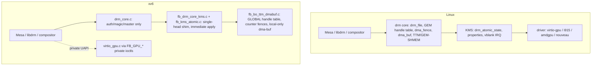

# Linux DRM / GPU Graphics ABI Compatibility Plan

Last updated: 2026-06-07 (Phase 6 committed; Mesa virgl validator, direct KMS GBM/EGL virgl validator, damage-aware resource-bind scanout validator, upstream kmscube, upstream drm_info, and libdrm modetest/drmdevice validation pass; launcher blob path verified; HOST_VISIBLE fail-closed gate added; host virgl+blob blocker rechecked; init-time host-visible map probe now proves the host actively rejects mappable host3d blobs)

## Implementation status (2026-06-07)

This plan is no longer purely forward-looking: most of the roadmap has been
built. Status verified by source reads, headless QEMU boot of the freshly
built kernel (`dma_fence: selftest ok`, all DRM nodes register, boots clean to
the Wayland desktop with no panics), and the GTK `-gl` virgl validator.

| Phase | State | Evidence |
|---|---|---|
| 0 — audit + `drmabitest` | **Done** | `user/programs/drmabitest`, `docs/linux-drm-abi-audit.md` baseline |
| 1 — `dma_fence` core + syncobj/sync_file | **Done (committed)** | `dev/fb/dma_fence.c`; `dma_fence: selftest ok` at boot; `SYNCOBJ_EVENTFD` real |
| 2 — per-file GEM + FLINK/OPEN + dma-buf | **Done (committed)** | per-file handle table, `fb_gem_flink`, generic dma-buf ops + mmap |
| 3 — KMS atomic + blobs + cursor + vblank | **Done (committed)** | writable propblobs, atomic out-fences, cursor plane, present-driven vblank |
| 4 — standard virtio-gpu UAPI | **Done (committed)** | `EXECBUFFER` honors fences, resource wait-by-fence, virtgpu→PRIME bridge |
| 5 — blob / host-visible / zero-copy | **Partially complete; host-visible positive mapping refused by the host (now verified, not just untested)** | `RESOURCE_CREATE_BLOB`, `F_RESOURCE_BLOB`, host-visible SHM-cap discovery, BAR assignment, `RESOURCE_MAP_BLOB`/`UNMAP_BLOB`, bounds/ownership-checked mmap, scanout bind preference, and dirty-rect flushes are committed. Runtime proves guest blobs and fail-closed `HOST_VISIBLE=0` on the non-GL blob lane. Kernel `a78111b` fixes the HOST3D create path so host-visible blobs no longer require guest pages before `VIRTGPU_MAP`; kernel `5efbbc4` keeps `GETPARAM(HOST_VISIBLE)` false unless a mappable host-visible blob has actually mapped successfully; kernel `87b25d8` actively probes one mappable host-visible blob at init. The probe (`virtio_gpu_smoke_host_visible_map`) sends one mappable `HOST3D` `RESOURCE_CREATE_BLOB` to the host whenever a host-visible aperture is negotiated, so the gate is no longer circular: under the rutabaga `virtio-gpu-rutabaga-pci,blob=true,x-virgl2=on` backend (which negotiates a 32 MiB host-visible BAR + virgl2 capset + working 3D) the host **rejects** the mappable host3d create (`create=-5`, virtio error response), so `HOST_VISIBLE` correctly stays `0`. This is a confirmed host-side refusal, not merely an unexercised path. The non-blob GTK `-gl` virgl path passes `gpu-validate`, including Mesa Wayland EGL linux-dmabuf presentation and virgl PRIME import identity. |
| 6 — structural cleanup | **Done (committed)** | shared `fb_shmem_*` page allocator; KMS/virtgpu split into smaller concern fragments; BO backing file renamed to `fb_bo_shmem_dmabuf.c`; retained `FB_GPU_TTM_*` private ABI labels documented as sysmem/shmem metadata compatibility names |

**Latest virgl validation (2026-06-07):** kernel `4ad498f` fixes
`FB_GPU_VIRGL_RESOURCE_EXPORT_FD` to use render-owner-local BO handles during
resource export, kernel `a78111b` fixes the HOST3D blob create path, kernel
`9f6bb5a` submits Linux `RESOURCE_CREATE_BLOB` command payloads before host3d
blob creation while keeping guest blobs strict, and ports `23c60af` hardens
`mesaglsmoke` so it renders into an explicit GLES framebuffer and fails
nonzero on GL/readback errors. With the final image rebuilt,
`GPU_VALIDATE_TIMEOUT=240s GPU_VALIDATE_SECONDS=1 GPU_VALIDATE_3D_SECONDS=1 bash scripts/gpu/gpu-validate.sh`
passes. Current rerun evidence includes `wlcomp: linux-dmabuf enabled
(virgl)`, `mesawlegl[1]: complete frames=16 seconds=1 status=0`,
`mesaglsmoke[1]: complete frames=5 seconds=1 status=0`,
all virgl resource/copy/async/invalid/import `__GPUV_*_DONE_0__` markers,
`virgltest: dmabuf-resource-import ok ... imported_resource=84`,
`backend virgl flags 0x27`, `bo_fd_live 0`, `virtio_failures 0`, and
`virtio_timeouts 0`.

**Latest libdrm validation (2026-06-07):** the libdrm port now installs its
test tools, and xv6-specific libdrm device discovery maps both
`/dev/dri/card0` and `/dev/dri/renderD128`. In the freshly rebuilt image,
plain `modetest -c` discovers `/dev/dri/card0`, `drmdevice` reports both
primary and render nodes, and `modetest -D /dev/dri/card0 -p` prints CRTC and
plane state; all exit `0` with `virtio_failures 0` and `virtio_timeouts 0`.

**Latest upstream drm_info validation (2026-06-07):** `ports/drm_info` stages
upstream drm_info commit `462458e0f292145b2a9d5a8b65c392eaeef7362d` with a
static `json-c` dependency. A headless `virtio-gpu` boot of the freshly rebuilt
image runs `drm_info /dev/dri/card0` successfully and prints connector, CRTC,
plane, and property state. Kernel `d122470` fixed the Linux object-property ABI
metadata that this tool exposed: `CRTC_ID` and `FB_ID` now report their target
object type in the `DRM_IOCTL_MODE_GETPROPERTY` values array, so `drm_info`
prints `"CRTC_ID" (atomic): object CRTC = ...` and `"FB_ID" (atomic): object
framebuffer = 0` instead of faulting while walking properties. The same run
ends with `virtio_failures 0`, `virtio_timeouts 0`, and no panic/fatal fault.

**Latest upstream kmscube validation (2026-06-07):** `ports/kmscube` stages
upstream kmscube commit `f60e50e887d3c49e91ac9b06d8199b36152632fa` with only a
build-system patch to make libpng optional. In the freshly rebuilt image,
GTK/virgl runs of `kmscube -D /dev/dri/renderD128 -O -v 256x256 -c 4 -N` and
`kmscube -D /dev/dri/card0 -c 2 -N` both reach Mesa EGL 1.5 and OpenGL ES 3.1
with renderer `virgl (D3D12 (NVIDIA GeForce RTX 4060 Laptop GPU))`. The KMS
run renders frames on `/dev/dri/card0`; a follow-up `fbstat` in the same
QEMU/virgl shape reports `backend virgl`, `backend_opengl_submit 1`,
`virtio_failures 0`, and `virtio_timeouts 0`. The WSLg GTK serial stream
interleaves shell echoes, Mesa logs, and `fbstat`, so the audit records exact
log files and marker caveats instead of treating counters alone as proof.

**Latest direct KMS GBM/EGL validation (2026-06-07):** after parent `29901cd`
fixed the validator's geometry check, `VIRGL_KMS_VALIDATE_XRES=720
VIRGL_KMS_VALIDATE_YRES=400 bash scripts/gpu/virgl-kms-validate.sh` passes.
The in-guest `mesakmsgl` path opens `/dev/dri/card0`, selects
`mode=720x400@60`, creates GBM BOs with `has_export=1`, initializes Mesa EGL
1.5 / OpenGL ES 3.1 through renderer
`virgl (D3D12 (NVIDIA GeForce RTX 4060 Laptop GPU))`, and reports FPS samples
up to 81.4. The monitor screenshot path is unavailable in this GTK/WSLg run;
visual framebuffer proof is covered by the damage-aware guest PPM run above.

**Host capability status (corrected 2026-06-07):** `/dev/udmabuf` is present
(custom WSL2 kernel `6.18.26.1-microsoft-standard-WSL2+`) and QEMU is **9.0.2**
with `blob`/`hostmem`/`max_hostmem` props on `virtio-gpu-pci`/`virtio-vga`.
However, end-to-end blob is **still host-blocked** on this machine for two
reasons proven by direct testing:

1. QEMU's `virtio_gpu_have_udmabuf()` also requires guest RAM backed by a
   **shared sealable memfd** (`-object memory-backend-memfd,share=on` +
   `-machine ...,memory-backend=ID`); plain anonymous `-m` RAM fails with
   "need rutabaga or udmabuf for blob resources" even though `/dev/udmabuf`
   opens fine. The launcher now wires this memfd backend when blob is attached.
2. QEMU 9.0.2's **classic virgl path rejects blob outright** ("blobs and virgl
   are not compatible (yet)"); only the separate rutabaga/gfxstream backend
   supports virgl + blob. The default GUI uses `virtio-vga-gl` (virgl), so the
   launcher now auto-disables blob for virgl GPUs (override `QEMU_VIRGL_BLOB_OK=1`).

Rechecked after Phase 6 on 2026-06-07:

- `virtio-gpu-gl-pci,blob=true,...` and `virtio-vga-gl,blob=true,...` still
  fail before boot with `blobs and virgl are not compatible (yet)`.
- A forced launcher override with `QEMU_VIRGL_BLOB_OK=1`,
  `QEMU_VIRTIO_GPU_BLOB=1`, and `QEMU_REQUIRE_UDMABUF=1` still fails before
  boot in `/tmp/xv6-virgl-blob-forced-20260607.log` with the same rejection.
- `-display egl-headless -device virtio-gpu-gl-pci,blob=true,...` still fails
  with `egl: no drm render node available`.
- `qemu-system-x86_64 -device help` lists `virtio-gpu-gl-pci`,
  `virtio-vga-gl`, and `vhost-user-gpu`, but no rutabaga device.
- A local QEMU 9.2.0 rutabaga build with validation-only host patches
  (`x-virgl2` property plus surfaceless Rutabaga FFI) boots xv6 and negotiates
  `RESOURCE_BLOB`, the host-visible SHM BAR, and virgl2 capset id 2. Kernel
  `87b25d8` now runs an init-time probe
  (`virtio_gpu_smoke_host_visible_map`) that
  actively sends one mappable `HOST3D` `RESOURCE_CREATE_BLOB` to this backend.
  The host **rejects the create** with a virtio error response
  (`resource blob create host rejected ... response=0x1200` →
  `host-visible map probe: create=-5`), so no `RESOURCE_MAP_BLOB` is ever
  attempted and current xv6
  correctly reports `GETPARAM(HOST_VISIBLE)=0`. This refusal is now
  **verified by an actual host round-trip**, not inferred from an unexercised
  path. Evidence: `/tmp/xv6-rutabaga-hostvis-probe.log`.
- `vhost-user-gpu-pci` now works far enough to boot the non-virgl backend after
  kernel `7b1af61` negotiates `VIRTIO_F_VERSION_1`, but that path exposes no
  SHM window and no 3D capsets. The virgl helper remains blocked by host GL:
  `egl-headless,gl=on` has no DRM render node, and `gtk,gl=es` makes
  `/usr/lib/qemu/vhost-user-gpu -v` fail `Failed to initialize virgl`.

Net: the **kernel-side guest blob code and fail-closed host-visible plumbing
boot clean**, and the init-time map probe now **actively confirms** that the
only available host-visible-capable backend (rutabaga) refuses mappable blob
creation; full host-visible zero-copy validation still awaits a backend that
both negotiates the BAR and successfully creates/maps mappable blob
resources.

**Damage-aware resource-bind scanout validation (2026-06-07):** after the
host-side validator fix in parent `fa3224e`, the finite GTK/virgl damage-flip
run
`VIRGL_DESKTOP_TRACE_DIR=/tmp/vd-fb20 VIRGL_DESKTOP_VALIDATE_TIMEOUT=280s VIRGL_DESKTOP_VALIDATE_SECONDS=20 VIRGL_DESKTOP_VALIDATE_DAMAGE_FLIP=1 VIRGL_DESKTOP_VALIDATE_FBSTAT=1 VIRGL_DESKTOP_VALIDATE_SCREENSHOT_REQUIRED=1 bash scripts/gpu/virgl-desktop-validate.sh`
passes. The captured guest framebuffer shows the live 640x480 Mesa demo window
inside the 1280x800 desktop, and `screenshot_matrix ... status=PASS`.
The compositor reports `wlcomp: virgl framebuffer damage-flip preserving
damage`, steady-state `present-trace` lines with `path_gl_preflush > 0`,
`path_cpu_only=0`, `scanout_submits > 0`, `scanout_rebinds=0`, and
`scanout_rects/frame=1`; fbstat reports `display_last_complete 1455`,
`virtio_failures 0`, and `virtio_timeouts 0`. The QEMU trace post-check passes
`page_flip_trace_matrix ... p2_cached=1 status=PASS`, with desktop-sized
scanouts only after the initial 32x32 smoke scanout is unbound. Archived
artifacts:
`build-x86_64/virgl-desktop-validate/current-damage-fb20-pass-20260607/`.

## Goal

Make the xv6-os graphics subsystem compatible with the **Linux DRM/GPU kernel
ABI** so that unmodified Linux userland graphics stacks — `libdrm`, Mesa
(`gallium`, `drm/virtio`, `kmsro`), `libgbm`, `libEGL`, Wayland compositors,
and the X/Xorg `modesetting` driver — can drive the kernel through the same
ioctl contract they use on Linux.

"Compatible" here means the same thing the syscall-ABI plans
(`docs/linux-abi-compat-plan.md`) mean for syscalls, applied to graphics:

- the same device-node layout (`/dev/dri/card0`, `/dev/dri/renderD128`);
- the same `DRM_IOCTL_*` numbers, struct layouts, and field semantics;
- the same object models (GEM handles per-file, dumb buffers, PRIME dma-buf,
  DRM syncobj / `dma_fence`, KMS atomic state);
- the same `virtio-gpu` UAPI (`DRM_IOCTL_VIRTGPU_*`) so a stock Mesa
  `virtio_gpu`/`virgl` winsys binds without xv6-specific shims.

This document is a **comparison + implementation plan**. Sections §1–§6 record
the original gap analysis (the pre-implementation baseline); §7 tracks the
phased roadmap, now mostly **landed** (see the status table above). Phase 6
cleanup is complete. Phase 5 guest blob and fail-closed host-visible plumbing
are landed, but positive host-visible zero-copy remains open until a backend
can create and map mappable blob resources.

This plan is scoped to **x86_64** (consistent with the syscall ABI plans).
RISC-V graphics is out of scope.

---

## 1. Current state — what xv6-os already has

The kernel already ships a surprisingly complete DRM shim. Files (all under
`kernel/kernel/`):

| Area | File(s) | Approx LOC | Maturity |
|---|---|---|---|
| DRM generic core (device/file/auth/magic/dispatch) | `dev/drm_core.c`, `inc/dev/drm_core.h` | ~245 | Solid, device-agnostic |
| DRM UAPI numbers/structs | `inc/uabi/drm.h` | ~900 | Broad ioctl + struct coverage |
| Node registration (`card0`, `renderD128`, `gpu0`, `fb0`) | `dev/fb/fb_init_panic.c` | ~450 | Both primary + render nodes |
| KMS modesetting + properties + blobs | `dev/fb/fb_drm_core_kms.c`, `dev/fb/fb_drm_kms_*.c` | split fragments | Single-head, real queries |
| KMS atomic + page-flip + FB lifecycle | `dev/fb/fb_kms_atomic.c` | ~600 | Simplified atomic shim |
| Ioctl router | `dev/fb/fb_drm_dispatch.c` | ~600 | Dispatch table |
| GEM/BO + shmem placement metadata + dma-buf wrapper | `dev/fb/fb_bo_shmem_dmabuf.c` | ~1800 | Per-file GEM handles over shmem pages |
| syncobj + PRIME + virtgpu user ioctls | `dev/fb/fb_syncobj_prime_virtgpu.c` | ~1600 | Counter fences |
| Fence fd / dma-buf file ops | `dev/fb/fb_fd_sync.c` | ~400 | Real custom fds |
| Scanout / BO→framebuffer present | `dev/fb/fb_scanout.c` | ~1000 | virgl + CPU paths |
| virtio-gpu driver (2D + 3D virgl) | `virtio_gpu.c`, `virtio_gpu_*.c` | split fragments | Full 2D + 3D, async ring |
| Device facade ioctls (`FB_GPU_*`) | `dev/fb/fb_device_ioctl.c` | ~2200 | xv6-private UAPI |
| Hyper-V DXG present backend | `dev/fb/fb_dxg_present.c` | — | Out of DRM scope |
| Nouveau scaffold | `dev/fb/fb_nouveau.c` | — | DDA path, separate |

What works today against the **real** Linux ioctl numbers:

- **DRM core**: `VERSION`, `GET_MAGIC`, `AUTH_MAGIC`, `GET_CLIENT`, `GET_CAP`,
  `SET_CLIENT_CAP`, `SET_MASTER`, `DROP_MASTER`. Render-node auth bypass and
  primary-node master arbitration are modeled (`drm_core.c`).
- **KMS queries**: `MODE_GETRESOURCES`, `GETCRTC`, `GETCONNECTOR`, `GETENCODER`,
  `GETPLANE`, `GETPLANERESOURCES`, `GETPROPERTY`, `GETPROPBLOB`, `GETFB`,
  `GETFB2`, `OBJ_GETPROPERTIES`.
- **KMS state**: `SETCRTC`, `ADDFB2`, `RMFB`, `CLOSEFB`, `PAGE_FLIP` (with
  `PAGE_FLIP_EVENT`), `DIRTYFB`, `ATOMIC` (validate + immediate apply),
  `OBJ_SETPROPERTY`.
- **Buffers**: `MODE_CREATE_DUMB`/`MAP_DUMB`/`DESTROY_DUMB` backed by real
  anon pages; `GEM_CLOSE`.
- **PRIME**: `PRIME_HANDLE_TO_FD`/`FD_TO_HANDLE` with a real custom fd and
  file-ops (poll/release), local-only.
- **syncobj**: `CREATE`/`DESTROY`/`WAIT`/`TIMELINE_WAIT`/`SIGNAL`/
  `TIMELINE_SIGNAL`/`RESET`/`TRANSFER`/`QUERY`/`HANDLE_TO_FD`/`FD_TO_HANDLE`.
- **virtio-gpu**: full 2D + 3D virgl command path internally
  (`RESOURCE_CREATE_2D/3D`, `ATTACH_BACKING`, `SET_SCANOUT`, `TRANSFER_*`,
  `RESOURCE_FLUSH`, `CTX_CREATE/DESTROY/ATTACH/DETACH`, `SUBMIT_3D`,
  `GET_CAPSET*`), with an async submission ring and fence reaping.

This is a strong foundation. The gaps below are mostly about **closing
semantic mismatches** and **exposing the existing engine through the standard
UAPI** rather than building from scratch.

---

## 2. Architecture comparison: xv6-os vs Linux DRM

Key structural differences (the **xv6 column below is the original baseline**;
the **Now** column reflects the landed implementation — see the status table at
the top):

| Concept | Linux | xv6-os baseline | Now |
|---|---|---|---|
| **GEM handle scope** | Per-`drm_file` handle table (`idr`) | One **global** table, isolation by `owner_id`/`tgid` | **Per-file handle table + global BO refcount; `FLINK`/`OPEN` implemented** (Phase 2) |
| **dma_fence** | First-class refcounted fence objects, fence context/seqno, cross-driver | `uint64` counters + pending-callback counts | **Real `dma_fence` core (`dma_fence.c`); syncobj/sync_file rebacked on it** (Phase 1) |
| **dma_buf** | `struct dma_buf` + attachments + sg_table, cross-device | Local-only wrapper, foreign fd rejected | **Generic dma-buf wrapper ops + mmap; virtgpu→PRIME bridge** (Phase 2/4) |
| **KMS atomic** | `drm_atomic_state` trees, check/commit, rollback, async commit, in/out fences | Validate then immediate global apply; in-fence wait rejected | **Atomic publishes after present; real out-fences signal on display completion** (Phase 3) |
| **KMS objects** | Dynamic per-HW (N CRTCs/connectors/planes, hotplug) | Static singletons (1 each), no overlay/cursor plane | **Cursor plane wired to virtio cursor queue; connector mode list exposed** (Phase 3) |
| **vblank** | HW IRQ timestamped, `drm_vblank` accounting | Synthetic 60 Hz from tick counter | **Driven from present completion; `WAIT_VBLANK`/`CRTC_*_SEQUENCE`** (Phase 3) |
| **virtio-gpu UAPI** | `DRM_IOCTL_VIRTGPU_*` (Mesa winsys target) | Standard ioctls **wired** but incomplete | **`EXECBUFFER` honors BO list + in/out fences; `WAIT` per-resource fence** (Phase 4) |
| **TTM / memory mgr** | TTM or GEM-SHMEM, real placement/migration, mmap fault | Metadata-only naming, plain anon pages | Unchanged (Phase 6 cleanup pending) |
| **Blob resources** | `VIRTGPU_RESOURCE_CREATE_BLOB`, host-visible, zero-copy | Absent (explicit transfers only) | **Code complete** — `RESOURCE_CREATE_BLOB` + `F_RESOURCE_BLOB` + host-visible SHM-cap/BAR + `MAP_BLOB`/`UNMAP_BLOB` + PFNMAP mmap; init-time map probe shows the rutabaga host actively refuses mappable host3d blobs (`create=-5`), so host-visible zero-copy stays fail-closed pending a backend that accepts them (Phase 5) |

---

## 3. Detailed gap inventory

### 3.1 DRM core (`drm_core.c`)

Mostly compatible. Gaps:

- **`DRM_IOCTL_GET_UNIQUE` / `SET_VERSION` / `GET_STATS` / `GET_MAP` / `IRQ_BUSID`**
  — verify presence/behavior; libdrm's `drmGetVersion`/`drmGetBusid` path calls
  some of these. `SET_VERSION` interacts with the implicit `UNIVERSAL_PLANES`
  legacy behavior.
- **Capabilities (`GET_CAP`)** — audit the returned values against what a real
  driver reports: `DUMB_BUFFER=1`, `PRIME` import/export bits, `TIMESTAMP_MONOTONIC`,
  `CRTC_IN_VBLANK_EVENT`, `SYNCOBJ`, `SYNCOBJ_TIMELINE`, `ADDFB2_MODIFIERS`,
  `PAGE_FLIP_TARGET`, `ASYNC_PAGE_FLIP`. Several map to features that are
  currently rejected (target/async flip) and must report `0` consistently.
- **`drm_version`** name/date/desc lengths: ensure the two-pass length probe
  (caller passes `len=0` to size buffers) matches libdrm exactly.

### 3.2 KMS modesetting (`fb_drm_core_kms.c`, `fb_kms_atomic.c`)

- **`MODE_CREATEPROPBLOB` / `DESTROYPROPBLOB`** — currently `-EOPNOTSUPP`. Real
  atomic clients create a MODE_ID blob via `CREATEPROPBLOB` and reference it in
  the atomic commit. Without writable blobs, `drmModeAtomicCommit` with a
  mode set (the normal compositor modeset path) cannot work. **Must implement.**
- **`MODE_SETPLANE`** — `-EOPNOTSUPP`. Needed by legacy (non-atomic) plane
  users and by `xf86-video-modesetting` cursor/overlay fallback.
- **`MODE_ADDFB` (legacy)** — `-EOPNOTSUPP`. Some older userland and the kernel
  fbdev-emulation path use the legacy single-plane AddFB; ADDFB2 covers modern
  clients, but a legacy shim mapping to ADDFB2 is cheap and improves coverage.
- **Cursor plane** — `MODE_CURSOR`/`CURSOR2` validate-only; no actual cursor
  plane. A real cursor plane (DRM_PLANE_TYPE_CURSOR) + `SETPLANE` is needed for
  hardware-cursor compositors. The virtio-gpu cursor queue already exists
  (`FB_GPU_SET_CURSOR`/`MOVE_CURSOR`); wire it to the KMS cursor plane.
- **Universal planes / overlay** — only one PRIMARY plane. Add a CURSOR plane
  and (optionally) an OVERLAY plane so `DRM_CLIENT_CAP_UNIVERSAL_PLANES`
  reports something truthful.
- **Multi-mode connector** — connector exposes a single generated mode from
  `xres/yres`. Real EDID/mode lists improve compositor mode selection. The
  virtio-gpu `GET_EDID` and `GET_DISPLAY_INFO` paths can feed a proper mode
  list.
- **Atomic engine** — replace the immediate-apply shim with a minimal but real
  `drm_atomic_state`-style flow:
  - build a transient per-object state set during `ATOMIC`,
  - run a **check** phase (TEST_ONLY uses only this) that validates the whole
    set atomically and can fail without side effects,
  - run a **commit** phase that applies plane/CRTC/connector state together,
  - support **`ATOMIC_NONBLOCK`** real async commit (currently rejected unless
    TEST_ONLY),
  - honor **`IN_FENCE_FD`** by actually waiting on the imported fence before
    the flip (currently rejected), and emit a **real `OUT_FENCE_PTR`** fence
    that signals on flip completion (currently prepared but not signaled by a
    completion event).
- **vblank / events** — move from synthetic ticks to a present-completion
  driven sequence: increment the CRTC sequence and timestamp when the scanout
  actually flips (virtio-gpu `RESOURCE_FLUSH` / present completion), and deliver
  `FLIP_COMPLETE` / vblank events at that point. Implement
  `CRTC_GET_SEQUENCE`/`CRTC_QUEUE_SEQUENCE` and `WAIT_VBLANK` consistently
  (currently rejected).
- **Page-flip target / async** — implement `PAGE_FLIP_TARGET_*` and
  `PAGE_FLIP_ASYNC` or keep them rejected but make `GET_CAP` report `0` for the
  matching caps so userland negotiates down cleanly.

### 3.3 GEM / buffer objects (`fb_bo_ttm_dmabuf.c`)

- **Per-file handle table** — the biggest structural correctness gap. Linux
  GEM handles are scoped to the open `drm_file`. xv6 uses one global table with
  `owner_id` matching. Refactor to a per-`drm_core_file` handle→BO map
  (small `idr`/`xarray`), with the BO itself globally refcounted. This is a
  prerequisite for correct `GEM_FLINK`/`GEM_OPEN`, for PRIME import creating a
  *new handle in the importing file*, and for multi-client render-node use.
- **`GEM_FLINK` / `GEM_OPEN`** — implement global flink names so two processes
  can share a BO by name (legacy but still used, e.g. by some Xorg paths).
- **`GEM_CLOSE` semantics** — ensure closing a handle drops only the *file's*
  reference, not the global BO, once per-file tables exist.
- **mmap fault model** — dumb/GEM mmap uses a precomputed offset and a custom
  VMA handler with `DONTFORK|DONTDUMP` (see runtime memory notes). Keep that,
  but align the offset scheme with `MAP_DUMB`'s returned offset and document
  the fake-offset → BO mapping the way Linux's `drm_gem_mmap` does.

### 3.4 dma-buf / PRIME (`fb_bo_ttm_dmabuf.c`, `fb_fd_sync.c`)

- **Cross-driver import** — foreign fds are rejected. To interoperate with the
  rest of the kernel (future v4l, future second GPU, or the virtio-gpu blob
  path), introduce a minimal generic `dma_buf`-like object with a small ops
  vtable (`map`, `unmap`, `mmap`, attach pages/sg). The fb BO becomes one
  exporter; importers obtain pages through the ops rather than a type check.
- **`sg_table` equivalent** — BOs are page arrays. A scatter-list abstraction
  is needed before any real DMA-capable importer (IOMMU/device DMA) can consume
  an imported buffer. For pure-sysmem QEMU this is low priority.
- **dma-buf mmap** — expose `mmap()` on the PRIME fd itself (Linux allows
  `mmap(dmabuf_fd)`), not only via the GEM offset path. `libgbm`/`gbm_bo_map`
  and some EGL paths rely on it.
- **Poll semantics** — current poll compares snapshot fence counters. Once real
  `dma_fence` objects exist (3.5), wire dma-buf `POLLIN/POLLOUT` to the
  reservation object's fences as Linux does.

### 3.5 DRM syncobj / dma-fence (`fb_syncobj_prime_virtgpu.c`, `fb_fd_sync.c`)

- **Real `dma_fence` objects** — replace `uint64` counters with a refcounted
  fence type carrying `{context, seqno, signaled, callbacks, error}`. This is
  the single most leveraged change: it makes syncobj, dma-buf reservation,
  sync_file, and atomic in/out fences all share one mechanism, matching Linux.
- **`SYNCOBJ_EVENTFD`** — currently `-EOPNOTSUPP`. With real fences, register a
  fence callback that signals an eventfd. Needed by modern compositors that
  poll syncobj via eventfd.
- **sync_file import/export** — `HANDLE_TO_FD`/`FD_TO_HANDLE` already produce
  custom fds; make the exported fd a genuine `sync_file` (with the
  `SYNC_IOC_*` / `POLLIN`-on-signal contract) so it round-trips through other
  Linux components.
- **Timeline correctness** — timeline points work via `timeline_value`. Audit
  `QUERY` to return the *last signaled* point (`QUERY_FLAGS_LAST_SUBMITTED`
  semantics) and ensure transfer/proxy chains signal transitively under the
  real fence model.
- **`WAIT_FOR_SUBMIT` / `WAIT_AVAILABLE` / deadline** — verify these flags
  behave like Linux (block until a fence is even attached, not just signaled).

### 3.6 virtio-gpu UAPI (`fb_device_ioctl.c`, `fb_syncobj_prime_virtgpu.c`, `virtio_gpu.c`)

Correction after source audit: the standard `DRM_IOCTL_VIRTGPU_*` set is
**already dispatched** in `fb_drm_dispatch.c` (`GETPARAM`, `CONTEXT_INIT`,
`RESOURCE_CREATE`, `RESOURCE_CREATE_BLOB`, `RESOURCE_INFO`, `TRANSFER_TO/FROM_HOST`,
`WAIT`, `GET_CAPS`, `EXECBUFFER`, `MAP`) on top of the existing engine. The work
is therefore **completion**, not greenfield. Remaining gaps:

- **`VIRTGPU_EXECBUFFER`** ignores the `bo_handles` array and the in/out
  fence fds (it calls `virtio_gpu_user_submit(..., NULL, 0, &fence, &signaled)`).
  Plumb the BO handle list (for residency) and honor `DRM_IOCTL` in-fence wait /
  out-fence (`fence_fd`) so Mesa's explicit-sync path works.
- **Per-ioctl completion** to verify against the engine:
  - `VIRTGPU_GETPARAM` → 3D features / capset query-fix / resource-blob /
    host-visible / context-init / supported-capset-IDs.
  - `VIRTGPU_GET_CAPS` → return virgl/virgl2 capset payloads (already queried).
  - `VIRTGPU_CONTEXT_INIT` → map to `CTX_CREATE` with capset/num-rings/debug-name.
  - `VIRTGPU_RESOURCE_CREATE` → `RESOURCE_CREATE_3D` + backing + GEM handle.
  - `VIRTGPU_RESOURCE_INFO` → resource metadata by handle.
  - `VIRTGPU_EXECBUFFER` → `SUBMIT_3D` (with in/out fence + ring index +
    bo handle list). This is the core 3D submit path Mesa uses.
  - `VIRTGPU_TRANSFER_TO_HOST` / `FROM_HOST` → existing transfer cmds.
  - `VIRTGPU_WAIT` → wait on a BO's last fence.
  - `VIRTGPU_MAP` → return mmap offset for a resource (like `MAP_DUMB`).
  - `VIRTGPU_RESOURCE_CREATE_BLOB` → see blob work below.
- **Blob resources + host-visible memory** — implement
  `VIRTIO_GPU_F_RESOURCE_BLOB` (`RESOURCE_CREATE_BLOB` cmd, blob mem
  guest/host3d/host3d-guest, `USE_MAPPABLE`/`USE_SHAREABLE`). Modern Mesa
  (venus, and recent virgl) and zero-copy presentation rely on it. Requires the
  virtio-gpu host-visible shared-memory region (`VIRTIO_GPU_SHM_ID_HOST_VISIBLE`)
  and `RESOURCE_MAP_BLOB`/`UNMAP_BLOB`.
- **GBM/dma-buf bridge** — virtgpu resources must be exportable as PRIME fds
  (handle↔resource↔dma-buf) so EGL/GBM can scan out a rendered buffer through
  KMS `ADDFB2`. The render-node→KMS-node buffer hand-off is the desktop path.
- **Keep `FB_GPU_*`** as an internal/diagnostic UAPI; the new path is additive.

### 3.7 fbdev compat (`inc/dev/fb.h`)

- `FBIOGET_VSCREENINFO`/`FSCREENINFO`/`PUT_VSCREENINFO` exist. Audit the
  `fb_var_screeninfo`/`fb_fix_screeninfo` struct layouts against Linux
  `<linux/fb.h>` (bitfields for RGBA offsets, `smem_len`, `line_length`) so
  `fbdev` clients and the kernel's own `fbcon`-style users see correct values.
- Consider exposing the DRM-managed scanout through fbdev emulation
  (`drm_fbdev`) so `/dev/fb0` and `/dev/dri/card0` stay coherent.

### 3.8 Memory management / TTM

- TTM here is naming-only metadata. For QEMU sysmem this is acceptable. The
  real need is a **GEM-SHMEM-equivalent** clean abstraction (shmem-backed BO
  with pages, mmap, and a single allocation/free/refcount path) that GEM,
  dumb, virtgpu resources, and dma-buf all share — replacing the parallel
  page-array logic currently duplicated across `fb_bo_ttm_dmabuf.c`,
  `fb_syncobj_prime_virtgpu.c`, and `virtio_gpu.c`.

---

## 4. Semantic mismatches to fix (correctness, not features)

These are places where an ioctl exists but may behave differently from Linux,
which silently breaks real clients:

1. **GEM handle scope** (§3.3) — handles must be per-file; returning a global
   handle violates the contract `drmPrimeFDToHandle` relies on (a *new* handle
   in the importing file).
2. **Atomic in-fence rejection** (§3.2) — Linux clients that pass `IN_FENCE_FD`
   expect the commit to wait, not `-EOPNOTSUPP`. Either honor it or ensure the
   client never advertises it (but Mesa/compositors do).
3. **Out-fence never signals** (§3.2/§3.5) — an `OUT_FENCE_PTR` fd that never
   signals will hang a compositor's frame loop. Must be backed by a real
   completion.
4. **`GET_CAP` truthfulness** (§3.1) — `gpu_drm_get_cap()` already returns `0`
   for `ASYNC_PAGE_FLIP`/`PAGE_FLIP_TARGET`/`CRTC_IN_VBLANK_EVENT`, so caps and
   behavior currently agree. Keep this invariant: if a flip flag is later
   implemented, flip the cap to `1` in the same change; never advertise a cap
   whose ioctl path returns `-EOPNOTSUPP`.
5. **`CREATEPROPBLOB` rejection** (§3.2) — blocks the standard atomic-modeset
   path; must be implemented for atomic modeset to function at all.
6. **PRIME foreign-fd rejection** (§3.4) — breaks the intended cross-component
   buffer sharing that `card0`↔`renderD128` desktop hand-off needs.
7. **syncobj fd not a real sync_file** (§3.5) — round-tripping through other
   Linux components (EGL_ANDROID_native_fence_sync style) needs true poll-on-
   signal semantics.

---

## 5. Structural improvements

1. **Introduce a `dma_fence` core** (`dev/fb/dma_fence.c` or a shared
   `kernel/kernel/inc/dev/dma_fence.h`): refcounted fence, context/seqno,
   `signal`, `add_callback`, `wait`, `default_wait`. Back syncobj, dma-buf
   reservation, sync_file, and atomic fences on it. **Highest leverage.**
2. **Per-file GEM handle table** in `struct drm_core_file` (or a driver
   sub-struct), with global BO refcount. Centralizes 3.3/3.4 correctness.
3. **Unify BO allocation** behind one shmem-style allocator (§3.8) used by GEM,
   dumb, virtgpu, and dma-buf. Removes triplicated page logic.
4. **Real atomic state objects** (§3.2): a small `kms_atomic_state` with per
   plane/CRTC/connector snapshots, check/commit split, rollback on failure.
5. **Generic `dma_buf` object** with an ops vtable (§3.4) so import is not a
   driver-type check.
6. **Split the monolithic files**: `fb_drm_core_kms.c` (2300L) and
   `virtio_gpu.c` (7400L) are large; once the new abstractions land, group by
   concern (objects vs atomic vs properties; transport vs resource vs 3D).
7. **virtgpu UAPI layer** (§3.6) as a thin translation file mapping
   `DRM_IOCTL_VIRTGPU_*` onto the existing engine, keeping `FB_GPU_*` separate.

---

## 6. Performance improvements

Grounded in the runtime notes (`/memories/repo/xv6-os-*`) and the alpine-virgl
handoff plan:

1. **Blob / host-visible resources** (§3.6) — eliminate explicit
   `TRANSFER_TO_HOST` copies for mappable buffers (zero-copy present). This is
   the largest virgl-path win.
2. **Real vblank pacing** (§3.2) — drive present from actual flip completion
   instead of synthetic 60 Hz ticks, removing over/under-submission and the
   jitter described in the alpine handoff plan.
3. **Deeper async submit ring** — the engine has an 8-slot async ring; expose
   ring depth to the virtgpu `EXECBUFFER` path and let the compositor overlap
   GL submit with host vsync (already partially proven; make it the default
   through the standard UAPI).
4. **Scanout fast paths** — the kernel already has direct-scanout mmap and
   fast row-copy blits (see `xv6-os-hyperv-fb.md`). Ensure the KMS `PAGE_FLIP`
   / atomic commit uses resource-bind scanout (no readback) whenever the FB is
   a virgl resource, falling back to CPU copy only for shm buffers.
5. **Damage-aware present** — plumb `MODE_DIRTYFB` / atomic `FB_DAMAGE_CLIPS`
   into virtio-gpu `RESOURCE_FLUSH` partial rects to avoid full-frame transfers
   (the compositor already computes damage).
6. **Avoid COW divergence on BO maps** — keep the `DONTFORK|DONTDUMP` mapping
   fix already documented in `xv6-os-runtime.md`; apply it uniformly to all BO/
   resource maps in the unified allocator (§3.8) so the class of bug cannot
   recur.

---

## 7. Phased roadmap

Ordered by dependency and compatibility payoff. **Phases 0–4 are landed and
committed; Phase 5 is in progress; Phase 6 not started** (see status table at
the top). Detail retained below for reference and for the remaining work.

### Phase 0 — Audit & truthfulness — **DONE**
- `GET_CAP` values reconciled with behavior (`gpu_drm_get_cap`).
- `drmabitest` probe added (`user/programs/drmabitest`); baseline captured in
  `docs/linux-drm-abi-audit.md`.

### Phase 1 — dma_fence core + syncobj/sync_file correctness — **DONE**
- `dma_fence` implemented in `dev/fb/dma_fence.c` (boot self-test passes).
- syncobj rebacked on `dma_fence`; exported syncobj/PRIME fds are real
  `sync_file`s; `SYNCOBJ_EVENTFD` signals via `eventfd_signal_file`.

### Phase 2 — Per-file GEM table + FLINK/OPEN + dma-buf generalization — **DONE**
- Per-`drm_file` handle table with global BO refcount; `GEM_CLOSE` drops only
  the file's reference.
- `GEM_FLINK`/`GEM_OPEN` (`fb_gem_flink`); PRIME import creates a new per-file
  handle; generic `dma_buf` wrapper ops + `mmap`.

### Phase 3 — Real KMS atomic + CREATEPROPBLOB + cursor/planes — **DONE**
- Writable `CREATEPROPBLOB`/`DESTROYPROPBLOB`.
- Atomic state published after a successful present; real `OUT_FENCE_PTR`
  signalled from display completion.
- CURSOR plane wired to the virtio-gpu cursor queue; legacy `ADDFB` shim;
  connector mode list exposed.
- vblank/sequence driven from present completion.

### Phase 4 — Complete the standard virtio-gpu UAPI — **DONE**
- `VIRTGPU_EXECBUFFER` honors BO handles + in/out fence fds; `VIRTGPU_WAIT`
  waits the resource's last-submit fence; virtgpu resources bridge to PRIME
  export for the render-node → KMS-node desktop hand-off.
- Still to validate end-to-end with a stock Mesa `virgl` build against
  `renderD128` (needs the `-gl` GTK path; see §8).

### Phase 5 — Blob resources + zero-copy + damage present — **CODE COMPLETE (host-blocked)**

- **Landed (committed):**
  `VIRTIO_GPU_F_RESOURCE_BLOB` negotiation + `VIRTIO_GPU_CMD_RESOURCE_CREATE_BLOB`
  + `virtio_gpu_resource_create_blob()`; 64-bit shared-memory PCI cap discovery
  with on-the-fly BAR assignment (`pci.c`, `virtio_pci_cap64`); host-visible
  region (`VIRTIO_GPU_SHM_ID_HOST_VISIBLE`) + `RESOURCE_MAP_BLOB`/`UNMAP_BLOB`;
  `VIRTGPU_MAP` returns the real blob offset; `VIRTGPU_GETPARAM` advertises
  `HOST_VISIBLE`/`RESOURCE_BLOB` **only** when negotiated (caps = behavior);
  bounds/ownership-checked user mmap (`virtio_gpu_user_host_visible_mmap`/
  `_page`) + `VMA_FLAG_PFNMAP` fault semantics in `mm/vm.c`; resource-bind
  scanout preference and dirty-rect flushes.
- **Launcher validation path:** `QEMU_VIRTIO_GPU_BLOB=auto` now wires
  `blob=true,hostmem=...,max_hostmem=...` into non-GL `virtio-gpu` devices and
  attaches the required shared memfd RAM backend. A headless boot through that
  script path proves `RESOURCE_BLOB=1`, real guest blob create commands, and
  fail-closed `HOST_VISIBLE=0` when the current transport lacks a usable
  host-visible virgl lane.
- **Host-visible map probe (closes the circular gate):**
  `virtio_gpu_smoke_host_visible_map()` runs once at init whenever the host has
  negotiated a host-visible blob aperture. It creates one mappable `HOST3D`
  blob and, if creation succeeds, issues a real `RESOURCE_MAP_BLOB`, so
  `GETPARAM(HOST_VISIBLE)` no longer depends on a map that nothing ever
  attempts. Against the rutabaga
  backend (which negotiates a 32 MiB host-visible BAR + virgl2 capset + working
  3D smoke) the host **rejects the mappable create** (`create=-5`, virtio error
  response), so the cap stays `0` and zero panics occur. This converts the
  former "untested" host-visible blocker into a **verified host refusal**
  (`/tmp/xv6-rutabaga-hostvis-probe.log`).
- **Remaining (host-blocked, not a kernel gap):** end-to-end virgl+blob
  zero-copy can't be exercised on QEMU 9.0.2 — its classic virgl path rejects
  blob ("blobs and virgl are not compatible"), and udmabuf needs a shared
  memfd RAM backend. The rutabaga backend negotiates the host-visible BAR but
  refuses mappable blob creation (proven by the probe above). Needs a
  rutabaga/gfxstream-capable QEMU that accepts mappable host3d blobs, or a
  working vhost-user/rutabaga virgl backend.

### Phase 6 — Structural cleanup — **DONE**
- Unified shmem BO allocator, KMS/virtgpu file splits, and TTM-naming retirement
  are committed and validated by the post-cleanup `drmabitest`/`gpu-validate`
  runs.

---

## 8. Validation strategy

Follow the existing ABI-audit discipline (do not declare a path dead from
source alone — runtime-trace it; see `xv6-os-runtime.md`).

**Host readiness (2026-06-07):** KVM (`/dev/kvm`), `tun`, and `memfd` are
present; `/dev/udmabuf` is **now available** (custom WSL2+ kernel) and QEMU
9.0.2 exposes `blob`/`hostmem`/`max_hostmem`. `scripts/launch/run-qemu.sh`
auto-enables `blob=true,hostmem=…` for non-GL `virtio-gpu` devices when
`/dev/udmabuf` is readable (`QEMU_VIRTIO_GPU_BLOB=auto`) and adds the required
shared memfd guest RAM backend. The same script intentionally disables blob on
this host's `-gl` virgl devices because QEMU 9.0.2 rejects classic virgl + blob
before boot.

**Boot caveat:** the GTK `gl=es` GUI path can stall at GtkGLArea in this WSLg
environment and produces no debugcon output. Use a **headless** boot
(`DISPLAY_MODE=nographic`, serial captured) for kernel-boot/DRM-init checks;
use the GTK `-gl` path only for actual virgl present/scanout validation. A
headless boot of the current kernel already shows `dma_fence: selftest ok`, all
DRM nodes registering, and a clean desktop start.

1. **`drmabitest`** — exercise every ioctl with known-good and error inputs,
   asserting Linux-matching errno and struct output; refresh
   `docs/linux-drm-abi-audit.md` against the **current** kernel (the existing
   file is the Phase-0 baseline and is now stale vs landed Phases 1–4).
2. **libdrm conformance** — `modetest`, `kmscube`, `drm_info` against
   `/dev/dri/card0`.
3. **Mesa bring-up** — build stock Mesa `gallium-drivers=virgl`; confirm
   `eglinfo`/`es2gears` select `renderD128` without xv6 env shims (Phase 4
   end-to-end check, still outstanding).
4. **Blob/zero-copy** — with `blob=true,hostmem=…` (udmabuf), verify
   `VIRTGPU_GETPARAM(RESOURCE_BLOB)==1`; on this host, verify the non-GL guest
   blob path and fail-closed `HOST_VISIBLE=0`. Full mappable virgl blob
   zero-copy remains blocked until a host backend can expose virgl + blob.
5. **Compositor end-to-end** — the Wayland compositor + WebKit/GL apps remain
   the integration test; compare trace shape + on-screen output + guest
   framebuffer samples, never counters alone.
6. **Regression guard** — keep fail-closed counters; assert caps and behavior
   agree (§4.4), especially the new blob/host-visible `GETPARAM` advertising.

---

## 9. Out of scope / explicitly separate

- **Hyper-V DXG / GPU-PV** (`fb_dxg_present.c`, `d3dkmthk.h`) — a Microsoft
  paravirtual path tracked in `GPU_REMAINING_GAPS.md`; it is not the Linux DRM
  ABI and stays fail-closed. Do not couple this plan to it.
- **Nouveau/DDA real-hardware** (`fb_nouveau.c`) — separate discrete-GPU
  passthrough effort; this plan targets the DRM ABI surface, not a new HW
  driver.
- **RISC-V graphics** — out of scope (consistent with the syscall ABI plans).

---

## 10. Summary

The convergence work is largely **done**. xv6-os now implements, on top of its
broad fail-closed DRM shim:

- a real `dma_fence` core unifying syncobj, sync_file, and atomic fences
  (Phase 1, verified by boot self-test);
- per-file GEM handles with `FLINK`/`OPEN` and a generic dma-buf wrapper
  (Phase 2);
- KMS atomic with writable property blobs, present-driven vblank, real
  out-fences, and a wired cursor plane (Phase 3);
- the standard `DRM_IOCTL_VIRTGPU_*` UAPI with `EXECBUFFER` BO list + in/out
  fences, per-resource `WAIT`, and a virtgpu→PRIME bridge (Phase 4).

**What remains:**

- **Host-dependent validation gap:** full virgl+blob zero-copy proof still needs
  a host backend that can expose both virgl and blob resources. The current QEMU
  9.0.2 classic virgl path rejects that combination before xv6 boots, and the
  available vhost-user helper cannot initialize virgl without a host DRM render
  node.
- **External-tool sweep:** keep refreshing `drm_info`, `modetest`, `kmscube`,
  and stock Mesa virgl evidence as the host path improves. Validate with trace
  shape + on-screen output + framebuffer samples, never counters alone.
