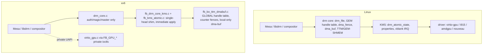

# Linux DRM / GPU Graphics ABI Compatibility Plan

Last updated: 2026-06-06

## Goal

Make the xv6-os graphics subsystem compatible with the **Linux DRM/GPU kernel
ABI** so that unmodified Linux userland graphics stacks — `libdrm`, Mesa
(`gallium`, `drm/virtio`, `kmsro`), `libgbm`, `libEGL`, Wayland compositors,
and the X/Xorg `modesetting` driver — can drive the kernel through the same
ioctl contract they use on Linux.

"Compatible" here means the same thing the syscall-ABI plans
(`docs/linux-abi-compat-plan.md`) mean for syscalls, applied to graphics:

- the same device-node layout (`/dev/dri/card0`, `/dev/dri/renderD128`);
- the same `DRM_IOCTL_*` numbers, struct layouts, and field semantics;
- the same object models (GEM handles per-file, dumb buffers, PRIME dma-buf,
  DRM syncobj / `dma_fence`, KMS atomic state);
- the same `virtio-gpu` UAPI (`DRM_IOCTL_VIRTGPU_*`) so a stock Mesa
  `virtio_gpu`/`virgl` winsys binds without xv6-specific shims.

This document is a **comparison + implementation plan**. It does not change
code. It inventories what exists, what is a semantic mismatch, and what is
missing, then proposes a phased roadmap with structural and performance work.

This plan is scoped to **x86_64** (consistent with the syscall ABI plans).
RISC-V graphics is out of scope.

---

## 1. Current state — what xv6-os already has

The kernel already ships a surprisingly complete DRM shim. Files (all under
`kernel/kernel/`):

| Area | File(s) | Approx LOC | Maturity |
|---|---|---|---|
| DRM generic core (device/file/auth/magic/dispatch) | `dev/drm_core.c`, `inc/dev/drm_core.h` | ~245 | Solid, device-agnostic |
| DRM UAPI numbers/structs | `inc/uabi/drm.h` | ~900 | Broad ioctl + struct coverage |
| Node registration (`card0`, `renderD128`, `gpu0`, `fb0`) | `dev/fb/fb_init_panic.c` | ~450 | Both primary + render nodes |
| KMS modesetting + properties + blobs | `dev/fb/fb_drm_core_kms.c` | ~2300 | Single-head, real queries |
| KMS atomic + page-flip + FB lifecycle | `dev/fb/fb_kms_atomic.c` | ~600 | Simplified atomic shim |
| Ioctl router | `dev/fb/fb_drm_dispatch.c` | ~600 | Dispatch table |
| GEM/BO + TTM metadata + dma-buf wrapper | `dev/fb/fb_bo_ttm_dmabuf.c` | ~2500 | Global handle table |
| syncobj + PRIME + virtgpu user ioctls | `dev/fb/fb_syncobj_prime_virtgpu.c` | ~1600 | Counter fences |
| Fence fd / dma-buf file ops | `dev/fb/fb_fd_sync.c` | ~400 | Real custom fds |
| Scanout / BO→framebuffer present | `dev/fb/fb_scanout.c` | ~1000 | virgl + CPU paths |
| virtio-gpu driver (2D + 3D virgl) | `virtio_gpu.c` | ~7400 | Full 2D + 3D, async ring |
| Device facade ioctls (`FB_GPU_*`) | `dev/fb/fb_device_ioctl.c` | ~2200 | xv6-private UAPI |
| Hyper-V DXG present backend | `dev/fb/fb_dxg_present.c` | — | Out of DRM scope |
| Nouveau scaffold | `dev/fb/fb_nouveau.c` | — | DDA path, separate |

What works today against the **real** Linux ioctl numbers:

- **DRM core**: `VERSION`, `GET_MAGIC`, `AUTH_MAGIC`, `GET_CLIENT`, `GET_CAP`,
  `SET_CLIENT_CAP`, `SET_MASTER`, `DROP_MASTER`. Render-node auth bypass and
  primary-node master arbitration are modeled (`drm_core.c`).
- **KMS queries**: `MODE_GETRESOURCES`, `GETCRTC`, `GETCONNECTOR`, `GETENCODER`,
  `GETPLANE`, `GETPLANERESOURCES`, `GETPROPERTY`, `GETPROPBLOB`, `GETFB`,
  `GETFB2`, `OBJ_GETPROPERTIES`.
- **KMS state**: `SETCRTC`, `ADDFB2`, `RMFB`, `CLOSEFB`, `PAGE_FLIP` (with
  `PAGE_FLIP_EVENT`), `DIRTYFB`, `ATOMIC` (validate + immediate apply),
  `OBJ_SETPROPERTY`.
- **Buffers**: `MODE_CREATE_DUMB`/`MAP_DUMB`/`DESTROY_DUMB` backed by real
  anon pages; `GEM_CLOSE`.
- **PRIME**: `PRIME_HANDLE_TO_FD`/`FD_TO_HANDLE` with a real custom fd and
  file-ops (poll/release), local-only.
- **syncobj**: `CREATE`/`DESTROY`/`WAIT`/`TIMELINE_WAIT`/`SIGNAL`/
  `TIMELINE_SIGNAL`/`RESET`/`TRANSFER`/`QUERY`/`HANDLE_TO_FD`/`FD_TO_HANDLE`.
- **virtio-gpu**: full 2D + 3D virgl command path internally
  (`RESOURCE_CREATE_2D/3D`, `ATTACH_BACKING`, `SET_SCANOUT`, `TRANSFER_*`,
  `RESOURCE_FLUSH`, `CTX_CREATE/DESTROY/ATTACH/DETACH`, `SUBMIT_3D`,
  `GET_CAPSET*`), with an async submission ring and fence reaping.

This is a strong foundation. The gaps below are mostly about **closing
semantic mismatches** and **exposing the existing engine through the standard
UAPI** rather than building from scratch.

---

## 2. Architecture comparison: xv6-os vs Linux DRM

Key structural differences:

| Concept | Linux | xv6-os today | Compatibility impact |
|---|---|---|---|
| **GEM handle scope** | Per-`drm_file` handle table (`idr`) | One **global** table, isolation by `owner_id`/`tgid` | High — handle numbers differ between processes; FLINK/OPEN unsupported; render-node clients can collide conceptually |
| **dma_fence** | First-class refcounted fence objects, fence context/seqno, cross-driver | `uint64` counters + pending-callback counts | High — no real cross-driver fence sharing; sync_file semantics approximate |
| **dma_buf** | `struct dma_buf` + attachments + sg_table, cross-device | Local-only wrapper, foreign fd rejected | High — no cross-driver buffer sharing (GPU↔display↔v4l) |
| **KMS atomic** | `drm_atomic_state` trees, check/commit, rollback, async commit, in/out fences | Validate then immediate global apply; in-fence wait rejected | Medium — works for simple compositors, breaks atomic-fence users |
| **KMS objects** | Dynamic per-HW (N CRTCs/connectors/planes, hotplug) | Static singletons (1 each), no overlay/cursor plane | Medium — single-head only; no universal planes/overlay |
| **vblank** | HW IRQ timestamped, `drm_vblank` accounting | Synthetic 60 Hz from tick counter | Medium — present pacing approximate; no real CRTC sequence |
| **virtio-gpu UAPI** | `DRM_IOCTL_VIRTGPU_*` (Mesa winsys target) | Standard ioctls **wired** but incomplete; xv6-private `FB_GPU_VIRGL_*` also present | Medium — `EXECBUFFER` ignores BO list + in/out fences, blob/host-visible faked |
| **TTM / memory mgr** | TTM or GEM-SHMEM, real placement/migration, mmap fault | Metadata-only naming, plain anon pages | Low/Medium — fine for sysmem, no VRAM migration |
| **Blob resources** | `VIRTGPU_RESOURCE_CREATE_BLOB`, host-visible, zero-copy | Absent (explicit transfers only) | Medium — perf + modern Mesa paths |

---

## 3. Detailed gap inventory

### 3.1 DRM core (`drm_core.c`)

Mostly compatible. Gaps:

- **`DRM_IOCTL_GET_UNIQUE` / `SET_VERSION` / `GET_STATS` / `GET_MAP` / `IRQ_BUSID`**
  — verify presence/behavior; libdrm's `drmGetVersion`/`drmGetBusid` path calls
  some of these. `SET_VERSION` interacts with the implicit `UNIVERSAL_PLANES`
  legacy behavior.
- **Capabilities (`GET_CAP`)** — audit the returned values against what a real
  driver reports: `DUMB_BUFFER=1`, `PRIME` import/export bits, `TIMESTAMP_MONOTONIC`,
  `CRTC_IN_VBLANK_EVENT`, `SYNCOBJ`, `SYNCOBJ_TIMELINE`, `ADDFB2_MODIFIERS`,
  `PAGE_FLIP_TARGET`, `ASYNC_PAGE_FLIP`. Several map to features that are
  currently rejected (target/async flip) and must report `0` consistently.
- **`drm_version`** name/date/desc lengths: ensure the two-pass length probe
  (caller passes `len=0` to size buffers) matches libdrm exactly.

### 3.2 KMS modesetting (`fb_drm_core_kms.c`, `fb_kms_atomic.c`)

- **`MODE_CREATEPROPBLOB` / `DESTROYPROPBLOB`** — currently `-EOPNOTSUPP`. Real
  atomic clients create a MODE_ID blob via `CREATEPROPBLOB` and reference it in
  the atomic commit. Without writable blobs, `drmModeAtomicCommit` with a
  mode set (the normal compositor modeset path) cannot work. **Must implement.**
- **`MODE_SETPLANE`** — `-EOPNOTSUPP`. Needed by legacy (non-atomic) plane
  users and by `xf86-video-modesetting` cursor/overlay fallback.
- **`MODE_ADDFB` (legacy)** — `-EOPNOTSUPP`. Some older userland and the kernel
  fbdev-emulation path use the legacy single-plane AddFB; ADDFB2 covers modern
  clients, but a legacy shim mapping to ADDFB2 is cheap and improves coverage.
- **Cursor plane** — `MODE_CURSOR`/`CURSOR2` validate-only; no actual cursor
  plane. A real cursor plane (DRM_PLANE_TYPE_CURSOR) + `SETPLANE` is needed for
  hardware-cursor compositors. The virtio-gpu cursor queue already exists
  (`FB_GPU_SET_CURSOR`/`MOVE_CURSOR`); wire it to the KMS cursor plane.
- **Universal planes / overlay** — only one PRIMARY plane. Add a CURSOR plane
  and (optionally) an OVERLAY plane so `DRM_CLIENT_CAP_UNIVERSAL_PLANES`
  reports something truthful.
- **Multi-mode connector** — connector exposes a single generated mode from
  `xres/yres`. Real EDID/mode lists improve compositor mode selection. The
  virtio-gpu `GET_EDID` and `GET_DISPLAY_INFO` paths can feed a proper mode
  list.
- **Atomic engine** — replace the immediate-apply shim with a minimal but real
  `drm_atomic_state`-style flow:
  - build a transient per-object state set during `ATOMIC`,
  - run a **check** phase (TEST_ONLY uses only this) that validates the whole
    set atomically and can fail without side effects,
  - run a **commit** phase that applies plane/CRTC/connector state together,
  - support **`ATOMIC_NONBLOCK`** real async commit (currently rejected unless
    TEST_ONLY),
  - honor **`IN_FENCE_FD`** by actually waiting on the imported fence before
    the flip (currently rejected), and emit a **real `OUT_FENCE_PTR`** fence
    that signals on flip completion (currently prepared but not signaled by a
    completion event).
- **vblank / events** — move from synthetic ticks to a present-completion
  driven sequence: increment the CRTC sequence and timestamp when the scanout
  actually flips (virtio-gpu `RESOURCE_FLUSH` / present completion), and deliver
  `FLIP_COMPLETE` / vblank events at that point. Implement
  `CRTC_GET_SEQUENCE`/`CRTC_QUEUE_SEQUENCE` and `WAIT_VBLANK` consistently
  (currently rejected).
- **Page-flip target / async** — implement `PAGE_FLIP_TARGET_*` and
  `PAGE_FLIP_ASYNC` or keep them rejected but make `GET_CAP` report `0` for the
  matching caps so userland negotiates down cleanly.

### 3.3 GEM / buffer objects (`fb_bo_ttm_dmabuf.c`)

- **Per-file handle table** — the biggest structural correctness gap. Linux
  GEM handles are scoped to the open `drm_file`. xv6 uses one global table with
  `owner_id` matching. Refactor to a per-`drm_core_file` handle→BO map
  (small `idr`/`xarray`), with the BO itself globally refcounted. This is a
  prerequisite for correct `GEM_FLINK`/`GEM_OPEN`, for PRIME import creating a
  *new handle in the importing file*, and for multi-client render-node use.
- **`GEM_FLINK` / `GEM_OPEN`** — implement global flink names so two processes
  can share a BO by name (legacy but still used, e.g. by some Xorg paths).
- **`GEM_CLOSE` semantics** — ensure closing a handle drops only the *file's*
  reference, not the global BO, once per-file tables exist.
- **mmap fault model** — dumb/GEM mmap uses a precomputed offset and a custom
  VMA handler with `DONTFORK|DONTDUMP` (see runtime memory notes). Keep that,
  but align the offset scheme with `MAP_DUMB`'s returned offset and document
  the fake-offset → BO mapping the way Linux's `drm_gem_mmap` does.

### 3.4 dma-buf / PRIME (`fb_bo_ttm_dmabuf.c`, `fb_fd_sync.c`)

- **Cross-driver import** — foreign fds are rejected. To interoperate with the
  rest of the kernel (future v4l, future second GPU, or the virtio-gpu blob
  path), introduce a minimal generic `dma_buf`-like object with a small ops
  vtable (`map`, `unmap`, `mmap`, attach pages/sg). The fb BO becomes one
  exporter; importers obtain pages through the ops rather than a type check.
- **`sg_table` equivalent** — BOs are page arrays. A scatter-list abstraction
  is needed before any real DMA-capable importer (IOMMU/device DMA) can consume
  an imported buffer. For pure-sysmem QEMU this is low priority.
- **dma-buf mmap** — expose `mmap()` on the PRIME fd itself (Linux allows
  `mmap(dmabuf_fd)`), not only via the GEM offset path. `libgbm`/`gbm_bo_map`
  and some EGL paths rely on it.
- **Poll semantics** — current poll compares snapshot fence counters. Once real
  `dma_fence` objects exist (3.5), wire dma-buf `POLLIN/POLLOUT` to the
  reservation object's fences as Linux does.

### 3.5 DRM syncobj / dma-fence (`fb_syncobj_prime_virtgpu.c`, `fb_fd_sync.c`)

- **Real `dma_fence` objects** — replace `uint64` counters with a refcounted
  fence type carrying `{context, seqno, signaled, callbacks, error}`. This is
  the single most leveraged change: it makes syncobj, dma-buf reservation,
  sync_file, and atomic in/out fences all share one mechanism, matching Linux.
- **`SYNCOBJ_EVENTFD`** — currently `-EOPNOTSUPP`. With real fences, register a
  fence callback that signals an eventfd. Needed by modern compositors that
  poll syncobj via eventfd.
- **sync_file import/export** — `HANDLE_TO_FD`/`FD_TO_HANDLE` already produce
  custom fds; make the exported fd a genuine `sync_file` (with the
  `SYNC_IOC_*` / `POLLIN`-on-signal contract) so it round-trips through other
  Linux components.
- **Timeline correctness** — timeline points work via `timeline_value`. Audit
  `QUERY` to return the *last signaled* point (`QUERY_FLAGS_LAST_SUBMITTED`
  semantics) and ensure transfer/proxy chains signal transitively under the
  real fence model.
- **`WAIT_FOR_SUBMIT` / `WAIT_AVAILABLE` / deadline** — verify these flags
  behave like Linux (block until a fence is even attached, not just signaled).

### 3.6 virtio-gpu UAPI (`fb_device_ioctl.c`, `fb_syncobj_prime_virtgpu.c`, `virtio_gpu.c`)

Correction after source audit: the standard `DRM_IOCTL_VIRTGPU_*` set is
**already dispatched** in `fb_drm_dispatch.c` (`GETPARAM`, `CONTEXT_INIT`,
`RESOURCE_CREATE`, `RESOURCE_CREATE_BLOB`, `RESOURCE_INFO`, `TRANSFER_TO/FROM_HOST`,
`WAIT`, `GET_CAPS`, `EXECBUFFER`, `MAP`) on top of the existing engine. The work
is therefore **completion**, not greenfield. Remaining gaps:

- **`VIRTGPU_EXECBUFFER`** ignores the `bo_handles` array and the in/out
  fence fds (it calls `virtio_gpu_user_submit(..., NULL, 0, &fence, &signaled)`).
  Plumb the BO handle list (for residency) and honor `DRM_IOCTL` in-fence wait /
  out-fence (`fence_fd`) so Mesa's explicit-sync path works.
- **Per-ioctl completion** to verify against the engine:
  - `VIRTGPU_GETPARAM` → 3D features / capset query-fix / resource-blob /
    host-visible / context-init / supported-capset-IDs.
  - `VIRTGPU_GET_CAPS` → return virgl/virgl2 capset payloads (already queried).
  - `VIRTGPU_CONTEXT_INIT` → map to `CTX_CREATE` with capset/num-rings/debug-name.
  - `VIRTGPU_RESOURCE_CREATE` → `RESOURCE_CREATE_3D` + backing + GEM handle.
  - `VIRTGPU_RESOURCE_INFO` → resource metadata by handle.
  - `VIRTGPU_EXECBUFFER` → `SUBMIT_3D` (with in/out fence + ring index +
    bo handle list). This is the core 3D submit path Mesa uses.
  - `VIRTGPU_TRANSFER_TO_HOST` / `FROM_HOST` → existing transfer cmds.
  - `VIRTGPU_WAIT` → wait on a BO's last fence.
  - `VIRTGPU_MAP` → return mmap offset for a resource (like `MAP_DUMB`).
  - `VIRTGPU_RESOURCE_CREATE_BLOB` → see blob work below.
- **Blob resources + host-visible memory** — implement
  `VIRTIO_GPU_F_RESOURCE_BLOB` (`RESOURCE_CREATE_BLOB` cmd, blob mem
  guest/host3d/host3d-guest, `USE_MAPPABLE`/`USE_SHAREABLE`). Modern Mesa
  (venus, and recent virgl) and zero-copy presentation rely on it. Requires the
  virtio-gpu host-visible shared-memory region (`VIRTIO_GPU_SHM_ID_HOST_VISIBLE`)
  and `RESOURCE_MAP_BLOB`/`UNMAP_BLOB`.
- **GBM/dma-buf bridge** — virtgpu resources must be exportable as PRIME fds
  (handle↔resource↔dma-buf) so EGL/GBM can scan out a rendered buffer through
  KMS `ADDFB2`. The render-node→KMS-node buffer hand-off is the desktop path.
- **Keep `FB_GPU_*`** as an internal/diagnostic UAPI; the new path is additive.

### 3.7 fbdev compat (`inc/dev/fb.h`)

- `FBIOGET_VSCREENINFO`/`FSCREENINFO`/`PUT_VSCREENINFO` exist. Audit the
  `fb_var_screeninfo`/`fb_fix_screeninfo` struct layouts against Linux
  `<linux/fb.h>` (bitfields for RGBA offsets, `smem_len`, `line_length`) so
  `fbdev` clients and the kernel's own `fbcon`-style users see correct values.
- Consider exposing the DRM-managed scanout through fbdev emulation
  (`drm_fbdev`) so `/dev/fb0` and `/dev/dri/card0` stay coherent.

### 3.8 Memory management / TTM

- TTM here is naming-only metadata. For QEMU sysmem this is acceptable. The
  real need is a **GEM-SHMEM-equivalent** clean abstraction (shmem-backed BO
  with pages, mmap, and a single allocation/free/refcount path) that GEM,
  dumb, virtgpu resources, and dma-buf all share — replacing the parallel
  page-array logic currently duplicated across `fb_bo_ttm_dmabuf.c`,
  `fb_syncobj_prime_virtgpu.c`, and `virtio_gpu.c`.

---

## 4. Semantic mismatches to fix (correctness, not features)

These are places where an ioctl exists but may behave differently from Linux,
which silently breaks real clients:

1. **GEM handle scope** (§3.3) — handles must be per-file; returning a global
   handle violates the contract `drmPrimeFDToHandle` relies on (a *new* handle
   in the importing file).
2. **Atomic in-fence rejection** (§3.2) — Linux clients that pass `IN_FENCE_FD`
   expect the commit to wait, not `-EOPNOTSUPP`. Either honor it or ensure the
   client never advertises it (but Mesa/compositors do).
3. **Out-fence never signals** (§3.2/§3.5) — an `OUT_FENCE_PTR` fd that never
   signals will hang a compositor's frame loop. Must be backed by a real
   completion.
4. **`GET_CAP` truthfulness** (§3.1) — `gpu_drm_get_cap()` already returns `0`
   for `ASYNC_PAGE_FLIP`/`PAGE_FLIP_TARGET`/`CRTC_IN_VBLANK_EVENT`, so caps and
   behavior currently agree. Keep this invariant: if a flip flag is later
   implemented, flip the cap to `1` in the same change; never advertise a cap
   whose ioctl path returns `-EOPNOTSUPP`.
5. **`CREATEPROPBLOB` rejection** (§3.2) — blocks the standard atomic-modeset
   path; must be implemented for atomic modeset to function at all.
6. **PRIME foreign-fd rejection** (§3.4) — breaks the intended cross-component
   buffer sharing that `card0`↔`renderD128` desktop hand-off needs.
7. **syncobj fd not a real sync_file** (§3.5) — round-tripping through other
   Linux components (EGL_ANDROID_native_fence_sync style) needs true poll-on-
   signal semantics.

---

## 5. Structural improvements

1. **Introduce a `dma_fence` core** (`dev/fb/dma_fence.c` or a shared
   `kernel/kernel/inc/dev/dma_fence.h`): refcounted fence, context/seqno,
   `signal`, `add_callback`, `wait`, `default_wait`. Back syncobj, dma-buf
   reservation, sync_file, and atomic fences on it. **Highest leverage.**
2. **Per-file GEM handle table** in `struct drm_core_file` (or a driver
   sub-struct), with global BO refcount. Centralizes 3.3/3.4 correctness.
3. **Unify BO allocation** behind one shmem-style allocator (§3.8) used by GEM,
   dumb, virtgpu, and dma-buf. Removes triplicated page logic.
4. **Real atomic state objects** (§3.2): a small `kms_atomic_state` with per
   plane/CRTC/connector snapshots, check/commit split, rollback on failure.
5. **Generic `dma_buf` object** with an ops vtable (§3.4) so import is not a
   driver-type check.
6. **Split the monolithic files**: `fb_drm_core_kms.c` (2300L) and
   `virtio_gpu.c` (7400L) are large; once the new abstractions land, group by
   concern (objects vs atomic vs properties; transport vs resource vs 3D).
7. **virtgpu UAPI layer** (§3.6) as a thin translation file mapping
   `DRM_IOCTL_VIRTGPU_*` onto the existing engine, keeping `FB_GPU_*` separate.

---

## 6. Performance improvements

Grounded in the runtime notes (`/memories/repo/xv6-os-*`) and the alpine-virgl
handoff plan:

1. **Blob / host-visible resources** (§3.6) — eliminate explicit
   `TRANSFER_TO_HOST` copies for mappable buffers (zero-copy present). This is
   the largest virgl-path win.
2. **Real vblank pacing** (§3.2) — drive present from actual flip completion
   instead of synthetic 60 Hz ticks, removing over/under-submission and the
   jitter described in the alpine handoff plan.
3. **Deeper async submit ring** — the engine has an 8-slot async ring; expose
   ring depth to the virtgpu `EXECBUFFER` path and let the compositor overlap
   GL submit with host vsync (already partially proven; make it the default
   through the standard UAPI).
4. **Scanout fast paths** — the kernel already has direct-scanout mmap and
   fast row-copy blits (see `xv6-os-hyperv-fb.md`). Ensure the KMS `PAGE_FLIP`
   / atomic commit uses resource-bind scanout (no readback) whenever the FB is
   a virgl resource, falling back to CPU copy only for shm buffers.
5. **Damage-aware present** — plumb `MODE_DIRTYFB` / atomic `FB_DAMAGE_CLIPS`
   into virtio-gpu `RESOURCE_FLUSH` partial rects to avoid full-frame transfers
   (the compositor already computes damage).
6. **Avoid COW divergence on BO maps** — keep the `DONTFORK|DONTDUMP` mapping
   fix already documented in `xv6-os-runtime.md`; apply it uniformly to all BO/
   resource maps in the unified allocator (§3.8) so the class of bug cannot
   recur.

---

## 7. Phased roadmap

Ordered by dependency and compatibility payoff. Each phase is independently
landable and testable.

### Phase 0 — Audit & truthfulness (low risk, do first)
- Reconcile `GET_CAP` values with actual behavior (§4.4).
- Audit `drm_version`, `GET_CLIENT`, `GET_UNIQUE`, fbdev struct layouts
  (§3.1, §3.7) against libdrm/Linux headers.
- Document the exact ioctl support matrix (extend the table in §1 with
  pass/stub/reject per ioctl) and add a userspace probe (mirroring
  `linuxsyscallabitest`) — call it `drmabitest`.

### Phase 1 — dma_fence core + syncobj/sync_file correctness
- Implement `dma_fence` (§5.1), reback syncobj on it.
- Make exported syncobj/PRIME fds real `sync_file`s; implement
  `SYNCOBJ_EVENTFD` (§3.5).
- Result: correct fence semantics that every later phase depends on.

### Phase 2 — Per-file GEM table + FLINK/OPEN + dma-buf generalization
- Per-`drm_file` handle table with global BO refcount (§5.2).
- `GEM_FLINK`/`GEM_OPEN`; PRIME import creates a new per-file handle (§3.3).
- Generic `dma_buf` object + ops; accept cross-component import (§3.4).

### Phase 3 — Real KMS atomic + CREATEPROPBLOB + cursor/universal planes
- Writable blobs (`CREATEPROPBLOB`/`DESTROYPROPBLOB`) (§3.2).
- `kms_atomic_state` with check/commit/rollback; honor `IN_FENCE_FD`, emit real
  `OUT_FENCE_PTR`, support `ATOMIC_NONBLOCK` (§3.2, §5.4).
- Add CURSOR plane wired to the virtio-gpu cursor queue; implement `SETPLANE`
  (§3.2).
- Real vblank/flip-completion sequence; `WAIT_VBLANK`, `CRTC_*_SEQUENCE` (§3.2).

### Phase 4 — Complete the standard virtio-gpu UAPI
- The `DRM_IOCTL_VIRTGPU_*` ioctls are already dispatched; finish them:
  `EXECBUFFER` BO-handle residency + in/out fence fds, real blob/host-visible
  memory, `MAP` offset for blob resources (§3.6).
- Validate with a stock Mesa `virtio_gpu`/`virgl` build against the kernel’s
  `renderD128`.

### Phase 5 — Blob resources + zero-copy + damage present (performance)
- `VIRTIO_GPU_F_RESOURCE_BLOB`, host-visible region, `RESOURCE_MAP_BLOB` (§3.6).
- Damage-aware `RESOURCE_FLUSH`; resource-bind scanout default (§6).

### Phase 6 — Structural cleanup
- Unified shmem BO allocator (§5.3), file splits (§5.6), TTM-naming retirement.

---

## 8. Validation strategy

Follow the existing ABI-audit discipline (do not declare a path dead from
source alone — runtime-trace it; see `xv6-os-runtime.md`):

1. **`drmabitest`** userspace probe (new, Phase 0) exercising every ioctl with
   known-good and error inputs, asserting Linux-matching errno and struct
   output. Mirror the `scripts/linux_abi_*` audit generators with a
   `docs/linux-drm-abi-audit.{md,csv}`.
2. **libdrm conformance** — run `modetest`, `kmscube`, and `drm_info` against
   `/dev/dri/card0`; their output is a direct compatibility signal.
3. **Mesa bring-up** — once Phase 4 lands, build stock Mesa with
   `gallium-drivers=virgl` and confirm `eglinfo`/`es2gears` select the kernel’s
   render node without xv6 env shims.
4. **Compositor end-to-end** — the existing Wayland compositor and WebKit/GL
   apps remain the integration test; compare trace shape + on-screen output +
   guest framebuffer samples (per runtime notes), never counters alone.
5. **Regression guard** — keep the extensive fail-closed stats counters already
   present; add assertions that caps and behavior agree (§4.4).

---

## 9. Out of scope / explicitly separate

- **Hyper-V DXG / GPU-PV** (`fb_dxg_present.c`, `d3dkmthk.h`) — a Microsoft
  paravirtual path tracked in `GPU_REMAINING_GAPS.md`; it is not the Linux DRM
  ABI and stays fail-closed. Do not couple this plan to it.
- **Nouveau/DDA real-hardware** (`fb_nouveau.c`) — separate discrete-GPU
  passthrough effort; this plan targets the DRM ABI surface, not a new HW
  driver.
- **RISC-V graphics** — out of scope (consistent with the syscall ABI plans).

---

## 10. Summary

xv6-os already implements a broad, fail-closed DRM shim with real node
registration, KMS queries, dumb buffers, PRIME fds, DRM syncobj, and a complete
virtio-gpu 2D+3D engine. The path to Linux graphics-ABI compatibility is
therefore mostly **convergence work**, not greenfield:

- the **highest-leverage structural change** is a real `dma_fence` core, which
  unifies syncobj, dma-buf, sync_file, and atomic fences (Phase 1);
- the **highest-impact compatibility change** is completing the already-wired
  `DRM_IOCTL_VIRTGPU_*` UAPI (EXECBUFFER BO list + in/out fences, real blob /
  host-visible memory) so stock Mesa binds with explicit sync (Phase 4);
- the **most correctness-critical fixes** are per-file GEM handles,
  `CREATEPROPBLOB` + a real atomic check/commit, and making caps agree with
  behavior;
- the **biggest performance wins** are blob/host-visible zero-copy resources,
  real flip-driven vblank pacing, and damage-aware present.
